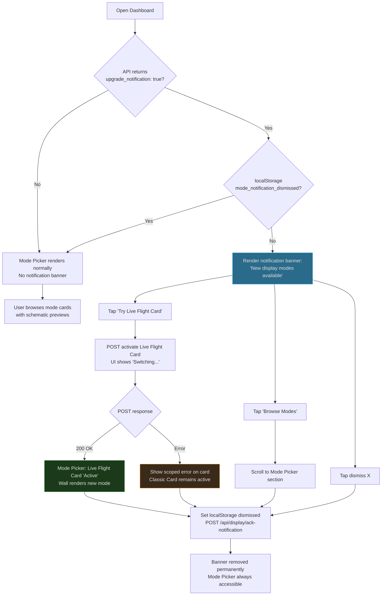
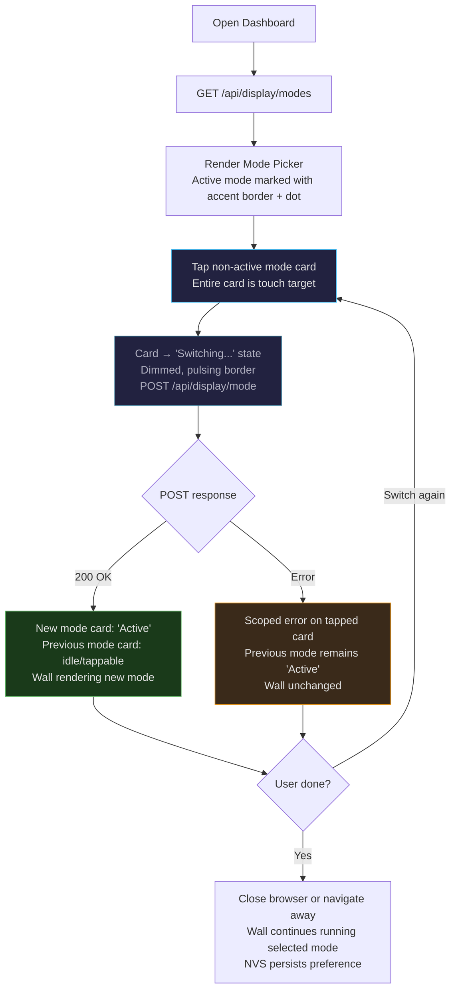
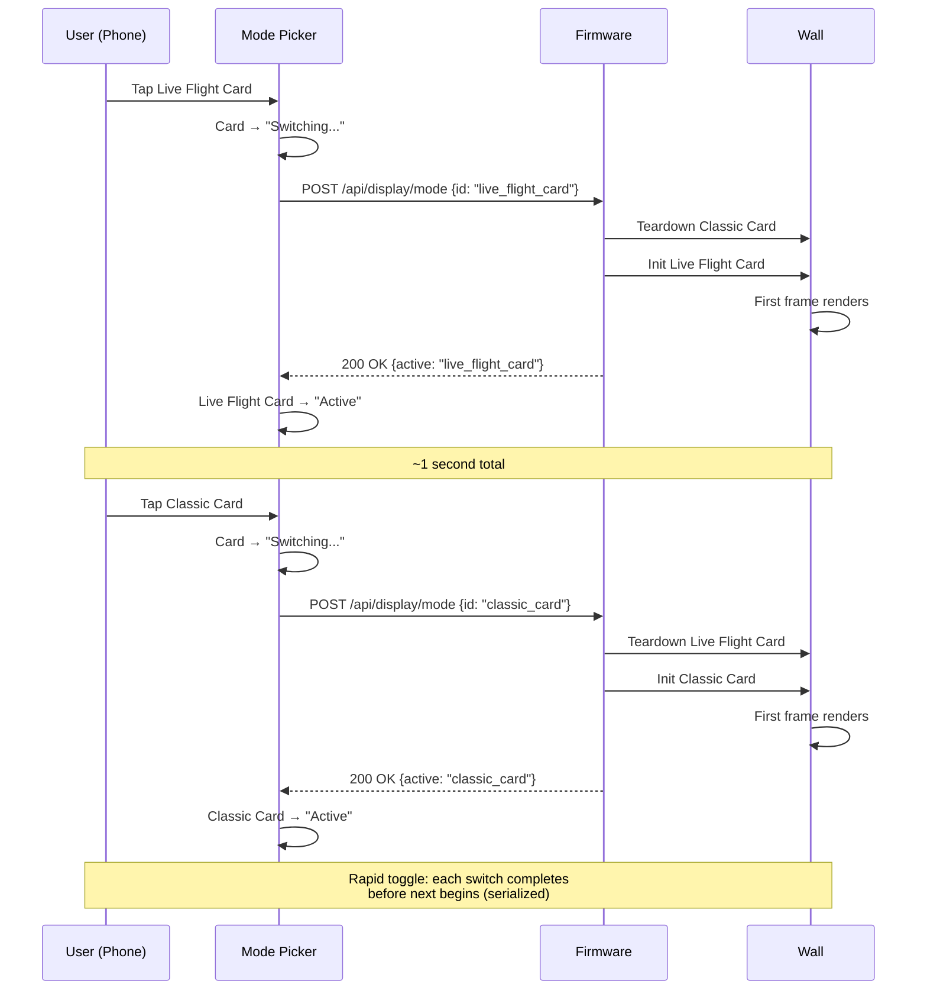
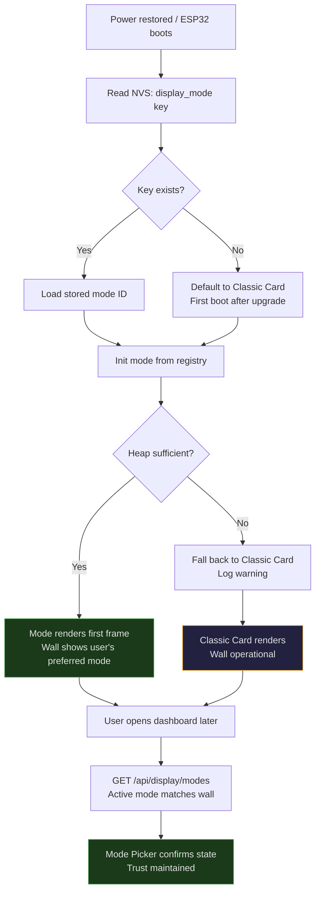
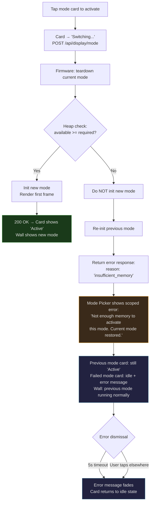

# UX Design Specification — TheFlightWall Display System Release

**Author:** Christian
**Date:** 2026-04-11

---

## Executive Summary

### Project Vision

The Display System Release transforms TheFlightWall from a single-purpose flight ticker into a display platform. The hardware — twenty 16x16 LED panels driven by an ESP32 with a zone-based layout engine — is already capable of far more than three-line flight cards. The missing piece is a clean abstraction boundary between "what data do we have" and "how do we visualize it."

This release draws that line with two UX surfaces: the **LED matrix** gains a pluggable mode system where each visual presentation is self-contained (lifecycle, rendering, memory), and the **web dashboard** gains a **Mode Picker** — a new section designed for frequent, casual interaction rather than one-time configuration. Users switch display modes from their phone like changing TV channels: tap, watch the wall respond, done.

Two modes ship at launch: Classic Card (the existing three-line flight card, migrated pixel-identically to the new architecture) and Live Flight Card (an enriched layout exploiting telemetry fields already in the data pipeline — altitude, ground speed, heading, vertical rate). The architectural payoff: adding a third mode becomes a contained exercise — one interface implementation, one line in the mode table, zero changes to data pipeline or web portal.

### Target Users

**Primary: Christian (project owner)** — Tech-savvy maker, phone-first interaction from the couch. Has lived with the wall through MVP and Foundation releases. Knows the system deeply but wants mode switching to feel effortless — casual enough to demo for friends, reliable enough to leave running for days. Single user, trusted local network, no authentication concerns.

**Secondary: Future contributors** — Developers who clone the repo and want to add a display mode. Their UX touchpoint is indirect: modes they build auto-appear in the Mode Picker because the UI reads the registry dynamically. The Mode Picker's schematic preview system and automatic discovery make extensibility visible without requiring portal code changes.

### Key Design Challenges

1. **"Remote control" interaction cadence** — Every other dashboard card (Display, Timing, Network, Hardware) is configure-once-and-forget. The Mode Picker is designed for repeated, casual use — browsing modes, switching on a whim, showing friends. The interaction must feel fast, lightweight, and inviting to revisit. This is a fundamentally different UX rhythm within the same dashboard surface.

2. **Schematic wireframe previews at phone scale** — Each mode needs a labeled wireframe communicating its zone layout. The 160x32 matrix is a wide, short rectangle. Rendering recognizable schematics at phone width while keeping content region labels readable is a spatial challenge. These previews must let an uninitiated user distinguish Classic Card from Live Flight Card at a glance — they're the visual language of the mode system.

3. **Transition state trust** — The wall goes briefly blank during a mode switch (up to 2 seconds). The Mode Picker must bridge this gap: "Switching..." appears immediately on tap, then resolves to "Active" only after the firmware confirms the new mode is rendering. If the UI leads the hardware or lags behind it, the user loses trust in the feedback. The emotional beat is: tap → "Switching..." → wall changes → UI confirms.

4. **Technical error in consumer language** — Heap guard failures ("insufficient memory to activate mode") are deeply technical. The error message must be honest without being alarming, and the recovery must be obvious: previous mode restored, wall still works, no reboot needed. The user should feel "okay, that one doesn't fit right now" — not "something is broken."

5. **Upgrade discovery without disruption** — The one-time "New display modes available" notification must surface new capabilities without feeling like an ad or a nag. Curiosity, not obligation. Tapping it should feel like finding a new feature, not being sold one. And it must never reappear after dismissal or first Mode Picker visit.

### Design Opportunities

1. **Channel-switching feel** — If mode switching hits the < 2 second target, it becomes a party trick. The UX should lean into this by minimizing friction: see mode → tap activate → done. No confirmation dialogs, no intermediate screens. The activation path should be as short as a TV remote channel button.

2. **Schematic previews as visual identity** — The wireframe previews aren't just functional navigation aids — they're the visual identity of the mode library. A well-designed schematic system makes each mode recognizable at thumbnail scale and scales naturally as new modes are added in future releases.

3. **Progressive richness storytelling** — The jump from Classic Card (3 lines) to Live Flight Card (6 data regions) is a tangible upgrade visible in the Mode Picker schematics. Side-by-side comparison tells the story: "your wall can show more." This is the first time the user sees the hardware's untapped potential made accessible.

4. **Platform foundation** — The Mode Picker is the first user-facing evidence that TheFlightWall is a display platform, not just a flight ticker. Getting this interaction right — fast switching, clear previews, graceful errors, automatic mode discovery — sets the UX precedent for every future mode addition. The patterns established here will be reused by community modes, scheduled modes, and multi-mode configurations in future releases.

## Core User Experience

### Defining Experience

The defining interaction of the Display System Release is **switching a display mode from your phone and watching the wall respond.** This is what Christian does when friends ask about the wall. This is the moment that proves the FlightWall is a display platform: tap a mode, the wall changes, done.

The secondary experience — discovering the Mode Picker for the first time after an upgrade — is the onboarding moment. The one-time "New display modes available" notification leads to the Mode Picker, where the user sees two modes with schematic previews, tries one, and experiences the wall's new capability. This happens once. Mode switching happens forever after.

The supporting experiences (NVS persistence, heap guard recovery, Classic Card parity) are invisible when working correctly — which is the highest compliment infrastructure can receive.

### Platform Strategy

| Surface | Display System Release Changes | Context |
|---------|-------------------------------|---------|
| Dashboard | New Mode Picker section with mode cards, schematic wireframe previews, activate buttons, transition state feedback, one-time upgrade notification | Local network, phone or laptop browser |
| LED Matrix | Two rendering modes (Classic Card, Live Flight Card) driven by the new DisplayMode abstraction | Physical hardware, mode output |
| Mode Switch API | GET modes list + active mode, POST activate mode (synchronous — returns after mode is rendering or fails) | Consumed by Mode Picker UI; available to future external clients |

**Constraints carried forward from Foundation Release:**
- All web assets served from ESP32 LittleFS (~896KB budget with dual-OTA partition table)
- No frontend frameworks — vanilla HTML/JS/CSS with the existing design system
- ESPAsyncWebServer connection limits — Mode Picker must not introduce auto-polling
- Same CSS custom properties, card layout, toast notification, and button patterns
- New HTML/JS for Mode Picker must be minimal — estimate ~3-4KB additional gzipped web assets

**New constraint: Interaction cadence.** The Mode Picker is the first dashboard section designed for repeated casual use, not one-time configuration. This changes the design emphasis from form completion (labels, validation, save confirmation) to direct manipulation (see it, tap it, it happens). The mode card itself is the action — not a form that leads to an action.

**Card ordering in dashboard (top to bottom):**

1. Display (existing)
2. **Mode Picker** (new) — positioned high because it's the most-frequently-used section for this release. "Remote control" cadence demands top-of-fold placement, not burial below configure-once cards.
3. Timing (existing)
4. Network & API (existing)
5. Firmware (Foundation)
6. Night Mode (Foundation)
7. Hardware (existing)
8. Calibration (existing)
9. Location (existing)
10. Logos (existing)
11. System (existing)

### Key Interaction Patterns

#### Mode Switching Flow

The mode switch is a synchronous request-response interaction with no client-side polling:

1. **Browse** — Mode Picker shows all available modes as cards with schematic wireframe previews. The active mode is visually marked. No loading, no pagination — the mode list is small and static (shipped in firmware).
2. **Activate** — User taps "Activate" on a non-active mode card. The UI immediately shows "Switching..." (client-side optimism while the POST is in flight). The wall goes briefly blank as the firmware tears down the old mode and initializes the new one.
3. **Confirm** — The POST returns synchronously after the new mode is rendering (or returns an error). The Mode Picker updates: new mode shows "Active," previous mode returns to activatable state. No polling loop — "Switching..." is the POST in flight, "Active" is the 200 response. The UI never speculates about state it hasn't confirmed.

No confirmation dialog before activation. No intermediate "are you sure?" screen. The schematic preview IS the preview — the user already knows what they're selecting. Pre-activation validation happens silently on the firmware side (heap guard).

**Dual feedback channels:** The wall changing is the primary confirmation, but the user may be looking at their phone. The Mode Picker's "Active" state must be independently satisfying — a clear visual transition from "Switching..." to confirmed active, not just a subtle label change. Both channels (wall and phone) must each fully confirm success on their own.

#### Upgrade Discovery Flow

On first dashboard visit after upgrading from Foundation Release:

1. A notification banner appears: "New display modes available" — styled as an informational banner (not a toast, not a modal). The banner includes a direct action: **"Try Live Flight Card"** button alongside a link to browse the Mode Picker. The notification is direct manipulation — the user can activate a mode from the banner itself without navigating first.
2. Tapping "Try Live Flight Card" activates the mode immediately and scrolls to the Mode Picker (now showing Live Flight Card as active). Tapping the browse link scrolls to the Mode Picker without activating anything.
3. The banner does not reappear after dismissal or after the user's first Mode Picker interaction.
4. The wall continues running Classic Card (default after upgrade) until the user takes action — no visual disruption.

#### Error Recovery Flow

When a mode activation fails (heap guard):

1. User taps "Activate" on a mode. UI shows "Switching..."
2. Firmware tears down current mode, checks heap, finds insufficient memory.
3. Firmware restores the previous mode and returns an error response.
4. Mode Picker shows error message on the failed mode's card: "Not enough memory to activate this mode. Current mode restored."
5. The wall never crashed, never showed garbage. The previous mode is confirmed active. The error message is temporary (dismisses on next interaction or after timeout).

### Effortless Interactions

- **Mode switching** — See the mode, tap activate, wall changes. Two taps from Mode Picker visible (tap activate, confirm on screen). If Mode Picker is below the fold: scroll + tap. No forms, no save buttons, no confirmation dialogs. The tap IS the action.
- **Mode discovery** — Modes auto-populate from the firmware registry. No manual registration in the UI, no configuration files. Flash firmware with a new mode → it appears in the Mode Picker. Zero UI code changes for mode additions.
- **Persistence** — Switch to Live Flight Card, leave it. Power cycles, reboots, OTA updates — the wall comes back in the last-active mode. The user never re-selects a mode unless they want to change it.
- **Upgrade continuity** — After upgrading from Foundation Release, the wall shows Classic Card (identical to pre-upgrade). The notification banner offers a direct "Try Live Flight Card" action. No visual disruption, no forced migration, no "your settings were reset."
- **Schematic previews** — Each mode card shows a labeled wireframe of the mode's zone layout. No need to activate a mode to understand what it does. The preview communicates the information density and layout at a glance.

### Critical Success Moments

1. **First mode switch** — Christian taps "Activate" on Live Flight Card. The wall goes blank for a beat, then lights up with altitude, speed, heading, and vertical rate alongside airline and route data. The Mode Picker confirms "Active." The wall just got more interesting. This is the moment the display platform becomes real.

2. **The switch back** — After running Live Flight Card for a few days, Christian decides he prefers Classic Card for everyday background use — the simpler layout is easier to read from across the room. He opens the Mode Picker and taps Classic Card. Back in one second. The round-trip preference switch is the most common interaction after initial discovery. It must feel just as effortless as the first switch.

3. **The friend demo** — Friends are over. Christian pulls out his phone, opens the Mode Picker, taps back and forth between modes. The wall responds every time within a second. No crashes, no loading screens. The rapid switching feels like changing channels. This is the moment the Mode Picker proves its "remote control" design.

4. **Power cycle survival** — Power goes out. When it returns, the wall boots into Live Flight Card — exactly where Christian left it. No dashboard visit needed. This is the moment NVS persistence proves the wall is an appliance, not a tethered display.

5. **Graceful rejection** — Six months later, a memory-hungry third mode fails to activate. The Mode Picker shows a clear error, the previous mode is restored, the wall never went dark. This is the moment the heap guard proves the system is safe to experiment with.

6. **Pixel-identical Classic Card** — After the migration, the wall displays the exact same three-line flight cards it always has. Same font, same colors, same cycling. The architecture changed; the output didn't. This is the moment that validates the migration — invisible means successful.

### Experience Principles

1. **The wall and the phone both confirm** — The LED matrix is the primary confirmation that an action worked, but the user might be looking at their phone. Both feedback channels — wall changing and Mode Picker UI state — must independently and fully confirm success. Neither should require the other to feel complete.

2. **Direct manipulation over form submission** — Mode cards are tappable objects, not form fields leading to a save button. The activation path is: see it, tap it, it happens. No intermediate screens, no confirmation dialogs, no "Apply Changes." The upgrade notification carries a direct action button, not just a link. Every touchpoint should feel like a physical remote, not a web form.

3. **Honest, calm error communication** — Technical failures (heap guard, switch serialization) are real possibilities. The UI must name what happened ("not enough memory") and what the system did about it ("current mode restored") without alarm language. The tone is: "that didn't work, but everything's fine."

4. **Invisible when working** — Persistence, Classic Card parity, switch serialization, cooperative scheduling — these are infrastructure. When working correctly, the user doesn't know they exist. The best UX for these features is no UX at all. They only become visible when they prevent a problem.

5. **Complete with two, scalable to twenty** — The Mode Picker ships with two modes. The card layout must feel generous and intentional at this count — not sparse, not "waiting for more." Larger schematics, more breathing room, visual weight that fills the section. The same layout must also accommodate twenty modes without redesign, but the two-mode experience is what ships and must feel finished.

## Desired Emotional Response

### Primary Emotional Goals

**Capability unlocked** — "My wall can do more than I thought." The Display System Release is the first time the user sees the LED matrix as a platform with options, not a fixed display. The emotional goal isn't surprise (the user built the hardware) — it's the satisfaction of untapped potential becoming accessible. The wall hasn't changed. What it can show has.

**Casual control** — "I can change this whenever I want." Mode switching should feel as low-stakes as changing a TV channel. No anxiety about breaking something, no commitment to a choice, no setup ritual. The emotional register is: playful ownership. The user controls the wall's personality from their phone, and switching back is always one tap away.

**Reliable responsiveness** — "It just works, every time." The wall responds to every mode switch within two seconds. No crashes after rapid toggling. No stale displays after power cycles. The emotional goal isn't excitement — it's the quiet confidence of a system that always does what you asked. Reliability becomes invisible, which is the point.

### Emotional Journey Map

| Stage | Feeling | Design Implication |
|-------|---------|-------------------|
| Upgrade notification | Curiosity — "what's new?" | Informational banner, not urgent. "New display modes available" with a direct "Try Live Flight Card" action. Inviting, not demanding. |
| First Mode Picker visit | Discovery — "oh, there are options now" | Two mode cards with generous schematics. The layout should feel curated, not sparse. Visual comparison between Classic and Live Flight Card tells the story. |
| First mode switch | Delight — "that was fast" | Tap → "Switching..." → wall changes → "Active." Under 2 seconds. The speed is the delight. No fanfare animation needed — the wall changing IS the reward. |
| Showing friends | Pride �� "watch this" | Rapid back-and-forth switching works flawlessly. The Mode Picker is the demo. The wall is the stage. The user feels ownership of a capable system. |
| Daily use preference | Comfort — "this is how I like it" | Switching back to a preferred mode is effortless. NVS persistence means the choice sticks. The wall becomes personal — the user chose this view. |
| Power cycle recovery | Trust — "it remembered" | Wall boots into last-active mode. No dashboard visit. No re-selection. The system preserved the user's preference through an outage. Trust earned silently. |
| Heap guard failure | Calm acceptance — "okay, not that one" | Error message names the issue and the recovery. Previous mode restored. No panic, no reboot, no garbled display. The tone is: "that didn't fit, but everything's fine." |
| Classic Card parity | Continuity — "nothing broke" | After upgrade, the wall looks exactly the same as before. The architecture changed; the experience didn't. Invisible migration is the emotional success. |

### Micro-Emotions

**Prioritize:**
- **Playfulness** over formality — Mode switching is a casual action, not a system operation. The Mode Picker should invite experimentation, not careful selection.
- **Confidence** over anxiety — Every switch completes cleanly. The UI confirms state honestly. Errors name the cause and the recovery.
- **Ownership** over passivity — The user chose this mode. The wall reflects their preference. The display is personal, not default.
- **Trust** over skepticism — Power cycles, rapid toggling, error recovery — the system handles edge cases the user shouldn't have to think about.

**Avoid:**
- **Decision paralysis** — With only two modes, this isn't a risk now. But the design must not create a "which one is better?" anxiety. Both modes are valid. Switching is free. There's no wrong choice.
- **Abandonment during transition** — The 0.5–2 second blank transition must never feel like the wall crashed. "Switching..." in the UI bridges the gap. The blank is brief and expected.
- **Alarm from technical errors** — "Insufficient memory" sounds like a system failure to a non-developer. The message must frame it as "this mode needs more resources than available right now" — a fit issue, not a failure.
- **Notification fatigue** — The upgrade banner appears once. The Mode Picker is always accessible. No recurring prompts, no badges, no "you haven't tried Live Flight Card yet."

### Design Implications

| Emotion | UX Approach |
|---------|-------------|
| Capability unlocked | Schematic previews show what each mode displays — the comparison between Classic (3 lines) and Live Flight Card (6 regions) visually communicates "there's more here." The Mode Picker existence itself signals platform capability. |
| Casual control | No confirmation dialogs. Activate button is the only action. Switch back is identical to switch forward. The interaction is symmetrical and non-committal. |
| Reliable responsiveness | Synchronous POST means the UI state is always truthful. "Switching..." is the request in flight. "Active" is the confirmed response. No speculative states, no optimistic UI that gets corrected. |
| Pride in demo | Rapid switching works cleanly because the firmware serializes requests. The Mode Picker reflects true state after each switch. The friend sees a responsive, reliable system. |
| Comfort in preference | NVS persistence is invisible UX. The wall remembers. The Mode Picker shows the correct active mode on every dashboard visit. State consistency across wall and UI builds subconscious trust. |
| Calm error recovery | Error message appears on the failed mode's card (not a global alert). Previous mode is confirmed active. The error is scoped to the action that failed, not the system. Recovery is automatic. |

### Emotional Design Principles

1. **Speed is the delight** — The sub-2-second mode switch is the emotional payoff. No animation, no transition effect, no celebration modal needed. The wall changing quickly IS the reward. Don't add ceremony to a moment that's already satisfying.

2. **Low stakes, high reward** — Every mode switch is reversible, instant, and free. The emotional register should be "try it and see" — not "configure carefully." The Mode Picker should feel like browsing, not committing.

3. **Honest feedback, calm tone** — The UI always reflects confirmed firmware state. Errors name the cause without alarm. Recovery is automatic and communicated. The emotional contract is: "we'll always tell you what happened, and it'll always be fine."

4. **Invisible infrastructure earns trust** — NVS persistence, switch serialization, Classic Card parity — the user never interacts with these features. They earn trust by preventing problems the user never knows about. The emotional reward is the absence of frustration.

5. **The wall is the showpiece, the phone is the remote** — The emotional weight lives on the wall — that's what people look at, that's what changes, that's what friends react to. The phone UI is the enabler, not the destination. Design the Mode Picker to get out of the way after the tap, letting the wall be the star.

## UX Pattern Analysis & Inspiration

### Inspiring Products Analysis

**Apple TV Remote (iOS App) — Phone-as-Remote for a Display**
- The phone screen is a trackpad and button panel, not a content destination. The TV is the content. The app is deliberately minimal — large touch targets, no chrome competing with the TV screen.
- State feedback is mirrored: the app shows what's playing, but the TV is the truth. If you look only at the phone, you still know what's happening. If you look only at the TV, you still know what's happening. Both channels are independently complete.
- Switching inputs or apps is one tap from the main view. No navigation depth. The remote surface is always one gesture away from the control you need.
- **Lesson for FlightWall:** The Mode Picker should follow the same philosophy — the phone is the remote, the wall is the display. The Mode Picker should be shallow (no navigation depth to reach activate), and state should be independently readable on both phone and wall. Don't try to make the Mode Picker a rich content experience — it's a control surface.

**Philips Hue App (Scene Picker) — Visual Preview + Instant Activation**
- Each lighting scene shows a color palette thumbnail — a visual preview of what the room will look like. You don't need to read a description to understand "Tropical Twilight" vs. "Concentrate." The preview IS the communication.
- Tap a scene, lights change immediately. No confirmation. No "applying..." delay on the standard path. The scene picker is a grid of tappable visual objects — direct manipulation at its purest.
- The active scene is highlighted. Switching back to a previous scene is identical to switching forward. The interaction is perfectly symmetrical.
- Favorites and "last used" surface the most relevant scenes without burying them in a list. With two scenes (FlightWall's case), every option is visible — no scrolling, no navigation.
- **Lesson for FlightWall:** Schematic wireframe previews are our equivalent of Hue's color palette thumbnails. They must communicate the mode's layout at a glance — not through labels alone, but through visual shape. The activation pattern (tap → instant change → active indicator) maps directly. The symmetry of switching (forward = backward) is critical for the "casual control" emotional goal.

**Sonos App (Room/Source Switching) — Persistent State Across Physical Devices**
- The Sonos app shows what's playing in each room. When you switch sources, the physical speaker responds immediately. State persists — close the app, reopen it, the speaker is still playing what you selected. The app never disagrees with the hardware.
- The "Now Playing" bar is always visible — one glance tells you what's active without navigating. This persistent state indicator is the trust anchor.
- Error states are scoped: if a source fails in one room, other rooms are unaffected. The error message appears on the affected room card, not as a global alert. Recovery is suggested inline.
- Grouping/ungrouping rooms is a casual gesture — no "are you sure?" because it's instantly reversible.
- **Lesson for FlightWall:** The "Active" indicator on the current mode card is our "Now Playing" bar — it must be visible without scrolling or interaction. NVS persistence mirrors Sonos's state persistence: the wall remembers, the UI reflects truth. Scoped error messages (on the failed mode card, not global) align with Sonos's per-room error pattern. The "no confirmation for reversible actions" principle reinforces our direct manipulation approach.

**ESPHome Dashboard — ESP32 Peer Device Control**
- ESPHome's entity toggles are the closest technical peer: a web UI controlling an ESP32 device. Toggle a switch → device responds → UI reflects new state. The round-trip is visible and honest.
- State is polled via WebSocket (FlightWall uses synchronous HTTP, but the principle is the same): the UI never shows a state the device hasn't confirmed.
- Device cards show entity type icons and current values — compact, scannable, information-dense without being cluttered.
- Error handling is specific: "Upload failed: binary too large for partition" — not "something went wrong." Every error names the cause.
- **Lesson for FlightWall:** The synchronous POST pattern gives us ESPHome's state honesty without WebSocket complexity. The specific error messaging standard ("not enough memory to activate this mode" vs. "mode switch failed") is directly adopted. The compact card layout with state indicators aligns with our Mode Picker card design.

### Transferable UX Patterns

**Remote Control Patterns:**
- **Shallow control surface** (Apple TV Remote) — The Mode Picker must be reachable in one scroll/tap from the dashboard. No navigation depth to reach the activate button. The remote is always "right there."
- **Visual preview as primary communication** (Philips Hue) — Schematic wireframe previews communicate mode layout through shape, not text. The preview thumbnail is the primary differentiator between modes, not the mode name or description.
- **Symmetrical switching** (Philips Hue, Sonos) — Switching from A→B is identical in interaction cost to switching from B→A. No "default" bias, no "are you sure you want to leave" friction. Every switch is equally effortless.

**State Management Patterns:**
- **Persistent "now active" indicator** (Sonos) — The active mode is visible without interaction. On every dashboard load, the Mode Picker shows confirmed state. The indicator is the trust anchor.
- **State persists across sessions** (Sonos) — NVS persistence mirrors Sonos's behavior: close the app, reopen it, the device is still in the mode you selected. The phone and wall always agree.
- **Confirmed state, never speculative** (ESPHome) — The UI shows "Switching..." during the request and "Active" only after the response. No optimistic UI that might need correction.

**Error Patterns:**
- **Scoped error on the affected card** (Sonos) — Heap guard errors appear on the failed mode's card, not as a global dashboard alert. The error is contained to the action that failed.
- **Specific cause in error messages** (ESPHome) — "Not enough memory to activate this mode" — not "mode switch failed." Every error names the cause and the recovery.

**Visual Patterns:**
- **Generous layout at low item count** (Philips Hue with few scenes) — Two mode cards should fill the Mode Picker section comfortably. Larger schematics, more whitespace, visual weight that communicates "this is the complete set" — not "we're waiting for more."

### Anti-Patterns to Avoid

- **Confirmation dialogs for reversible actions** — Hue doesn't ask "apply this scene?" before changing lights. FlightWall shouldn't ask "switch to this mode?" before a reversible, instant action. Confirmation dialogs inject doubt ("should I be worried?") into a low-stakes interaction.
- **Global error alerts for scoped failures** — A modal or global toast for a mode switch failure makes it feel like the whole system failed. Scoped card-level error messaging (Sonos pattern) keeps the failure proportional to the action.
- **Stale or speculative state indicators** — Some IoT dashboards show cached state that might not match the device. The Mode Picker must never show "Active" for a mode the firmware hasn't confirmed. Synchronous POST prevents this, but the principle must be maintained if the API contract ever changes.
- **Auto-polling for state updates** — ESPHome uses WebSockets; some IoT dashboards poll every few seconds. FlightWall's ESP32 can't handle continuous polling alongside flight data fetching. The Mode Picker fetches state on page load and after user actions — never in the background. State is demand-driven, not push-driven.
- **Navigation depth to reach controls** — Some smart home apps bury device controls behind room → device → entity navigation. The Mode Picker is one section in a flat dashboard. No drill-down, no modal overlays, no secondary screens.
- **Rich content on the control surface** — The Apple TV Remote app doesn't try to be a content browser. The Mode Picker shouldn't try to be a mode configuration panel (that's deferred to post-MVP). It's a picker — browse, activate, done. Resist the urge to add settings, descriptions, or statistics to the mode cards.

### Design Inspiration Strategy

**Adopt directly:**
- Philips Hue's "tap to activate, instant feedback, active indicator" pattern — maps 1:1 to mode switching
- Sonos's "persistent now-active indicator visible without interaction" — the Mode Picker's active mode badge
- ESPHome's "specific error messages naming cause and recovery" — heap guard error communication
- Apple TV Remote's "shallow control surface, minimal chrome" — Mode Picker layout philosophy

**Adapt:**
- Philips Hue's scene preview thumbnails — adapted as schematic wireframe previews showing zone layout rather than color palettes. Same function (visual differentiation at thumbnail scale), different content (labeled rectangles vs. color swatches).
- Sonos's per-room error scoping — adapted to per-mode-card error display. Same containment principle, smaller scope (one picker section vs. multi-room system).
- ESPHome's confirmed-state pattern — adapted from WebSocket to synchronous HTTP. Same guarantee (UI never lies about device state), different transport.

**Innovate:**
- **Schematic wireframe previews** — No reference product uses labeled zone-layout diagrams as mode selection thumbnails. This is a novel visual language for communicating "what will this mode show on my LED matrix" at phone scale. Closest parallel is Hue's scene previews, but ours communicate spatial layout, not color.
- **Upgrade discovery banner with direct action** — The "Try Live Flight Card" button in the notification banner combines discovery (there's something new) with direct manipulation (try it now). Most IoT apps separate notification from action.
- **Synchronous mode activation without polling** — Most device control UIs either use WebSocket or poll for state. FlightWall's synchronous POST (returns after mode is rendering) gives ESPHome-grade state honesty with zero client-side complexity. This is possible because mode init is sub-second on ESP32.

**Avoid:**
- ESPHome's raw log output during operations — progress/status must be human-readable
- Any form of confirmation dialog for mode switching
- Auto-polling or background state refresh
- Navigation depth beyond the flat dashboard
- Rich content or settings on mode cards (deferred to post-MVP)

## Design System Foundation

### Design System Choice

**Extend the existing minimal custom stylesheet** — The MVP established a hand-written CSS file (`style.css`) with CSS custom properties for theming. The Foundation Release extended it with six new component patterns (OTA upload zone, progress bar, persistent banner, timeline bar, time picker row, schedule status line). The Display System Release adds one new dashboard section (Mode Picker) using the same design tokens, component patterns, and interaction conventions. Same `style.css`, new selectors.

### Rationale for Selection

- **Design system already exists, is tested, and works** — The dark theme, card layout, button hierarchy, toast notifications, and status indicators are established across two prior releases. The Mode Picker inherits all of this.
- **LittleFS budget is tight** — ~896KB with dual-OTA partitions. Adding any CSS framework is out of the question. The incremental CSS for Mode Picker components should add no more than ~200 bytes gzipped.
- **Consistency with existing dashboard** — NFR C4 in the PRD explicitly requires the Mode Picker to match existing dashboard visual styling and card layout conventions. No separate design system.
- **Solo developer** — One person, one stylesheet, full understanding. No framework learning curve, no dependency updates, no build toolchain.
- **The Foundation UX spec already documented the complete design system** — Colors, typography, spacing, accessibility, component inventory. This release builds on that foundation, not beside it.

### Implementation Approach

**New CSS patterns needed (additions to existing `style.css`):**

| Pattern | CSS Class | Used In | Estimated Size |
|---------|-----------|---------|----------------|
| Mode card | `.mode-card` | Mode Picker — container for each mode option | ~15 lines |
| Active mode indicator | `.mode-card.active` | Mode Picker — visually marks the currently active mode | ~5 lines |
| Switching state | `.mode-card.switching` | Mode Picker — "Switching..." transition visual | ~5 lines |
| Schematic preview | `.mode-schematic` | Mode Picker — zone layout wireframe container | ~20 lines |
| Mode error message | `.mode-error` | Mode Picker — scoped error on failed mode card | ~10 lines |
| Upgrade notification | `.mode-notification` | Dashboard — one-time "New display modes available" banner | ~10 lines |

**Total estimated addition:** ~65 lines of CSS, ~200 bytes gzipped. Well within budget.

**Reused existing patterns (no new CSS):**

| Existing Pattern | Reused In |
|-----------------|-----------|
| `.card` | Mode Picker section container |
| `.btn-primary` | "Activate" button, "Try Live Flight Card" button |
| `.btn-secondary` | "Browse Modes" link in notification |
| `.toast` | Mode switch error feedback (if global fallback needed) |
| `.helper-copy` | Mode description text, error recovery guidance |
| `.status-dot` | Active mode indicator dot |

**New JS components (additions to existing `dashboard.js`):**

| Component | Estimated Lines | Purpose |
|-----------|----------------|---------|
| Mode Picker section | ~50 lines | Fetch mode list from GET API, render mode cards with schematics, handle activate POST, update state |
| Schematic renderer | ~0 lines | HTML/CSS flexbox — zone layout defined in HTML template from API data, styled with CSS. No canvas JS needed. |
| Upgrade notification | ~15 lines | Check API `upgrade_notification` flag + localStorage `mode_notification_dismissed`, show/dismiss banner, POST ack, handle direct "Try" action |
| Mode card state machine | ~20 lines | Manage per-card states: idle → switching → active/error. Synchronous POST simplifies this to request-in-flight vs. response-received |

**Total estimated JS addition:** ~85 lines. Lighter than the Foundation Release's OTA handler (~125 lines).

### Customization Strategy

**No customization needed** — The Display System Release uses the MVP + Foundation design system as-is. Same colors, same spacing, same typography, same dark theme. The new Mode Picker components are styled to match existing patterns using the established CSS custom properties:

- Mode card: `--bg-surface` background, `--bg-input` for schematic preview area, standard `.card` padding
- Active indicator: `--accent` left border (4px) + `--accent` status dot, matching the Foundation's status patterns
- Switching state: `--accent-dim` pulsing border or opacity reduction, consistent with existing loading patterns
- Error message: `--warning` text on `--bg-surface`, matching the Foundation's rollback banner tone (but scoped to card, not full-width banner)
- Upgrade notification: `--accent` left border on `--bg-surface`, with `--accent` "Try" button — informational, not warning. Distinct from the Foundation's amber rollback banner.
- Schematic preview: `--bg-input` canvas background, `--text-secondary` for zone labels, `--accent-dim` for zone borders — consistent with the Foundation's timeline bar canvas pattern

All new components inherit the existing design language. No new colors, no new fonts, no new spacing values.

## Defining Core Experience

### The Defining Interaction

*"I changed what my wall shows from my phone."*

That's what Christian tells a friend. One sentence captures the Display System Release's value. The defining interaction is the complete mode switch cycle: open Mode Picker, see the options with previews, tap the mode you want, watch the wall change. Four seconds from dashboard to new mode on the wall. The sentence structure — "I changed" + "what my wall shows" + "from my phone" — reveals the three pillars: user agency, display platform capability, remote control convenience.

The supporting defining sentence for the developer persona: *"I added a new mode and it just showed up in the picker."* This captures the extensibility payoff — zero portal code changes, automatic discovery.

### User Mental Model

**Expected model: TV remote / smart home scene picker**

Users have changed TV channels thousands of times and switched Hue scenes hundreds of times. The mental model is: point at the thing you want, press a button, the physical device changes. Instant, reversible, no consequence.

**Where FlightWall matches the model:**
- See options → tap the one you want → device changes. Same arc as a channel guide or scene picker.
- The mode card is the touch target — the entire non-active card is tappable, not a small button within it. Hue scenes work this way: tap the scene, not a button on the scene. The card IS the action.
- Switching back is identical to switching forward. No "undo" concept needed — there's just "switch to this one."
- The active indicator (like Hue's highlighted scene or TV's "CH 7") confirms what's currently showing.

**Where FlightWall extends the model:**
- **Schematic previews** — TV channels have network logos; Hue scenes have color swatches. FlightWall modes have wireframe schematics showing zone layout. This is a richer preview than either reference product. The user understands *what* they'll see, not just *which* option they're picking.
- **Brief blank transition** — TV channel changes are instant. Hue scene changes are smooth. FlightWall has a 0.5–2 second blank while the firmware tears down and initializes. The "Switching..." UI state bridges this gap. Users accept "loading" if they can see it's happening.
- **Heap guard rejection** — TVs don't refuse to change channels. This is novel. The mental model closest to it: a phone app saying "not enough storage to install." Users understand resource limits when framed as "doesn't fit right now" rather than "system error."

**Where FlightWall must not break the model:**
- The Mode Picker must never require scrolling through settings, reading documentation, or understanding firmware concepts to switch modes. If it's harder than a TV remote, the mental model breaks.
- "Active" must always agree with what the wall is showing. If the UI says "Classic Card active" but the wall is showing Live Flight Card, the user loses trust in the entire system.

### Success Criteria

| Criterion | Target | Measurement |
|-----------|--------|-------------|
| Mode switch end-to-end | Under 2 seconds | From tap mode card to wall rendering new mode |
| Mode Picker load | Under 1 second | From dashboard navigation to mode list rendered with schematics |
| State accuracy | 100% within session | Mode Picker "Active" indicator always matches wall state after page load and after user-initiated actions in that browser session |
| Multi-tab staleness | Known limitation | Mode Picker reflects confirmed state at page load and after user actions. Stale state in other open browser tabs is resolved on next page load or user action in that tab. Not a bug — documented behavior. |
| Rapid switch resilience | Zero failures | 10 toggles in 3 seconds, no garbled output, no crashes |
| Error recovery | Previous mode restored | Heap guard failure → wall continues showing previous mode, user sees scoped error |
| Persistence | Survives power cycle | Boot into last-active mode, Mode Picker confirms on next visit |
| Upgrade continuity | Classic Card default | First boot after upgrade shows Classic Card, firmware-driven notification surfaces new modes |

### Novel vs. Established Patterns

**Established patterns (adopt directly):**
- Tap-to-activate with active indicator — TV remote, Philips Hue, Sonos. No learning curve.
- Entire card as touch target — Philips Hue scene picker. The card is the action, not a button within the card. Maximizes touch target, reinforces direct manipulation.
- Synchronous action → confirmed state — every toggle switch in every app. Tap → state changes → UI confirms.
- Persistent preference across sessions — every smart device remembers its last setting.

**Adapted patterns:**
- **Schematic wireframe previews** — Adapted from Hue's color swatch previews. Same function (visual mode differentiation at thumbnail scale), but communicating spatial layout instead of color. Users understand "this rectangle shows what each section of the wall displays."
- **Scoped card-level errors** — Adapted from Sonos's per-room error display. Error appears on the specific mode card that failed, not as a system-wide alert.

**Novel patterns:**
- **Synchronous mode activation via HTTP** — Most device control UIs poll or use WebSocket. The synchronous POST that blocks until the mode is rendering is novel — it gives guaranteed state honesty with zero client-side complexity.
- **Firmware-driven upgrade discovery with direct action** — The upgrade notification is driven by a firmware API flag (`upgrade_notification: true` in the modes API response), not purely client-side state. The "Try Live Flight Card" button in the banner combines feature announcement with immediate activation. Dismissal clears both localStorage and the firmware flag via POST — matching the Foundation Release's rollback notification pattern (`rolled_back` flag cleared via `POST /api/ota/ack-rollback`).

### Experience Mechanics

#### Mode Switch — Step by Step

**1. Initiation:**
- User opens dashboard (navigates to device IP or `flightwall.local`)
- Dashboard loads, fetches `GET /api/display/modes` for mode list, active mode, and `upgrade_notification` flag
- Mode Picker section renders: two mode cards with schematics, active mode marked with accent border and status dot

**2. Interaction:**
- User taps the non-active mode card (the entire card is the touch target — not a button within the card)
- Card immediately transitions to "Switching..." state: dimmed, pulsing border or loading indicator. Active mode card remains visible but the tapped card is clearly "in progress."
- `POST /api/display/mode` sent with the requested mode ID
- The wall goes briefly blank as firmware executes teardown → heap check → init → first render

**3. Feedback:**
- POST returns synchronously after the new mode is rendering (200 OK with confirmed mode) or fails (error with reason)
- **Success path:** Card transitions from "Switching..." to "Active" (accent border, status dot). Previous mode card returns to idle (tappable). Green toast optional but not required — the card state change is the primary feedback.
- **Error path:** Card shows scoped error message: "Not enough memory to activate this mode. Current mode restored." Previous mode card remains "Active." Error auto-dismisses after 5 seconds or on next interaction.

**4. Completion:**
- The wall is rendering the new mode. The Mode Picker shows confirmed state. The user is done.
- No "save" step, no "apply" confirmation, no follow-up action needed.
- The mode preference is automatically persisted to NVS — the next boot will use this mode.
- The user can switch again, navigate to other dashboard sections, or close the browser. The wall keeps running the selected mode.

#### Upgrade Discovery — Step by Step

**1. Initiation:**
- User opens dashboard after upgrading from Foundation Release
- Dashboard fetches `GET /api/display/modes` — response includes `upgrade_notification: true` (set by firmware when no prior `display_mode` key exists in NVS, meaning Classic Card default was applied on first boot of Display System Release)
- Dashboard checks: API flag `upgrade_notification: true` AND localStorage key `mode_notification_dismissed` not set
- If both conditions met: render notification banner at top of page

**2. Interaction:**
- Banner shows: "New display modes available" with two actions: "Try Live Flight Card" (primary button) and "Browse Modes" (secondary link)
- **"Try" path:** POST activate Live Flight Card immediately. Scroll to Mode Picker section. Set localStorage `mode_notification_dismissed`. POST `/api/display/ack-notification` to clear firmware flag.
- **"Browse" path:** Scroll to Mode Picker section. Set localStorage. POST ack to clear firmware flag.
- **Dismiss (X button):** Set localStorage. POST ack to clear firmware flag. No mode action.

**3. Completion:**
- Banner never reappears — both client-side (localStorage) and firmware-side (NVS flag) cleared.
- If localStorage is cleared but firmware flag was already acked, banner stays hidden (firmware returns `upgrade_notification: false`).
- If firmware is reflashed but localStorage persists, banner stays hidden (localStorage check prevents display).
- Dual-source dismissal is robust against either storage being cleared independently.
- Mode Picker accessible from dashboard navigation permanently regardless of notification state.

## Visual Design Foundation

### Color System

**Inherited from MVP + Foundation — no changes to the palette.** All existing CSS custom properties carry forward:

| Token | Value | Display System Release Usage |
|-------|-------|------------------------------|
| `--bg-primary` | `#1a1a2e` | Page background (unchanged) |
| `--bg-surface` | `#222240` | Mode Picker section container, mode card backgrounds |
| `--bg-input` | `#2a2a4a` | Schematic zone background fills, inactive input styling |
| `--text-primary` | `#e0e0e0` | Mode name text, "Active" label, notification banner text |
| `--text-secondary` | `#b0b0c0` | Schematic zone labels, mode description text, error recovery guidance |
| `--accent` | `#4fc3f7` | Active mode card left border (4px), active status dot, "Try Live Flight Card" button, schematic zone borders on active mode |
| `--accent-dim` | `#2a6a8a` | Non-active mode card border, schematic zone borders (non-active), "Switching..." static state |
| `--success` | `#66bb6a` | Mode switch success toast (if used), active status dot alternative |
| `--warning` | `#ffa726` | Heap guard error message text, error status dot |
| `--error` | `#ef5350` | (No current use — mode errors use `--warning` tone for "calm, not alarming" per emotional design principles) |

**New color applications specific to Display System Release:**

- **Active mode card:** 4px left border in `--accent`. Background remains `--bg-surface`. Status dot in `--accent` with "Active" label in `--text-primary`. The accent border is the primary visual differentiator — visible at a glance without reading text.
- **Non-active mode card (idle):** 1px border in `--accent-dim`. Background `--bg-surface`. Entire card is tappable. On hover/tap-down: border brightens to `--accent`, background shifts to `#1e1e3a` (midpoint between `--bg-primary` and `--bg-surface` — distinct from both card background and schematic zone fills, avoiding visual merge). This hover feedback signals tappability.
- **Switching state:** Card border pulses between `--accent-dim` and `--accent` (CSS animation, ~1s cycle). Card content slightly dimmed (opacity 0.7). "Switching..." text in `--text-secondary`. The pulse communicates "something is happening" without being distracting. **Reduced-motion fallback:** Static `--accent-dim` border (no animation), full opacity, "Switching..." text label — state is communicated through text alone.
- **Error state:** Error message text in `--warning` on `--bg-surface`. No background color change on the card — the text color alone signals the issue. Scoped to the card, not the section. Verified `--warning` on `--bg-surface` meets AA contrast (~4.5:1).
- **Upgrade notification banner:** Background `--bg-surface`. Left border 4px in `--accent` (informational tone, not warning). "Try Live Flight Card" button uses `--accent` (`btn-primary` pattern). "Browse Modes" link in `--text-secondary`. Dismiss X in `--text-secondary`. Visually distinct from Foundation's amber rollback banner (`--warning` border) — this is informational, not an alert.
- **Schematic wireframe previews:** HTML/CSS `<div>` elements with flexbox layout. Zone containers use `--bg-input` background fill with 1px `--accent-dim` borders. Zone labels in `--text-secondary` (real HTML text, inherits CSS font scaling). Active mode's schematic gets zone borders in `--accent` instead of `--accent-dim` — subtle reinforcement of "this is what's currently showing."

### Typography System

**Inherited from MVP + Foundation — no changes.** Same system font stack, same three-size scale:

| Token | Size | Display System Release Usage |
|-------|------|------------------------------|
| `--font-size-lg` | `1.25rem` | "Display Modes" section heading |
| `--font-size-md` | `1rem` | Mode names ("Classic Card", "Live Flight Card"), "Active" label, "Switching..." text, notification banner text |
| `--font-size-sm` | `0.85rem` | Schematic zone labels, mode description (if any), error message text, notification dismiss hint |

**New typography applications:**
- **Mode name:** `--font-size-md`, `--text-primary`, weight 600. Displayed prominently at top of each mode card.
- **"Active" label:** `--font-size-md`, `--accent`, weight 400. Paired with status dot.
- **"Switching..." label:** `--font-size-md`, `--text-secondary`, weight 400. Replaces "Active" during transition.
- **Error message:** `--font-size-sm`, `--warning`, weight 400. "Not enough memory to activate this mode. Current mode restored."
- **Schematic zone labels:** `--font-size-sm`, `--text-secondary`, weight 400. Real HTML text inside `<div>` zone elements — inherits CSS font scaling, responds to browser zoom, is accessible to screen readers. Short labels: "Airline", "Route", "Alt", "Spd", "Hdg", "VRate".
- **Notification banner:** `--font-size-md` for main text, `--font-size-sm` for dismiss hint.

### Spacing & Layout Foundation

**Inherited from MVP + Foundation — no changes to the spacing scale or layout structure.**

**New component spacing:**

| Component | Internal Spacing | Notes |
|-----------|-----------------|-------|
| Mode Picker section | `--space-md` (16px) padding, same as all other `.card` sections | Standard section container |
| Mode card | `--space-md` padding. `--space-sm` (8px) between mode name and schematic preview. `--space-sm` between schematic and status/action area. | Each card is a self-contained unit |
| Mode card pair | `--space-md` (16px) gap between cards | Vertical stack on phone (single-column), side-by-side on wider viewports if two cards fit |
| Schematic preview | Height: 80px minimum. Full card width minus padding. HTML/CSS flexbox layout with `<div>` zone elements. | Proportions reference the 160x32 matrix but allow vertical breathing room for legible text labels. Zone labels are real HTML text at `--font-size-sm`. |
| Notification banner | `--space-sm` padding, `--space-md` margin bottom. Full dashboard width. | Sits above Mode Picker section, below any system-level alerts |
| Touch targets | Minimum 44x44px for all interactive elements | Entire mode card is touch target (well exceeds 44px). Notification buttons meet minimum. |

**Mode Picker position in dashboard:**
- Position #2 (after Display, before Timing) — per Core Experience decision for "remote control" cadence
- On phone screens, the Mode Picker should be visible with minimal scrolling. Two mode cards stacked vertically (each ~160px including 80px schematic + name + status) fit comfortably within a single viewport.

### Accessibility Considerations

**Inherited from MVP + Foundation — all WCAG AA contrast ratios verified.**

**Display System Release-specific accessibility notes:**

- **Active mode card border:** `--accent` (`#4fc3f7`) on `--bg-surface` (`#222240`) — decorative indicator, supplemented by "Active" text label. Not sole information channel.
- **Schematic zone labels:** Real HTML text in `--text-secondary` (`#b0b0c0`) on `--bg-input` (`#2a2a4a`) — ~3.8:1 contrast. Acceptable for supplementary labels per WCAG 1.4.11 (non-text contrast). Individual zone `<div>` elements carry `aria-hidden="true"`. The schematic container carries a single descriptive `aria-label` summarizing the layout: e.g., `aria-label="Classic Card layout: three rows showing Airline, Route, and Aircraft"` or `aria-label="Live Flight Card layout: six regions showing Airline, Route, Altitude, Speed, Heading, and Vertical Rate"`. This summary is more useful to screen reader users than hearing individual zone names — it communicates the mode's information density, which is what the schematic is for.
- **Error message:** `--warning` (`#ffa726`) on `--bg-surface` (`#222240`) — ~4.5:1 contrast (AA compliant for normal text at `--font-size-sm`).
- **Mode card tap targets:** Entire card surface is tappable — well exceeds 44x44px minimum on any viewport. No fine-motor targeting needed.
- **Notification banner:** All text meets AA contrast. "Try" button follows existing `.btn-primary` sizing (44px height minimum). Dismiss button: `aria-label="Dismiss notification"`.
- **Switching animation:** CSS border pulse is subtle (not flashing). Duration ~1s per cycle. Does not meet WCAG 2.3.1 flash threshold. **Reduced-motion fallback:** `@media (prefers-reduced-motion: reduce)` disables the pulse animation. Static state: `--accent-dim` border (no animation), full opacity, "Switching..." text label displayed. State is communicated through text and border color alone — no motion required.
- **Screen reader considerations:** Mode cards: `role="button"`, `aria-label="Activate [mode name]"` for non-active cards. Active card: `aria-current="true"`, not announced as a button (no action available). Switching state: `aria-busy="true"`. Error: `role="alert"`, `aria-live="polite"`.

## Design Direction Decision

### Design Directions Explored

A single focused direction was explored rather than multiple variations, given that the visual foundation is already established across two prior releases (MVP and Foundation). The existing dark utility dashboard — navy-black backgrounds, light blue accent, card-based sections, single-column phone-first layout — carries forward unchanged. The Display System Release adds components within this system, not a new visual direction.

The design exploration focused on **how the Mode Picker renders within the existing dashboard**: mode card layout, schematic preview design, active/switching/error state presentation, and upgrade notification banner placement.

### Chosen Direction

**Extend the existing dark utility dashboard** — same visual language, new Mode Picker components. Mode cards, schematic previews, state indicators, and the upgrade notification banner inherit all existing design tokens and component patterns.

**Key component decisions:**

- **Mode card layout:** Each mode is a full-width card within the Mode Picker section. Mode name at top (weight 600), schematic preview in the middle (80px CSS Grid), status/action area at bottom. The entire non-active card is a single tap target. Active card has 4px `--accent` left border + status dot + "Active" label. Non-active card has 1px `--accent-dim` border with hover feedback.

- **Schematic preview design:** CSS Grid layout driven by zone metadata from the API. Each mode reports its zone layout via its `getZoneLayout()` interface method; the mode registry serializes this into the `GET /api/display/modes` response. The HTML template renders a grid container with zone `<div>` elements positioned via `grid-row` / `grid-column` from the metadata. New modes automatically get schematics — no HTML changes needed.

  **Visual density communicates mode character.** The schematics are designed so users can distinguish modes at a glance through structural density, not just by reading labels:
  - *Classic Card schematic:* `grid: { rows: 3, cols: 1 }` — three tall, spacious rows labeled "Airline", "Route", "Aircraft". Generous internal padding. The visual impression is **simple and clean** — readable from across the room.
  - *Live Flight Card schematic:* `grid: { rows: 2, cols: 4 }` — top row spans two zones ("Airline" col 0-1, "Route" col 2-3), bottom row has four smaller zones ("Alt", "Spd", "Hdg", "VRate"). Row height ratio ~55%/45% (top identifiers more prominent, bottom telemetry denser). The visual impression is **packed and information-rich** — more data, tighter layout.
  - The contrast between "three spacious rows" and "six dense zones" tells the story without reading: Classic is simple, Live Flight Card shows more.

  **Note:** The schematic layouts described here are illustrative. The actual rendering is fully data-driven from each mode's `getZoneLayout()` metadata. Future modes define their own grid dimensions and zone positions — the Mode Picker renders them automatically.

  **Zone metadata JSON contract:**
  ```json
  {
    "id": "live_flight_card",
    "name": "Live Flight Card",
    "grid": { "rows": 2, "cols": 4 },
    "zones": [
      { "label": "Airline", "row": 0, "col": 0, "rowSpan": 1, "colSpan": 2 },
      { "label": "Route",   "row": 0, "col": 2, "rowSpan": 1, "colSpan": 2 },
      { "label": "Alt",     "row": 1, "col": 0, "rowSpan": 1, "colSpan": 1 },
      { "label": "Spd",     "row": 1, "col": 1, "rowSpan": 1, "colSpan": 1 },
      { "label": "Hdg",     "row": 1, "col": 2, "rowSpan": 1, "colSpan": 1 },
      { "label": "VRate",   "row": 1, "col": 3, "rowSpan": 1, "colSpan": 1 }
    ]
  }
  ```
  The HTML template uses `grid-template-rows` and `grid-template-columns` from the `grid` object, and places each zone via `grid-row` / `grid-column` properties. ~5 lines of JS to render.

- **State presentation:** Three mutually exclusive card states per mode — idle (tappable), switching (dimmed + pulsing border + "Switching..." label), active (accent border + dot + "Active" label). Error overlays the idle state temporarily with `--warning` text.

- **Upgrade notification:** Full-width banner above the Mode Picker section. `--accent` left border (informational, not warning). "New display modes available" text with "Try Live Flight Card" primary button and "Browse Modes" secondary link. Dismiss X button. Firmware-driven via `upgrade_notification` API flag + localStorage dual check.

- **Dashboard integration:** Mode Picker section uses standard `.card` container. Positioned #2 in card order (after Display, before Timing). Section heading "Display Modes" at `--font-size-lg`. No visual distinction from other dashboard sections in container styling — the mode cards within are the novel element.

### Design Rationale

- **No new visual direction needed** — The MVP + Foundation design system is comprehensive, tested, and appropriate for the Mode Picker. Introducing visual novelty would break dashboard consistency (violating NFR C4).
- **Component consistency** — Mode cards use the same `.card` background, spacing, border, and typography patterns as every other dashboard section. A user who knows the Display card already knows the visual language of the Mode Picker.
- **Novel elements are minimal** — Mode card states (active/switching/error), CSS Grid schematic previews, and the upgrade notification banner are the only new visual patterns. All three are simple, purposeful additions styled with existing tokens.
- **LittleFS budget respected** — ~65 lines of new CSS (~200 bytes gzipped), ~85 lines of new JS. Well within the ~896KB budget.
- **The schematic previews are the visual innovation** — Within the established dashboard, the schematics are the one novel visual element. Their density contrast (spacious Classic vs. packed Live Flight Card) is the primary way users understand the difference between modes. This deserves visual emphasis: generous 80px height, clear labels, distinct zone borders, and structural contrast that communicates before reading.
- **Data-driven schematics enable the platform promise** — Schematics render from mode metadata, not hardcoded HTML. A developer adding a new mode defines `getZoneLayout()` in their mode class; the Mode Picker renders the schematic automatically. This is the visual counterpart to the "zero UI code changes" extensibility principle.

### Implementation Approach

The Mode Picker is implemented directly in the existing `style.css`, `dashboard.html`, and `dashboard.js`. No separate design artifacts beyond this UX specification are needed — the component descriptions, color applications, spacing tables, and state definitions documented in the Visual Design Foundation and Design System Foundation sections serve as the implementation spec.

**Schematic preview data flow:** Each mode's `DisplayMode` interface includes a `getZoneLayout()` method returning a static struct array (zone label, grid position, span). The mode registry serializes all modes' zone layouts into the `GET /api/display/modes` JSON response. The dashboard JS iterates the zone array and creates `<div>` elements in a CSS Grid container — ~5 lines. New modes automatically get schematics. No HTML template changes, no JS changes, no CSS changes for new modes.

## User Journey Flows

### Journey 1: Mode Discovery (Post-Upgrade)

**Entry point:** Christian opens the dashboard after upgrading from Foundation Release.
**Goal:** Discover the new mode system and try Live Flight Card.
**Emotional arc:** Curiosity → Discovery → Delight



**Key design decisions:**
- **Three paths from the banner** — "Try" (direct action), "Browse" (explore first), or dismiss. All three clear the notification permanently. The "Try" path is the shortest distance from discovery to delight.
- **Banner dismissal is dual-source** — Both localStorage and firmware flag cleared. Robust against either store being wiped independently.
- **No forced interaction** — If the user ignores the banner, the Mode Picker is still accessible from the dashboard at all times. The notification is an invitation, not a gate.

### Journey 2: Casual Mode Switching

**Entry point:** Christian opens Mode Picker (already familiar with the system).
**Goal:** Change what the wall displays. Possibly demo for friends.
**Emotional arc:** Intent → Action → Confirmation (repeat)



**Rapid switching detail (the "friend demo" scenario):**



**Key design decisions:**
- **Entire card is the touch target** — No aiming at a small "Activate" button. The card IS the action (Philips Hue pattern).
- **Synchronous POST eliminates polling** — "Switching..." is the request in flight. "Active" is the 200 response. The UI is never speculative.
- **Serialized switches** — If the user taps rapidly, each switch completes before the next begins. No race conditions, no garbled frames.
- **No "undo"** — Switching back is identical to switching forward. The interaction is perfectly symmetrical.

### Journey 3: Persistence & Power Cycle

**Entry point:** Power returns after an outage (or ESP32 reboots for any reason).
**Goal:** Wall resumes the user's preferred mode without intervention.
**Emotional arc:** (None — user may not even notice.) Trust earned silently.



**Key design decisions:**
- **Zero user interaction** — The entire journey happens without the user touching a phone. The wall recovers autonomously.
- **Classic Card as universal fallback** — If NVS is empty (first boot after upgrade) or if the stored mode fails heap check on boot, Classic Card is always safe. It's the "mode zero."
- **Dashboard confirms, doesn't initiate** — When the user eventually opens the dashboard, the Mode Picker reflects the wall's actual state. The phone catches up to the wall, not the other way around.

### Journey 4: Error Recovery (Heap Guard)

**Entry point:** User taps activate on a memory-hungry mode.
**Goal:** Understand why activation failed. Know the wall is fine.
**Emotional arc:** Action → Brief uncertainty → Calm understanding



**Key design decisions:**
- **Error scoped to the card, not global** — The error appears on the failed mode's card only. The rest of the dashboard is unaffected. Sonos per-room error pattern.
- **Previous mode auto-restored** — The user doesn't have to do anything to recover. The firmware restores the previous mode before returning the error response.
- **"Not enough memory" over "insufficient heap"** — Consumer language for a technical failure. Frames it as "doesn't fit right now" not "system error."
- **Error auto-dismisses** — After 5 seconds or on next interaction. The error is temporary information, not a persistent warning.
- **Wall never goes dark** — The sequence is: teardown → heap check fails → re-init previous mode → error response. The wall shows the previous mode again before the error reaches the UI.

### Journey Patterns

Across the four user-facing journeys, consistent patterns emerge:

**Navigation Patterns:**
- **Single-surface interaction** — All mode switching happens within the Mode Picker section. No drill-down, no modals, no secondary screens. The user never leaves the dashboard.
- **Scroll-to-section** — The notification banner's "Browse" action and "Try" success both scroll to the Mode Picker. The dashboard is flat; section anchoring replaces navigation.

**Feedback Patterns:**
- **Three-state card lifecycle** — Every mode card cycles through: idle → switching → active (or idle + error). These three states are the only visual vocabulary for mode interaction.
- **Dual-channel confirmation** — The wall changing and the Mode Picker updating are independent confirmations. Neither requires the other. Both are complete on their own.
- **Synchronous truth** — The UI never shows a state the firmware hasn't confirmed. "Switching..." = POST in flight. "Active" = 200 response received. No speculative UI.

**Error Patterns:**
- **Scoped, not global** — Errors appear on the affected card, not as a system alert. Proportional to the action that failed.
- **Auto-recovery, then communicate** — The firmware restores the previous mode before sending the error response. By the time the user reads the error, the wall is already fine.
- **Temporary visibility** — Error messages auto-dismiss. They're informational, not persistent warnings.

**State Patterns:**
- **Classic Card as universal fallback** — First boot, NVS empty, heap guard failure on boot — Classic Card is always the safe default.
- **Demand-driven refresh** — State is fetched on page load and after user actions. No background polling, no WebSocket. State is fresh when the user is looking.

### Flow Optimization Principles

1. **Minimize taps to value** — Mode switching is one tap from Mode Picker visible: tap the card. Discovery is one tap from notification banner: "Try Live Flight Card." No intermediate screens, no confirmation dialogs.

2. **Front-load visual information** — Schematic previews let users understand what they're selecting before they tap. The preview eliminates the need for "try it to see what it does."

3. **Make the happy path invisible** — Persistence (J3) requires zero user interaction. Error recovery (J4) auto-restores before communicating. The user only sees infrastructure when it prevents a problem.

4. **Keep error context local** — The error message appears where the action happened (on the card), explains what went wrong ("not enough memory"), and confirms recovery ("current mode restored"). Three pieces of information, one location, auto-dismiss.

5. **Design for the repeat visit** — J2 (casual switching) is the most common journey. It must be the fastest: see cards, tap, done. No upgrade banners (dismissed), no errors (common path), no setup. Just the remote control.

## Component Strategy

### Design System Components (Reused)

The MVP + Foundation Release established a component library that covers the structural and utility needs of the Mode Picker. These components require **zero modification** — they're used as-is:

| Component | CSS Class | Reused In | Notes |
|-----------|-----------|-----------|-------|
| Section container | `.card` | Mode Picker section wrapper | Same padding, background, border-radius as Display, Timing, Network cards |
| Primary button | `.btn-primary` | "Try Live Flight Card" in notification banner | Standard accent-colored button, 44px min height |
| Secondary link | `.btn-secondary` | "Browse Modes" in notification banner | Lower-emphasis action |
| Toast notification | `.toast` | Fallback error display (if scoped card error is insufficient) | Not primary error path — card-level error is preferred |
| Helper text | `.helper-copy` | Mode description, error recovery guidance | `--font-size-sm`, `--text-secondary` |
| Status dot | `.status-dot` | Active mode indicator | Existing animated dot pattern from Foundation |
| Section heading | `h3` within `.card` | "Display Modes" heading | Standard card heading at `--font-size-lg` |

**Coverage assessment:** The existing design system covers ~60% of Mode Picker needs (layout, buttons, text styling, status indicators). The gap is three custom components specific to the mode interaction model.

### Custom Components

#### Mode Card

**Purpose:** Primary interaction element for selecting and monitoring display modes. Each mode in the registry gets one Mode Card in the Mode Picker section.

**Anatomy:**
```
+--[4px left border]--------------------------------------+
|  Mode Name (weight 600)              Status Area        |
|                                      [dot] Active       |
|  +--------------------------------------------------+  |
|  |              Schematic Preview                    |  |
|  |         (CSS Grid zone layout, 80px)              |  |
|  +--------------------------------------------------+  |
|                                                         |
|  [Error message area — hidden unless error state]       |
+---------------------------------------------------------+
```

**States:**

| State | Visual | Trigger | Exit |
|-------|--------|---------|------|
| **Idle** | 1px `--accent-dim` border. Full opacity. Entire card is tappable. Hover: border brightens to `--accent`, bg shifts to `#1e1e3a`. | Default for non-active modes. Also: after error dismissal, after switch completes. | User taps card → switching. |
| **Switching** | Pulsing border (`--accent-dim` ↔ `--accent`, 1s cycle). Opacity 0.7. "Switching..." label replaces status. Reduced-motion: static `--accent-dim` border, full opacity, "Switching..." text only. | User taps idle card; POST in flight. | POST returns 200 → active. POST returns error → idle + error overlay. |
| **Active** | 4px `--accent` left border. Status dot + "Active" label. Not tappable (no hover feedback, `cursor: default`). | POST returns 200 confirming this mode. Also: page load when API reports this mode active. | Another mode activated → idle. |
| **Disabled** | Opacity 0.5. No hover feedback. Taps ignored (`pointer-events: none`). | Any sibling card enters switching state. | Sibling card exits switching state (POST returns). |
| **Error** | Idle visual + `--warning` error text below schematic. "Not enough memory to activate this mode. Current mode restored." | POST returns error for this mode's activation. | 5s timeout or user interaction elsewhere → idle. |

**Interaction Behavior:**

The Mode Card's state transitions are managed by ~20 lines of JS event handlers within the Mode Picker section's initialization — not a separate component. On card tap: add `.switching` to tapped card, add `.disabled` to all sibling cards, POST mode ID. On 200 OK: remove `.switching`, remove `.disabled` from siblings, add `.active` to new card, remove `.active` from previous card. On error: remove `.switching`, remove `.disabled` from siblings, show error message with `setTimeout` for 5s auto-dismiss.

**Accessibility:**
- Idle card: `role="button"`, `aria-label="Activate [mode name]"`, `tabindex="0"`, Enter/Space triggers activation
- Active card: `aria-current="true"`, no role="button" (not actionable)
- Switching card: `aria-busy="true"`
- Disabled card: `aria-disabled="true"`
- Error overlay: `role="alert"`, `aria-live="polite"`

**CSS classes:** `.mode-card`, `.mode-card.active`, `.mode-card.switching`, `.mode-card.disabled`, `.mode-card.error`
**Estimated CSS:** ~28 lines (card base + 5 state variants + hover + reduced-motion)

#### Mode Schematic Preview

**Purpose:** Visual wireframe showing a mode's zone layout on the LED matrix. Communicates information density and spatial arrangement at a glance — the visual differentiator between modes.

**Anatomy:**
```
+--[CSS Grid container, 80px height]-------------------+
|  [Zone div]  [Zone div]  [Zone div]  [Zone div]      |
|  "Airline"   "Route"     (spans vary per mode)        |
|  [Zone div]  [Zone div]  [Zone div]  [Zone div]      |
|  "Alt"       "Spd"       "Hdg"       "VRate"         |
+-------------------------------------------------------+
```

**Content:** Rendered entirely from API zone metadata JSON. Each zone is a `<div>` positioned via `grid-row`/`grid-column` properties from the mode's `getZoneLayout()` data.

**Variants:**
- **Sparse layout** (Classic Card): `3 rows x 1 col` — three tall zones, generous padding. Visual impression: simple, clean.
- **Dense layout** (Live Flight Card): `2 rows x 4 cols`, top row spans 2+2, bottom row has 4 cells. Row ratio ~55%/45%. Visual impression: packed, information-rich.
- **Future modes:** Any grid dimensions the mode defines. Renderer is fully generic.

**States:**
- **Active mode schematic:** Zone borders in `--accent` (reinforces "this is what's currently showing")
- **Non-active mode schematic:** Zone borders in `--accent-dim`

**Accessibility:**
- Container: `aria-label="[Mode name] layout: [zone count] regions showing [zone labels joined]"`
- Individual zone divs: `aria-hidden="true"` (the container label is more useful than individual zone announcements)

**CSS classes:** `.mode-schematic`, `.mode-schematic .zone`
**Estimated CSS:** ~20 lines (grid container + zone styling + active variant)
**Estimated JS:** ~5 lines (iterate zone array, create div elements with grid positioning)

#### Upgrade Notification Banner

**Purpose:** One-time informational banner surfacing new display modes after upgrading from Foundation Release. Designed for discovery and direct action, not as a warning or alert.

**Anatomy:**
```
+--[4px accent left border]-------------------------------------------+
|  "New display modes available"                              [X]     |
|  [Try Live Flight Card]  [Browse Modes]                             |
+---------------------------------------------------------------------+
```

**Content:**
- Headline: "New display modes available" (`--font-size-md`, `--text-primary`)
- Primary action: "Try Live Flight Card" (`.btn-primary`)
- Secondary action: "Browse Modes" (`.btn-secondary` or text link)
- Dismiss: X button (`--text-secondary`)

**States:**
- **Visible:** API flag `upgrade_notification: true` AND localStorage `mode_notification_dismissed` not set
- **Hidden:** Either condition false. Once hidden, permanently hidden.

**Actions:**
- "Try" → POST activate Live Flight Card, scroll to Mode Picker, set localStorage, POST ack to firmware
- "Browse" → scroll to Mode Picker, set localStorage, POST ack
- Dismiss → set localStorage, POST ack

**Accessibility:**
- Banner: `role="region"`, `aria-label="New feature notification"`
- Dismiss: `aria-label="Dismiss notification"`
- "Try" button: standard button semantics
- Banner removal: no jarring DOM shift — use `display: none` after animation or instant removal

**CSS classes:** `.mode-notification`
**Estimated CSS:** ~10 lines
**Estimated JS:** ~15 lines (condition check, event handlers, localStorage + POST ack)

### Component Implementation Strategy

**Build with existing tokens, not beside them.** Every custom component uses the established CSS custom properties (`--bg-surface`, `--accent`, `--accent-dim`, `--text-primary`, `--text-secondary`, `--warning`, spacing scale). No new color values, no new font sizes, no new spacing increments.

**Single-file additions.** All CSS additions go in `style.css`. All JS additions go in `dashboard.js`. All HTML goes in `dashboard.html` as a minimal container — the Mode Picker section is a `<div id="mode-picker"></div>` placeholder (~10 lines of HTML). Mode cards and schematics are rendered dynamically by JS from the API response. This is what enables "zero UI code changes for new modes."

**Data Contract — `GET /api/display/modes` Response:**

The Mode Picker's single data dependency. All three components render from this response:

```json
{
  "ok": true,
  "modes": [
    {
      "id": "classic_card",
      "name": "Classic Card",
      "active": true,
      "grid": { "rows": 3, "cols": 1 },
      "zones": [
        { "label": "Airline", "row": 0, "col": 0, "rowSpan": 1, "colSpan": 1 },
        { "label": "Route",   "row": 1, "col": 0, "rowSpan": 1, "colSpan": 1 },
        { "label": "Aircraft","row": 2, "col": 0, "rowSpan": 1, "colSpan": 1 }
      ]
    },
    {
      "id": "live_flight_card",
      "name": "Live Flight Card",
      "active": false,
      "grid": { "rows": 2, "cols": 4 },
      "zones": [
        { "label": "Airline", "row": 0, "col": 0, "rowSpan": 1, "colSpan": 2 },
        { "label": "Route",   "row": 0, "col": 2, "rowSpan": 1, "colSpan": 2 },
        { "label": "Alt",     "row": 1, "col": 0, "rowSpan": 1, "colSpan": 1 },
        { "label": "Spd",     "row": 1, "col": 1, "rowSpan": 1, "colSpan": 1 },
        { "label": "Hdg",     "row": 1, "col": 2, "rowSpan": 1, "colSpan": 1 },
        { "label": "VRate",   "row": 1, "col": 3, "rowSpan": 1, "colSpan": 1 }
      ]
    }
  ],
  "upgrade_notification": false
}
```

The JS consumes `modes[]` to render cards and schematics, reads `active` to set initial card states, and checks `upgrade_notification` to conditionally render the banner. If a developer changes this response shape, the Mode Picker breaks — this contract must be maintained.

**Total estimated additions:**

| Layer | Lines | Gzipped Estimate |
|-------|-------|-----------------|
| CSS (all custom components) | ~58 lines | ~190 bytes |
| JS (card rendering + schematics + state handlers + notification) | ~40 lines | ~250 bytes |
| HTML (Mode Picker section container) | ~10 lines | ~80 bytes |
| **Total** | **~108 lines** | **~520 bytes** |

Well within the ~896KB LittleFS budget. Lighter than Foundation's OTA handler alone.

### Implementation Roadmap

**Single phase — all components ship together.** The Mode Picker is one cohesive feature, not a phased rollout. The mode cards, schematics, and notification banner are all needed for the complete user experience defined in journeys J1-J4.

**Build order (dependency-driven):**

1. **Mode Schematic Preview** — Build first. Standalone renderer that takes zone metadata JSON and produces a CSS Grid. Can be tested with hardcoded data before the API exists.

2. **Mode Card** — Depends on Schematic Preview (embedded inside each card). Build the five states (idle/switching/active/disabled/error) with CSS. Test state transitions with manual class toggling.

3. **Mode Card interaction handlers** — Depends on Mode Card CSS. Wires up tap handlers, POST calls, state class management, and disabled-during-switch logic. Requires the `POST /api/display/mode` endpoint to be functional.

4. **Upgrade Notification Banner** — Independent of Mode Card internals. Requires the `GET /api/display/modes` response to include the `upgrade_notification` flag. Can be built in parallel with step 3.

**Integration order:**
- Steps 1-2 can be built and tested without firmware API (mock data from the documented response contract)
- Steps 3-4 require firmware API endpoints
- Final integration: Mode Picker section in `dashboard.html` with all three components wired together

## UX Consistency Patterns

### Action Patterns

**Action hierarchy for the Display System Release:**

| Priority | Pattern | Example | Visual Treatment |
|----------|---------|---------|-----------------|
| **Primary direct manipulation** | Tap a card to perform its core action | Tap non-active mode card → activate mode | Entire card is touch target. Hover: border brightens, bg shifts. No button needed — the card IS the action. |
| **Primary button** | Explicit button for a named action | "Try Live Flight Card" in notification banner | `.btn-primary` — `--accent` background, white text, 44px min height |
| **Secondary action** | Lower-emphasis alternative | "Browse Modes" link in notification banner | `.btn-secondary` — text link in `--text-secondary`, no background |
| **Dismiss** | Remove a transient element | X button on notification banner | `--text-secondary` icon, no background, `aria-label` required |

**Rules:**
- **One primary action per context.** The Mode Picker section has one primary action per card (tap to activate). The notification banner has one primary button ("Try"). Never two `.btn-primary` elements competing for attention in the same visual context.
- **Direct manipulation over button-mediated action.** When the object IS the action (mode card → activate mode), don't add a button. The card tap is faster and more intuitive. Reserve buttons for actions that aren't self-evident from the object (the notification banner's "Try" needs a button because the banner itself isn't a mode card).
- **No confirmation dialogs for reversible actions.** Mode switching is instant and reversible. No "Are you sure?" prompts. This applies to all future reversible actions in the dashboard.

### Feedback Patterns

**Feedback hierarchy — when and how to communicate state changes:**

| Feedback Type | Mechanism | Duration | Example |
|---------------|-----------|----------|---------|
| **Transition state** | Inline on the affected element | Duration of the operation | Mode card "Switching..." with pulsing border while POST is in flight |
| **Success confirmation** | State change on the affected element | Permanent (until next state change) | Mode card transitions from "Switching..." to "Active" with accent border + status dot |
| **Scoped error** | Inline message on the affected element | 5 seconds or next interaction | "Not enough memory to activate this mode. Current mode restored." on the failed mode card |
| **Toast (fallback)** | Global floating notification | 3-5 seconds, auto-dismiss | Only if scoped feedback is insufficient (e.g., API unreachable — no specific card to scope to) |

**Rules:**
- **Scoped over global.** Feedback appears where the action happened. Mode switch error → on the mode card. Not a global toast, not a modal, not a banner. Toast is the fallback for errors that can't be scoped to a specific element.
- **Confirmed state, never speculative.** The UI shows "Active" only after the firmware confirms via 200 response. "Switching..." is the only intermediate state. Never show "Active" optimistically and correct later.
- **Auto-dismiss for transient feedback.** Error messages, toasts, and transition states all resolve automatically. The user doesn't need to acknowledge errors with a button click. Information is presented, then removed.
- **Dual-channel for physical device feedback.** When an action affects the LED wall, both the wall (physical change) and the dashboard (UI state update) independently confirm success. Neither channel requires the other to be complete.

### State Indication Patterns

**How the dashboard communicates element states consistently:**

| State | Visual Language | Applied To |
|-------|----------------|------------|
| **Active / Current** | 4px `--accent` left border + `--accent` status dot + "Active" text label | Mode card (active mode), any future "currently selected" indicator |
| **Idle / Available** | 1px `--accent-dim` border + hover feedback (border brightens, bg shifts) | Mode card (non-active), any future tappable object cards |
| **In progress** | Pulsing border (`--accent-dim` ↔ `--accent`), opacity 0.7, text label ("Switching..."). Reduced-motion: static border + text only. | Mode card (switching), any future async operation indicator |
| **Disabled / Blocked** | Opacity 0.5, `pointer-events: none`, no hover feedback | Mode card (during sibling switch), any future temporarily unavailable element |
| **Error** | `--warning` text on element, auto-dismiss after 5s | Mode card (activation failure), any future scoped error |
| **Informational banner** | `--accent` left border on `--bg-surface`, primary + secondary actions, dismissible | Upgrade notification, any future one-time feature announcements |

**Rules:**
- **Left border as primary state indicator.** Active = 4px `--accent`. Informational = 4px `--accent`. Warning would be 4px `--warning` (not used in this release, but the pattern is established). This is consistent with the Foundation Release's rollback banner (`--warning` border).
- **Status dot + text label for redundancy.** Never rely solely on color or border. The "Active" text label + status dot + accent border provide three independent signals. Color-blind users get at least two.
- **Reduced-motion alternatives for all animations.** Every animated state (pulsing border) has a static equivalent behind `@media (prefers-reduced-motion: reduce)`. State is always communicated through text and static visual cues, with animation as enhancement only.

### Navigation Patterns

**Dashboard navigation model — flat, not hierarchical:**

| Pattern | Behavior | Example |
|---------|----------|---------|
| **Scroll-to-section** | Anchor link scrolls to a dashboard section | Notification banner "Browse Modes" scrolls to Mode Picker section |
| **Same-page state change** | Action modifies element in place, no page navigation | Tapping a mode card changes card state without leaving the dashboard |
| **Page load refresh** | Full state fetched on page load from API | Dashboard load fetches `GET /api/display/modes` for current state |
| **Action-driven refresh** | State updated after user-initiated POST | Mode switch POST response updates card states in place |

**Rules:**
- **No modals, no overlays, no drill-down.** The Mode Picker is a flat section in a flat dashboard. All interactions happen inline. No secondary screens, no popups. This is consistent with every other dashboard section.
- **No background polling.** State is fetched on page load and updated after user actions. The ESP32 can't handle periodic polling alongside flight data fetching. State is demand-driven.
- **Scroll position preservation.** After a mode switch (POST returns), the page should not scroll. The user stays at the Mode Picker section to see the result. Only the notification banner's "Try" action scrolls to Mode Picker (because the banner is above).
- **Multi-tab staleness is a known limitation.** If the user has two browser tabs open and switches modes in one, the other tab shows stale state until the next page load or user action. This is documented, not prevented.

### Loading & Empty States

**How the dashboard handles data absence and loading:**

| Scenario | Behavior | Visual |
|----------|----------|--------|
| **Mode Picker loading** | Show section container with placeholder | Section heading "Display Modes" visible, card area shows brief shimmer or is empty until API responds. Sub-second on local network — loading state is rarely visible. |
| **API unreachable** | Show last-known state or error | If `GET /api/display/modes` fails, show a scoped error in the Mode Picker section: "Unable to load display modes. Check device connection." No mode cards rendered. |
| **Zero modes (impossible in practice)** | Graceful empty state | "No display modes available." — This shouldn't happen (Classic Card is always registered), but defensive design prevents a blank section. |
| **Notification banner hidden** | No visual artifact | When the upgrade notification is dismissed or not applicable, the banner's DOM space is fully collapsed. No empty gap, no placeholder. |

**Rules:**
- **Optimistic rendering.** The Mode Picker section heading and container render immediately from HTML. Mode cards populate when the API responds. On a local network, the gap is imperceptible (~50ms).
- **Scoped error for API failure.** If the modes endpoint fails, the error appears in the Mode Picker section — not as a global alert. Other dashboard sections continue to function.
- **No skeleton screens.** The Mode Picker loads too fast on a local network to justify skeleton UI complexity. If latency increases in the future, skeleton cards can be added without changing the architecture.

### Design System Integration

**Pattern alignment with MVP + Foundation design system:**

All patterns documented above use existing design tokens and conventions. No new visual language is introduced:

| Pattern Element | Token/Convention | Source |
|----------------|-----------------|--------|
| Active border | `--accent` 4px left border | Foundation Release rollback banner, existing status patterns |
| Error text | `--warning` on `--bg-surface` | Foundation Release error messaging |
| Hover feedback | Border brightens to `--accent` | Existing button hover patterns adapted for card |
| Status dot | `.status-dot` with `--accent` | Foundation Release connection status |
| Toast fallback | `.toast` with auto-dismiss | MVP toast notification system |
| Informational banner | `--accent` left border + actions | Novel, but styled from existing tokens — spiritual sibling of Foundation's rollback banner |

**Custom pattern rules for the Display System Release:**
1. **Card-as-action is new.** The dashboard previously used cards as containers for form fields and status displays. The Mode Picker introduces cards as direct manipulation objects (tappable). This pattern should be reused for any future dashboard objects that are selected rather than configured.
2. **Disabled-during-operation is new.** Sibling cards going to `.disabled` while one is switching prevents ambiguous multi-action states. This pattern should be reused whenever a section has mutually exclusive async actions.
3. **Data-driven rendering is new.** Mode cards and schematics render from API JSON, not hardcoded HTML. This pattern should be reused for any future dynamic sections (e.g., scheduled mode presets, if added in a future release).

## Responsive Design & Accessibility

### Responsive Strategy

**Phone-first, single user.** The dashboard is accessed almost exclusively from Christian's phone on the local network. The Mode Picker is designed as a "remote control" — phone in hand, wall across the room. This is the primary viewport and the design target.

| Viewport | Usage | Mode Picker Layout |
|----------|-------|--------------------|
| **Phone (< 768px)** | Primary. Couch remote control. | Single column. Mode cards stacked vertically, full width. Each card ~160px tall (mode name + 80px schematic + status). Two cards fit comfortably in one viewport. |
| **Tablet (768px-1023px)** | Rare. Occasional use. | Same as phone. Single column, full-width cards. No layout change — the dashboard's existing single-column works well at tablet width with more breathing room. |
| **Desktop (1024px+)** | Secondary. Laptop on desk. | Mode cards placed side-by-side (two-column grid within the Mode Picker section). Each card takes ~50% width. Schematics have more horizontal space. The dashboard's existing `max-width` container prevents cards from stretching beyond readability. |

**Design principle:** The phone layout is the primary design. Wider viewports add breathing room and optional side-by-side card arrangement — they don't add features, navigation, or different interactions.

### Breakpoint Strategy

**Inherit the existing dashboard breakpoints.** The MVP dashboard already has a responsive approach — the Mode Picker follows it rather than introducing new breakpoints.

| Breakpoint | Trigger | Mode Picker Change |
|------------|---------|-------------------|
| **Default (mobile-first)** | All viewports | Single-column card stack. Full-width mode cards. |
| **`min-width: 600px`** | Wider phones, tablets | Mode cards may go side-by-side if existing dashboard CSS supports two-column grid at this width. Otherwise, same as default with more padding. |
| **`min-width: 1024px`** | Desktop | Two-column mode card grid within the section. Dashboard `max-width` container constrains total width. |

**Implementation notes:**
- The `min-width: 600px` breakpoint is inherited from the existing dashboard CSS. The `min-width: 1024px` breakpoint is **new for this release** — added for Mode Picker two-column card layout on desktop. A developer should not search the existing CSS for a `1024px` rule; it will be added with the Mode Picker styles.
- Mode cards use CSS Grid or flexbox with `flex-wrap: wrap` — cards naturally flow to side-by-side when container width allows.
- Schematic previews use percentage-based width (100% of card width) and fixed 80px height. They scale horizontally with the card.
- Touch targets (entire card) exceed 44x44px at every viewport. No adjustment needed.

### Accessibility Strategy

**Target: WCAG 2.1 AA** — consistent with the existing dashboard's accessibility approach. Full AAA compliance is not required for a single-user IoT dashboard on a local network, but AA ensures good practices and future-proofs for contributors.

**Accessibility inventory for the Display System Release:**

| Element | Requirement | Implementation | Status |
|---------|------------|----------------|--------|
| **Mode card (idle)** | Keyboard accessible, screen reader announced | `role="button"`, `tabindex="0"`, `aria-label="Activate [mode name]"`, Enter/Space triggers activation | Specified in Step 11 |
| **Mode card (active)** | Not announced as actionable | `aria-current="true"`, no `role="button"`, not in tab order as action | Specified in Step 11 |
| **Mode card (switching)** | Async state communicated | `aria-busy="true"` on card | Specified in Step 11 |
| **Mode card (disabled)** | Non-interactive state communicated | `aria-disabled="true"`, `pointer-events: none` | Specified in Step 11 |
| **Error message** | Announced without focus change | `role="alert"`, `aria-live="polite"` | Specified in Step 11 |
| **Schematic preview** | Layout described, zones hidden individually | Container: `aria-label="[Mode name] layout: [description]"`. Zone divs: `aria-hidden="true"` | Specified in Step 8 |
| **Notification banner** | Landmark, dismissible | `role="region"`, `aria-label="New feature notification"`. Dismiss: `aria-label="Dismiss notification"` | Specified in Step 11 |
| **Color contrast** | AA compliant for all text | `--text-primary` on `--bg-surface`: ~7:1. `--warning` on `--bg-surface`: ~4.5:1. `--text-secondary` on `--bg-input`: ~3.8:1 (acceptable for supplementary labels per WCAG 1.4.11). | Verified in Step 8 |
| **Reduced motion** | No animation dependency | `@media (prefers-reduced-motion: reduce)` disables pulsing border. State communicated via text + static border color. | Specified in Steps 8, 12 |
| **Touch targets** | Minimum 44x44px | Entire mode card is touch target (well exceeds minimum). Notification buttons meet `.btn-primary` sizing. | Verified in Step 8 |

### Keyboard Navigation

**Tab order within Mode Picker section:**

1. Section heading (if focusable, typically not)
2. First mode card (idle cards are `tabindex="0"`, active card is not in tab order as an action)
3. Second mode card
4. (If notification banner visible): "Try Live Flight Card" button → "Browse Modes" link → Dismiss button

**Keyboard interactions:**
- **Enter / Space on idle mode card** → Activate mode (same as tap)
- **Tab** → Move to next focusable element
- **Shift+Tab** → Move to previous focusable element
- **Escape** → No action (no modals to dismiss). Could dismiss error message if one is visible.

**Focus management during mode switch:**
- When a mode switch starts, focus stays on the tapped card (now in switching state)
- When the switch completes, the previously tapped card is now active (and loses `role="button"`). Focus should move to the next logical element — the previously active card, which is now idle and focusable.
- This prevents focus from landing on a non-interactive element after the state change.

**Focus management after notification banner removal:**
- When the notification banner is dismissed after the "Try" action, the banner is removed from the DOM. If the user was focused on the "Try" button, focus would fall to `<body>` — disorienting for keyboard users.
- After banner removal via "Try": set focus to the newly-active mode card in the Mode Picker section (the scroll-to-section already brings Mode Picker into view).
- After banner removal via "Browse" or dismiss: set focus to the first focusable mode card in the Mode Picker section.

### Testing Strategy

**Responsive testing — pragmatic scope for a single-user IoT device:**

| Test | Method | Priority |
|------|--------|----------|
| Phone layout (primary) | Chrome DevTools mobile emulation + physical iPhone/Android | High |
| Tablet layout | Chrome DevTools tablet emulation | Low |
| Desktop layout | Direct browser testing | Medium |
| Touch targets | Physical device tap testing | High |
| Schematic readability | Visual check at phone width — zone labels legible, grid structure clear | High |

**Accessibility testing — proportional to project scale:**

| Test | Method | Priority |
|------|--------|----------|
| Color contrast | Browser DevTools accessibility audit (Lighthouse) | High |
| Keyboard navigation | Manual: tab through Mode Picker, activate mode with Enter | High |
| Screen reader | VoiceOver (macOS/iOS) — verify mode card announcements, error alerts, schematic descriptions | Medium |
| Reduced motion | Toggle `prefers-reduced-motion` in browser, verify pulsing animation disabled, state still communicated via text | Medium |
| ARIA correctness | Browser DevTools accessibility tree inspection | Medium |

**No automated test suite.** The dashboard is vanilla HTML/JS served from an ESP32. Automated accessibility testing (axe, pa11y) could be run against the HTML files locally but is not part of the firmware CI pipeline. Manual testing is the primary validation method.

### Implementation Guidelines

**Responsive development:**
- Mobile-first CSS: default styles target phone, `@media (min-width: ...)` adds wider layout adaptations
- Mode cards: `display: grid; grid-template-columns: 1fr;` at default, `grid-template-columns: 1fr 1fr;` at desktop breakpoint
- Schematic preview: `width: 100%; height: 80px;` — scales horizontally with card, fixed vertical height for consistent visual rhythm
- No viewport-specific JavaScript. The same JS renders mode cards at all viewports — CSS handles layout adaptation
- Test on physical phone to verify touch target comfort and schematic label readability

**Accessibility development:**
- Semantic HTML first: use `<section>`, `<h3>`, `<button>` semantics before adding ARIA attributes
- ARIA as supplement: `aria-label`, `aria-current`, `aria-busy`, `aria-disabled` enhance semantics, don't replace them
- Focus management: ensure focus doesn't land on non-interactive elements after state changes
- Error announcements: use `aria-live="polite"` (not `"assertive"`) — mode switch errors are informational, not urgent
- Reduced-motion: wrap all CSS animations in `@media (prefers-reduced-motion: no-preference)` so they're opt-in, not opt-out

### Accessibility Implementation Checklist

Consolidated from Steps 8, 11, 12, and 13. A developer can implement directly from this list without cross-referencing other sections.

**Mode Card (idle — non-active mode):**
- `role="button"`
- `tabindex="0"`
- `aria-label="Activate [mode name]"` (e.g., `aria-label="Activate Live Flight Card"`)
- Enter/Space keydown handler triggers activation

**Mode Card (active — currently running mode):**
- `aria-current="true"`
- No `role="button"` (not actionable)
- No `tabindex` attribute (or `tabindex="-1"` to remove from tab order as an action)

**Mode Card (switching — POST in flight):**
- `aria-busy="true"`
- Text content: "Switching..."

**Mode Card (disabled — sibling is switching):**
- `aria-disabled="true"`
- `pointer-events: none` (CSS)

**Mode Card error message:**
- `role="alert"`
- `aria-live="polite"`
- Text: "Not enough memory to activate this mode. Current mode restored."

**Mode Schematic Preview container:**
- `aria-label="[Mode name] layout: [N] regions showing [zone labels comma-separated]"`
- Example: `aria-label="Live Flight Card layout: 6 regions showing Airline, Route, Altitude, Speed, Heading, Vertical Rate"`

**Mode Schematic Preview zone divs:**
- `aria-hidden="true"` (each individual zone div)

**Notification banner:**
- `role="region"`
- `aria-label="New feature notification"`

**Notification dismiss button:**
- `aria-label="Dismiss notification"`

**CSS media query:**
- `@media (prefers-reduced-motion: reduce)` — disable pulsing border animation, set static `--accent-dim` border, full opacity
