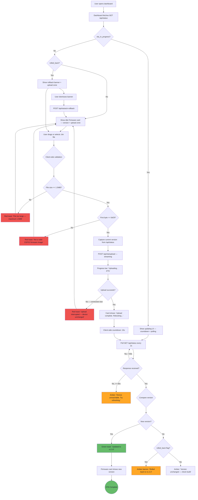
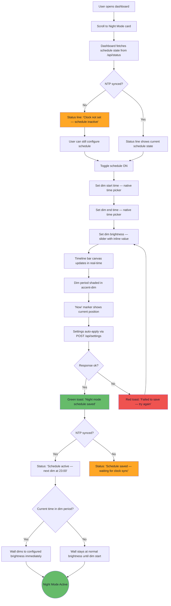
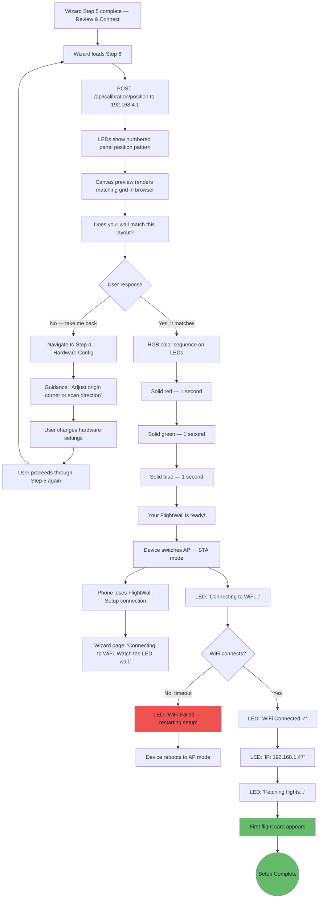
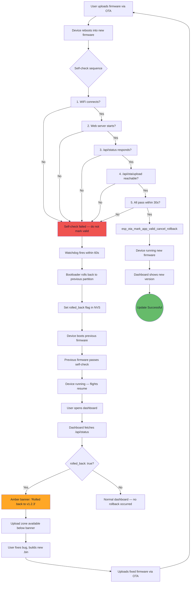
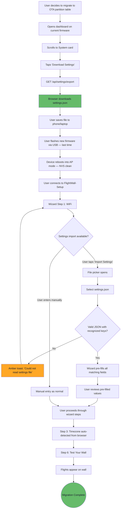

# UX Design Specification — TheFlightWall Foundation Release

**Author:** Christian
**Date:** 2026-04-11

---

## Executive Summary

### Project Vision

The Foundation Release transforms TheFlightWall from "working firmware that requires a laptop" into a "self-sustaining appliance you configure from your phone." Three capabilities close that gap: OTA firmware updates (never need USB again), night mode with brightness scheduling (the wall adapts to your day), and onboarding polish that catches hardware issues before they confuse the user. This UX specification extends the established MVP design system — dark theme, card-based dashboard, toast notifications, hot-reload patterns — with three new interaction surfaces.

### Target Users

**Primary: Christian (project owner)** — Tech-savvy maker, phone-first interaction, configures from the couch. Knows the system deeply but wants zero-friction for routine operations like firmware updates and schedule changes.

**Secondary: Jake (the friend)** — Receives a pre-flashed device, has never used PlatformIO. Needs the setup wizard to guide him through hardware configuration without ever seeing garbled output. Phone-only, no technical background beyond "connect to WiFi."

### Key Design Challenges

1. **OTA reboot dead zone** — During firmware update, the ESP32 reboots and is unreachable for 3-8 seconds. The browser must bridge this gap with a client-side countdown timer and polling, then resolve one of three outcomes: successful update (new version), rollback (same version), or unreachable (no response). The emotional arc must be confidence, patience, relief — never panic.

2. **Rollback communication** — A firmware rollback is a transient, one-time event. It must be surfaced as a persistent amber banner on the Firmware card (not an auto-dismissing toast), showing the rolled-back version and what happened. The user must see this message — it's the difference between "my device recovered itself" and "something silently went wrong."

3. **Night mode midnight-crossing** — Schedules like 23:00-07:00 are the common case but the unintuitive one. A visual timeline bar (00:00 to 24:00 with the dim period shaded) makes the schedule immediately comprehensible without requiring the user to think about edge cases.

4. **"Test Your Wall" in captive portal** — Step 6 runs in AP mode with no internet. Canvas preview and LED pattern must work offline. The back-navigation to hardware settings and return to Step 6 must feel like guided correction, not an error state.

5. **NTP dependency transparency** — Night mode won't activate until the clock syncs. The dashboard must show sync status clearly: "Clock not set — schedule inactive" vs. "Clock synced." No hidden failures.

### Design Opportunities

1. **OTA as trust milestone** — The first successful over-the-air update is the moment the FlightWall becomes an appliance. Client-side version comparison (capture version before upload, compare after reboot) gives instant, reliable feedback. Making this feel polished earns trust in the entire system.

2. **Night mode as "set and forget" proof** — One configuration, correct behavior forever — including across DST transitions and power cycles. The visual timeline makes setup intuitive; the NTP sync indicator provides transparency. If this works perfectly, it validates the appliance promise.

3. **"Test Your Wall" beyond the wizard** — The confirmation pattern ("does your wall match this layout?") is valuable not just during first-time setup but whenever hardware config changes. A "Run Panel Test" button in the dashboard Calibration card reuses the same logic at near-zero incremental cost.

4. **Contextual migration guidance** — Settings Export lives in the System card, but a contextual hint on the Firmware card ("Before migrating to OTA, download your settings backup from the System section below") surfaces it exactly when it matters most — for the user about to repartition who has never seen the export button.

## Core User Experience

### Defining Experience

The Foundation Release has a single defining moment: **the first successful OTA firmware update.** This is the interaction that transforms the FlightWall from a maker project into a self-sustaining appliance. The user uploads a binary from their phone, watches progress, endures a brief reboot, and sees the wall come back to life on new firmware. If this works — feels safe, gives clear feedback, recovers gracefully on failure — every future interaction benefits from earned trust. The USB cable goes in the drawer permanently.

The secondary experiences (night mode, "Test Your Wall") are high-value but low-frequency. Night mode is configured once and forgotten. "Test Your Wall" runs once per hardware change. The OTA flow is the one that recurs and the one that carries real stakes.

### Platform Strategy

| Surface | Foundation Release Changes | Context |
|---------|---------------------------|---------|
| Dashboard | New Firmware card, new Night Mode card, Settings Export button in System card, "Run Panel Test" button in Calibration card | Local network, phone or laptop browser |
| Setup Wizard | New Step 6 ("Test Your Wall"), timezone auto-detection in Step 3, settings import for migration | Captive portal (AP mode), phone browser |
| LED Matrix | Panel position test pattern, RGB color sequence (Step 6 only) | Physical hardware, no browser interaction |

**Constraints carried forward from MVP:**
- All web assets served from ESP32 LittleFS — now reduced to ~896KB (down from ~2MB) due to dual-OTA partition table
- No frontend frameworks — vanilla HTML/JS/CSS with the existing design system
- Captive portal JS limitations still apply for wizard steps
- Canvas preview renders client-side — no additional ESP32 resource cost
- ESPAsyncWebServer max concurrent connections unchanged — dashboard should not auto-poll

**New constraint:** LittleFS budget is tighter. New HTML/JS for Firmware card, Night Mode card, and Step 6 must be minimal. Estimate ~2-3KB additional gzipped web assets total.

### Key Interaction Patterns

#### OTA Upload Flow

The OTA upload is a multi-phase interaction with a client-side state machine:

1. **Pre-upload** — Dashboard JS captures current firmware version from `/api/status`
2. **File selection** — User drags/selects .bin file. Client validates file size (< 1.5MB) and reads first byte for ESP32 magic byte (`0xE9`) before uploading
3. **Upload** — Progress bar shows percentage of bytes transferred, updated every 2 seconds minimum. Upload button disabled during transfer.
4. **Reboot gap** — ESP32 reboots and is unreachable for 3-8 seconds. Dashboard shows local countdown: "Rebooting... reconnecting in 15s." No server communication during this phase.
5. **Reconnection** — Dashboard polls `/api/status` every 2 seconds. Three resolution outcomes:
   - **New version detected** — green toast: "Updated to v1.3.0"
   - **Same version detected** — persistent amber banner on Firmware card: "Firmware rolled back to v1.2.3 — the uploaded version failed its self-check"
   - **No response after 60s** — amber message: "Device unreachable — check WiFi or try refreshing"

#### Night Mode Schedule

- Time pickers for dim start and dim end (native `<input type="time">`)
- Brightness slider for dim level (reuses existing slider pattern)
- **Visual timeline bar** — horizontal 00:00-to-24:00 bar with the dim period shaded in `--accent-dim`. Instantly communicates midnight-crossing schedules without requiring the user to think about edge cases
- **Single-line status indicator**: "Dimmed (10%) until 07:00" / "Schedule active — next dim at 23:00" / "Clock not set — schedule inactive" / "Schedule disabled"
- Enable/disable toggle preserves configured times

#### "Test Your Wall" Confirmation

- LED matrix displays numbered panel position pattern
- Wizard shows matching canvas preview
- Binary question: "Does your wall match this layout?" — Yes / No
- **No** returns to hardware settings (Step 4) with guidance: "Adjust your origin corner or scan direction, then come back"
- **Yes** triggers RGB color sequence (red, green, blue, each held ~1 second) then proceeds to flight fetching
- Answers exactly two questions: panel order and color correctness. Nothing else.

### Effortless Interactions

- **OTA upload** — Drag file onto Firmware card, watch progress, done. No version selection, no release notes, no confirmation dialog. The file IS the action.
- **Night mode setup** — Pick two times, set a brightness, toggle on. Visual timeline confirms the schedule. Settings apply instantly (hot-reload, no reboot). One interaction, permanent result.
- **Settings export** — One button press, browser downloads JSON. No options, no format selection, no filename prompt.
- **Settings import in wizard** — Upload JSON file, wizard pre-fills all fields for review. User confirms and proceeds. No field-by-field re-entry.
- **"Test Your Wall"** — Pattern appears automatically when Step 6 loads. User just answers yes or no. No manual trigger, no configuration.
- **Timezone** — Auto-detected from browser in wizard. User confirms or overrides. No POSIX string entry, no timezone database browsing.

### Critical Success Moments

1. **First OTA update completes** — Progress bar fills, wall goes dark briefly, flights resume. New version confirmed in Firmware card. The USB cable era is over.

2. **First scheduled dim** — Night mode activates at the configured time without intervention. The wall dims. The user doesn't notice until the next morning when it's bright again. It just works.

3. **"Test Your Wall" catches a mismatch** — Jake sees the numbered panels don't match, taps "No," fixes the origin corner, comes back, and it matches. He never sees garbled flight data. The wizard caught the problem before it mattered.

4. **Rollback recovery** — Christian uploads a buggy firmware. The wall goes dark, reboots, and comes back on the old firmware. The dashboard shows exactly what happened. He fixes the bug and uploads again. No USB cable needed.

5. **Settings import after migration** — Christian repartitions, reboots into the wizard, uploads his settings JSON, and all fields pre-fill. Total reconfiguration: 3 minutes of pasting API keys and confirming, not 15 minutes of re-entering everything from scratch.

### Experience Principles

1. **Safety over speed** — OTA must feel safe above all else. Progress visibility, pre-upload validation, graceful rollback, clear error messages. A 30-second update that feels controlled beats a 10-second update that feels uncertain.

2. **Configure once, trust forever** — Night mode, timezone, hardware config — these are set-and-forget. The UX should make initial configuration easy and then become invisible. No recurring maintenance, no daily rituals.

3. **Show the outcome, not the mechanism** — The visual timeline shows when the wall will dim, not how POSIX timezone strings work. The panel test shows numbered squares, not wiring flag values. The rollback banner says "previous version restored," not "watchdog triggered esp_ota_mark_app_valid timeout."

4. **Recovery is a feature, not an edge case** — Rollback, settings export/import, "Test Your Wall" back-navigation — these aren't error handling, they're designed workflows. They should feel as polished as the happy path.

## Desired Emotional Response

### Primary Emotional Goals

**Confidence in the system** — "I can update this device without risk." The OTA flow must make the user feel in control at every step. Pre-upload validation says "we checked before you committed." Progress visibility says "you can see exactly what's happening." Rollback recovery says "even if something goes wrong, the system catches itself." The emotional goal is not excitement — it's the quiet confidence of a well-built tool.

**Relief from maintenance burden** — "I don't have to think about this anymore." Night mode eliminates a daily ritual. OTA eliminates the USB-cable-and-laptop ritual. Settings export eliminates the fear of data loss during migration. Each of these replaces a recurring friction with a one-time setup. The feeling is: weight lifted.

**Trust in self-correction** — "If something breaks, it fixes itself." Rollback is automatic. Night mode survives DST transitions. NTP re-syncs daily. The device handles edge cases the user shouldn't have to think about. The emotional response to a failure isn't panic — it's "the system handled it."

### Emotional Journey Map

| Stage | Feeling | Design Implication |
|-------|---------|-------------------|
| Pre-OTA upload | Mild anxiety — "will this brick my device?" | Pre-upload validation (size + magic byte) and clear "current version" display build confidence before committing |
| During OTA upload | Patience, focus | Progress bar with percentage. Upload button disabled. No other actions possible — the UI communicates "one thing is happening, it's going well" |
| Reboot gap (3-8s) | Uncertainty — wall is dark, dashboard is disconnected | Client-side countdown timer bridges the gap. "Rebooting... reconnecting in 15s" — the browser is still in control even though the device isn't |
| OTA success | Relief, satisfaction | Green toast with new version string. Flights resume. Understated — no confetti, no celebration modal. Just: it worked. |
| OTA rollback | Surprise, then reassurance | Persistent amber banner explains exactly what happened. No panic language. "Previous version restored" — the system caught it |
| Night mode setup | Ease — "that was quick" | Two time pickers, one slider, one toggle. Visual timeline confirms. Done in 30 seconds. |
| Night mode operating | Invisible — the best UX is no UX | The wall dims. The user doesn't notice. The next morning it's bright. No interaction needed. |
| "Test Your Wall" match | Validation — "I got it right" | Green confirmation, RGB color test, immediate transition to flight fetching. Smooth and rewarding. |
| "Test Your Wall" mismatch | Guided correction, not failure | "No" isn't an error — it's a guided path back to fix the issue. Language: "Let's fix that — adjust your settings and come back." No blame, no alarm. |
| Settings import | Convenience — "that saved me time" | Fields pre-fill from JSON. User reviews and confirms. Feels like the system remembers you. |

### Micro-Emotions

**Prioritize:**
- **Confidence** over anxiety — every OTA interaction should reduce uncertainty, not increase it
- **Trust** over skepticism — rollback works, schedules persist, settings survive power cycles
- **Competence** over confusion — status indicators tell you what the system is doing and why
- **Relief** over frustration — one-time setups replace recurring manual effort

**Avoid:**
- **Anxiety** during OTA reboot gap — the countdown timer and polling prevent "is it dead?" panic
- **Helplessness** after rollback — the banner explains what happened and the path forward (fix and re-upload)
- **Doubt** about night mode — the visual timeline and status indicator make the schedule unambiguous
- **Frustration** from re-entering settings — settings import eliminates the worst part of migration

### Design Implications

| Emotion | UX Approach |
|---------|-------------|
| Confidence | Pre-upload validation catches errors before they matter. Progress visibility during upload. Version confirmation after reboot. |
| Relief | Settings export is one click. Night mode is set-and-forget. OTA eliminates the USB workflow forever. |
| Trust | Rollback is automatic and communicated clearly. NTP sync status is visible. Schedule survives DST and power cycles. |
| Competence | Status indicators use plain language: "Dimmed (10%) until 07:00", not "Schedule state: ACTIVE, brightness_override: 10". Error messages name the cause and the recovery. |
| Guided correction | "Test Your Wall" mismatch returns to settings with guidance, not an error screen. Back-navigation preserves state. |

### Emotional Design Principles

1. **Quiet confidence over loud celebration** — A successful OTA update gets a green toast and version confirmation, not a fireworks animation. The emotional register of an infrastructure release is professional competence, not consumer delight. The reward is: it works, reliably, every time.

2. **Transparency builds trust** — NTP sync status, firmware version, rollback notifications, upload progress — the system always tells you what it's doing. Hidden state creates anxiety. Visible state creates trust. Even when the news is bad ("rollback occurred"), honesty earns more trust than silence.

3. **Failure is a guided path, not a dead end** — Rollback, "Test Your Wall" mismatch, settings import — every recovery scenario has clear next steps. The emotional goal is: "okay, I know what to do." Never: "something went wrong and I don't know why."

4. **Invisibility is the highest compliment** — Night mode's best emotional outcome is that the user forgets it exists. The wall dims at night, brightens in the morning, handles DST, survives power cycles — and the user never thinks about it. The absence of friction is the emotional reward.

## UX Pattern Analysis & Inspiration

### Inspiring Products Analysis

**Tesla OTA Updates (Firmware Update UX)**
- Pre-update screen shows release notes, estimated install time, and current version. Clear "Install Now" or "Schedule" choice.
- During install: progress bar with percentage, estimated time remaining, explicit "do not drive" warning. Phone app mirrors the same progress.
- Post-update: "Release notes" screen shows what changed. Version string visible in settings.
- Recovery: If update fails, car reverts to previous version silently. User sees "Update failed — will retry later."
- **Lesson for FlightWall:** The pre-upload validation (size + magic byte check) mirrors Tesla's pre-flight checks. The client-side countdown during reboot mirrors Tesla's "installing, please wait." The version comparison after reboot mirrors Tesla's post-update confirmation. Key difference: FlightWall has no release notes (user-compiled binaries) — just version string confirmation.

**Philips Hue Schedules (Time-Based Automation)**
- Schedule creation: pick a time, pick an action (on/off/scene), pick days. Visual confirmation of what will happen. Toggle to enable/disable without deleting.
- Midnight-crossing: handled transparently. "Turn off at 11pm, turn on at 7am" — two separate schedules, but the UI presents them as one "bedtime routine."
- Timezone: auto-detected from phone. User never sees timezone strings.
- Status: schedule shows "Next: Tonight at 11:00 PM" — one line of context.
- **Lesson for FlightWall:** Night mode should feel this simple. Two times, one brightness, one toggle. The visual timeline bar is our equivalent of Hue's schedule preview. The status line ("Dimmed (10%) until 07:00") mirrors Hue's "Next: Tonight at..." The enable/disable toggle without deleting times is directly adopted from Hue.

**UniFi Network Setup Wizard (Guided Hardware Verification)**
- Device adoption: UniFi discovers devices, shows topology, asks user to confirm physical placement matches the diagram.
- If mismatch: "This doesn't look right? Reassign devices." Returns to configuration without losing other settings.
- Visual feedback: network map updates in real-time as devices are confirmed.
- **Lesson for FlightWall:** "Test Your Wall" is essentially device adoption for LED panels. Show the expected layout, ask "does this match?", return to config on "No." The canvas preview is our network map. The key pattern is: **verify before proceeding, not debug after failing.**

**ESPHome Dashboard (ESP32 OTA Peer)**
- OTA upload: drag .bin file, progress log scrolls in real-time, clear success/failure message.
- No reboot dead zone — ESPHome maintains a WebSocket connection and detects disconnection/reconnection.
- Error handling: "Upload failed: binary too large for partition" — specific, actionable.
- **Lesson for FlightWall:** ESPHome's error specificity is the standard to match. "Not a valid ESP32 firmware image" and "Binary exceeds partition capacity (1.5MB)" — not "Upload failed." The reboot dead zone handling differs (we use polling, not WebSocket) but the principle is the same: bridge the gap with client-side state.

### Transferable UX Patterns

**OTA Update Patterns:**
- **Pre-flight validation** (Tesla, ESPHome) — Check before committing. File size, format validation, partition capacity. Reject early with a specific message. Applied to: Firmware card client-side validation before upload.
- **Progress with estimated completion** (Tesla) — Percentage-based progress bar updated every 2 seconds. Applied to: OTA upload progress indicator.
- **Version comparison for state resolution** (Tesla) — Capture before, compare after. Three outcomes: success, rollback, unreachable. Applied to: Client-side reboot recovery logic.
- **Persistent notification for critical events** (Tesla) — Update results stay visible until dismissed, not auto-dismissed. Applied to: Rollback amber banner on Firmware card.

**Scheduling Patterns:**
- **Visual schedule preview** (Philips Hue) — Show what the schedule means visually, not just the numbers. Applied to: 24-hour timeline bar with dim period shaded.
- **Single-line status** (Philips Hue) — "Next: Tonight at 11:00 PM." One line communicates schedule state. Applied to: Night Mode status indicator.
- **Enable/disable without delete** (Philips Hue) — Toggle preserves configuration. Applied to: Night mode enable/disable toggle.
- **Auto-detect timezone** (Philips Hue, every modern smart device) — Use the phone's timezone. User confirms or overrides. Applied to: Wizard Step 3 `Intl.DateTimeFormat` auto-detection.

**Hardware Verification Patterns:**
- **Verify-then-proceed** (UniFi) — Confirm physical reality matches expected state before moving forward. Applied to: "Test Your Wall" Step 6.
- **Guided correction on mismatch** (UniFi) — "Doesn't match? Let's fix it." Returns to config, not an error state. Applied to: "No" path in Step 6 returning to hardware settings.
- **Visual digital twin** (UniFi network map) — Real-time representation of physical hardware state. Applied to: Canvas preview matching LED panel layout.

### Anti-Patterns to Avoid

- **ESPHome's log-dump progress** — Real-time scrolling build logs are developer-appropriate but wrong for a consumer-facing OTA UI. FlightWall should show a clean progress bar, not raw flash write logs.
- **Generic "update failed" messages** — Many IoT devices show "Update failed. Try again." with no cause. Every OTA error must name the specific cause: size, format, connection, or boot failure.
- **Hue's separate schedule creation for midnight-crossing** — Hue requires two schedules for an overnight routine. FlightWall's visual timeline bar treats midnight-crossing as one schedule natively — simpler mental model.
- **"Are you sure?" before OTA upload** — Confirmation dialogs for OTA create doubt. The pre-upload validation (size + magic byte) is the safety gate. If validation passes, the file is ready. No additional "are you sure?" — that implies the system isn't confident, which undermines trust.
- **Auto-refreshing dashboard during OTA** — Some IoT dashboards poll the device continuously. During OTA, this would interfere with the upload stream. The dashboard must stop all background polling during an active upload and only resume polling during the post-reboot reconnection phase.

### Design Inspiration Strategy

**Adopt directly:**
- Tesla's version-comparison state resolution (capture before, compare after, three outcomes)
- Philips Hue's single-line schedule status and enable/disable toggle pattern
- UniFi's verify-then-proceed hardware confirmation flow
- ESPHome's specific error messages for OTA failures

**Adapt:**
- Tesla's progress UI — simplified for a single progress bar (no release notes, no "schedule for later," no phone mirror)
- Hue's schedule creation — collapsed into one form instead of two separate schedules for overnight
- UniFi's guided correction — adapted for LED panel wiring flags instead of network device placement

**Innovate:**
- **Visual timeline bar for midnight-crossing schedules** — No reference product handles this in a single visual. The shaded 24-hour bar is a novel pattern that communicates schedule semantics instantly.
- **Client-side OTA state machine with polling** — Unique to constrained devices where the server goes offline during update. The countdown timer + polling + version comparison is a bespoke pattern for the ESP32 reboot gap.

**Avoid:**
- Raw log output during OTA (ESPHome anti-pattern)
- Generic failure messages without specific cause
- Confirmation dialogs for non-destructive validated actions
- Auto-polling during active OTA uploads

## Design System Foundation

### Design System Choice

**Extend the existing minimal custom stylesheet** — The MVP established a hand-written CSS file (`style.css`, ~3-5KB uncompressed) with CSS custom properties for theming. The Foundation Release adds new dashboard cards and a wizard step that use the same design tokens, component patterns, and interaction conventions. No new framework, no new design system. Same `style.css`, new selectors.

### Rationale for Selection

- **Design system already exists and works** — The dark theme, card layout, slider patterns, toast notifications, status indicators, and button hierarchy are all established in the current `style.css` and `dashboard.html`. The Foundation Release builds on this, not beside it.
- **LittleFS budget is tighter** — With the dual-OTA partition table reducing LittleFS from ~2MB to ~896KB, adding any CSS framework is out of the question. The incremental CSS for Foundation features should add no more than ~500 bytes gzipped.
- **Consistency with existing dashboard** — The Firmware card and Night Mode card must look and feel identical to the existing Display, Timing, Network, Hardware, and System cards. Same `.card` container, same `.form-fields` layout, same `.range-row` sliders, same toast feedback.
- **Solo developer** — One person, one stylesheet, full understanding. No framework learning curve, no dependency updates, no build toolchain.

### Implementation Approach

**New CSS patterns needed (additions to existing `style.css`):**

| Pattern | CSS Class | Used In | Estimated Size |
|---------|-----------|---------|----------------|
| Upload zone | `.upload-zone` | Firmware card — drag/drop .bin file area | ~15 lines |
| Progress bar | `.ota-progress` | Firmware card — upload percentage bar | ~10 lines |
| Persistent banner | `.banner-warning` | Firmware card — rollback notification | ~10 lines |
| Timeline bar | `.schedule-timeline` | Night Mode card — 24-hour visual bar with shaded dim period | ~15 lines |
| Status line | `.schedule-status` | Night Mode card — single-line NTP/schedule status | ~5 lines |
| Time input pair | `.time-picker-row` | Night Mode card — dim start/end time inputs side by side | ~5 lines |
| Confirmation prompt | `.confirm-prompt` | Wizard Step 6 — "Does your wall match?" Yes/No buttons | ~10 lines |

**Total estimated addition:** ~70 lines of CSS, ~300 bytes gzipped. Well within budget.

**Reused existing patterns (no new CSS):**

| Existing Pattern | Reused In |
|-----------------|-----------|
| `.card` | Firmware card container, Night Mode card container |
| `.form-fields` | Night Mode settings layout |
| `.range-row` + `.range-val` | Night Mode dim brightness slider |
| `.btn-primary` | OTA upload button, Step 6 "Yes" button |
| `.btn-secondary` | Step 6 "No — take me back" button |
| `.toast` | OTA success/error, Night Mode save confirmation |
| `.btn-danger` | (no new uses) |
| `.helper-copy` | Contextual hints (migration backup, NTP status) |
| `.apply-btn` | Night Mode apply (if not hot-reload) |

**New JS components (additions to existing `dashboard.js`):**

| Component | Estimated Lines | Purpose |
|-----------|----------------|---------|
| OTA upload handler | ~60 lines | File selection, client-side validation, XMLHttpRequest with progress, reboot countdown, version polling |
| Night Mode card | ~40 lines | Time pickers, timeline bar rendering, schedule status fetch, toggle |
| Settings export | ~10 lines | `GET /api/settings/export`, trigger browser download |
| Rollback banner | ~15 lines | Check `/api/status` for rollback flag on page load, show/dismiss |

**New JS for wizard (`wizard.js` or inline in wizard HTML):**

| Component | Estimated Lines | Purpose |
|-----------|----------------|---------|
| Step 6 "Test Your Wall" | ~30 lines | Trigger panel test pattern, render canvas preview, Yes/No navigation |
| Timezone auto-detect | ~5 lines | `Intl.DateTimeFormat().resolvedOptions().timeZone` pre-fill |
| Settings import | ~25 lines | FileReader for JSON, pre-fill wizard fields, validate keys |

### Customization Strategy

**No customization needed** — The Foundation Release uses the MVP design system as-is. Same colors, same spacing, same typography, same dark theme. The new components (upload zone, progress bar, timeline bar, persistent banner) are styled to match existing patterns using the established CSS custom properties:

- Upload zone: `--bg-input` background, `--accent-dim` dashed border, `--accent` on hover/drag
- Progress bar: `--accent` fill on `--bg-input` track
- Rollback banner: `--warning` background with `--bg-primary` text
- Timeline bar: `--bg-input` track, `--accent-dim` shaded dim period
- Status line: `--text-secondary` text with `.status-dot` (green/amber/red) prefix

All new components inherit the existing design language. No new colors, no new fonts, no new spacing values.

## Defining Core Experience

### The Defining Interaction

*"I updated my wall's firmware from my phone."*

This is what Christian tells Jake. This is the sentence that proves the FlightWall crossed from maker project to appliance. The defining interaction is the complete OTA upload cycle: open dashboard, select file, watch progress, wait through reboot, see flights resume on new firmware. Five phases, thirty seconds, zero cables.

The supporting experiences have their own defining sentences:
- Night mode: *"The wall dims itself at night and I never touch it."*
- Test Your Wall: *"The wizard told me my panels were wired wrong before I ever saw a problem."*

### User Mental Model

**Expected model: Phone app update**

Users have updated phone apps thousands of times. The mental model is: tap "Update," progress bar fills, app restarts, done. OTA firmware updates are mechanically similar but carry higher stakes — bricking a phone app is impossible, but bricking an ESP32 is a real fear (even if rollback prevents it).

**Where FlightWall matches the model:**
- Select file, watch progress, it reboots, it works — same arc as any update
- Version string confirms the update took — same as checking app version in Settings

**Where FlightWall breaks the model:**
- **The file comes from the user, not a store** — Christian builds the binary himself. There's no curated update channel, no "what's new" screen. The file IS the update. Client-side validation (size + magic byte) replaces the trust normally provided by an app store.
- **The device goes offline during reboot** — Phone apps update in-place. The ESP32 reboots and the dashboard connection drops. The countdown timer bridges this gap with the "restarting..." mental model users know from phone reboots.
- **Rollback is invisible in apps but explicit here** — App stores handle bad updates silently. FlightWall makes rollback visible because the user needs to know what happened and what to do next.

**Night mode mental model: Smart home schedule.** Set a schedule, forget about it. The visual timeline bar adds clarity that most smart home apps lack.

**"Test Your Wall" mental model: Hardware setup confirmation.** Show a pattern, ask "does this look right?", fix if not.

### Success Criteria

| Criterion | Target | Measurement |
|-----------|--------|-------------|
| OTA upload to flights resuming | Under 60 seconds | From file selection to live flight data on LEDs |
| OTA progress visibility | No >2s gap without feedback | Progress bar updates during upload; countdown during reboot; polling during reconnection |
| Rollback communication | User knows within 10s | Amber banner visible on first dashboard load after rollback |
| Page refresh during OTA | No stranded state | Dashboard detects `ota_in_progress` flag and shows appropriate UI |
| Night mode configuration | Under 30 seconds | From opening Night Mode card to schedule active |
| Night mode correctness | 100% across DST | Schedule fires at correct local time through DST transitions |
| "Test Your Wall" completion | Under 60 seconds | From Step 6 load to either "Yes" confirmation or return to Step 4 |
| Settings export | One tap | Button press to JSON file in Downloads |
| Settings import | Under 3 minutes | From JSON upload to completed wizard (including review) |

### Novel vs. Established Patterns

**Established patterns (adopt directly):**
- File upload with drag/drop zone — standard web pattern, no learning curve
- Progress bar with percentage — universal, immediately understood
- Time pickers for schedule — native `<input type="time">`, familiar on every phone
- Enable/disable toggle — standard switch pattern
- "Does this look right?" confirmation — printer/TV calibration pattern

**Adapted patterns:**
- **Client-side reboot recovery** — Adapted from Tesla's post-update confirmation. Countdown timer + polling for the ESP32's brief offline window.
- **Version comparison for state detection** — Capture version before, compare after, resolve the outcome.

**Novel patterns:**
- **Visual 24-hour timeline bar** — No standard IoT UI shows a time schedule as a shaded horizontal bar. Minimal code (`
` with CSS gradient or thin `<canvas>`), high clarity.
- **Persistent rollback banner with NVS-backed state** — Rollback flag stored in NVS (survives power cycles), cleared via `POST /api/ota/ack-rollback` when user dismisses. Most IoT devices handle rollback silently — FlightWall makes it explicit.
- **OTA-aware dashboard load** — `/api/status` includes `ota_in_progress` flag. Dashboard renders the correct Firmware card state on every load, even after page refresh mid-upload.

### Experience Mechanics

#### Firmware Card — Three States

The Firmware card has three mutually exclusive states, resolved on every dashboard load by checking `/api/status`:

| State | Condition | UI |
|-------|-----------|-----|
| **Idle** | `ota_in_progress: false`, `rolled_back: false` | Current version display + upload zone + contextual migration hint (if pre-OTA device) |
| **Updating** | `ota_in_progress: true` | "Firmware update in progress..." + reboot countdown + reconnection polling. No upload zone. |
| **Rolled back** | `rolled_back: true` | Persistent amber banner: "Firmware rolled back to v1.2.3 — the uploaded version failed its self-check." + upload zone below for retry. Dismiss button sends `POST /api/ota/ack-rollback`. |

This handles the page-refresh-during-OTA scenario: user refreshes, dashboard loads, fetches `/api/status`, sees `ota_in_progress: true`, and displays the updating UI instead of a stale idle card.

#### OTA Upload — Step by Step

**1. Initiation:**
- User opens dashboard, scrolls to Firmware card (idle state)
- Card shows: current version (e.g., "v1.2.3"), upload zone, contextual hint for pre-OTA devices

**2. Client-side Validation (instant, before upload):**
- File size > 1.5MB → red toast: "File too large — maximum 1.5MB for OTA partition"
- First byte !== `0xE9` → red toast: "Not a valid ESP32 firmware image"
- Both pass → proceed

**3. Upload (5-30 seconds):**
- `XMLHttpRequest` POST to `/api/ota/upload` with `upload.onprogress` event listener
- Progress bar fills with percentage: "Uploading... 47%"
- Progress is purely client-side (browser tracks bytes sent) — zero ESP32 overhead
- Upload button replaced by progress bar. All dashboard polling suspended.

**4. Reboot Gap (3-15 seconds):**
- Server responds success → card transitions to updating state
- Local countdown: "Rebooting... reconnecting in 15s"
- Wall goes dark briefly. No server communication — purely client-side timer.

**5. Reconnection and Resolution (2-10 seconds):**
- Countdown reaches 0 → poll `GET /api/status` every 2 seconds
- **Success:** New version → green toast: "Updated to v1.3.0" → card returns to idle with new version
- **Rollback:** Same version + `rolled_back: true` → card shows rolled-back state with amber banner
- **Unreachable:** No response after 60s → amber message: "Device unreachable. Try refreshing."

#### Night Mode — Step by Step

**1. Initiation:** Open Night Mode card. Shows toggle, time pickers, brightness slider, timeline bar, status line.

**2. Configuration:** Toggle on, set times, set brightness. Timeline bar updates in real-time. Status line shows next event or NTP sync state.

**3. Save:** `POST /api/settings` — hot-reload, no reboot. Green toast: "Night mode schedule saved."

**4. Operation:** Invisible. Wall dims and restores automatically. Survives power cycles, DST, NTP re-syncs.

#### "Test Your Wall" — Step by Step

**1. Initiation (wizard Step 6, automatic):**
- Wizard sends `POST /api/calibration/position` to `192.168.4.1` (AP gateway)
- LEDs show numbered panel position pattern. Canvas preview renders matching grid.

**2. Confirmation:** "Does your wall match this layout?" — Yes (primary) / No (secondary)

**3a. Mismatch ("No"):** Navigate back to Step 4. Guidance: "Adjust your origin corner or scan direction." User fixes settings, returns to Step 6.

**3b. Match ("Yes"):**
- RGB color sequence on LEDs: red (1s) → green (1s) → blue (1s)
- "Your FlightWall is ready! Fetching your first flights..."
- **AP→STA transition:** Device switches from AP mode to STA mode (connects to configured WiFi). The phone's connection to `FlightWall-Setup` drops. Wizard page shows: "Your FlightWall is connecting to WiFi. Watch the LED wall for progress. Once connected, access the dashboard at flightwall.local or the device IP."
- Wizard page becomes non-functional — same pattern as existing Step 5→STA transition in the MVP.

## Visual Design Foundation

### Color System

**Inherited from MVP — no changes to the palette.** All existing CSS custom properties carry forward:

| Token | Value | Foundation Release Usage |
|-------|-------|------------------------|
| `--bg-primary` | `#1a1a2e` | Page background (unchanged) |
| `--bg-surface` | `#222240` | Firmware card, Night Mode card backgrounds |
| `--bg-input` | `#2a2a4a` | Upload zone background, timeline bar track, time picker backgrounds |
| `--text-primary` | `#e0e0e0` | Card headings, firmware version string, schedule times |
| `--text-secondary` | `#b0b0c0` | Helper text, NTP status line, upload hints |
| `--accent` | `#4fc3f7` | Upload button, progress bar fill, active timeline segment border, "Yes" button |
| `--accent-dim` | `#2a6a8a` | Upload zone dashed border, timeline bar dim period fill, inactive states |
| `--success` | `#66bb6a` | OTA success toast, "Clock synced" status dot, Step 6 "match" confirmation |
| `--warning` | `#ffa726` | Rollback banner text accent, "Clock not set" status dot, reboot countdown text |
| `--error` | `#ef5350` | OTA error toast (invalid file, too large), upload failure |

**New color applications specific to Foundation features:**

- **Rollback banner:** Background `#2d2738` (computed: 15% `--warning` blended on `--bg-surface`). Hardcoded hex instead of CSS `opacity` or `color-mix()` for captive portal WebKit compatibility. Left border: 4px solid `--warning`. Text in `--text-primary`. Verified AAA contrast (~10:1). Distinct from toasts — banners are persistent, rectangular, full-width within the card.
- **OTA progress bar:** `--accent` fill on `--bg-input` track. Matches the existing slider track aesthetic.
- **Timeline bar dim period:** `--accent-dim` fill on `--bg-input` track via `<canvas>` (not CSS gradient — canvas handles midnight-crossing schedules cleanly with two `fillRect` calls). Consistent with existing canvas rendering patterns in the dashboard layout preview.
- **Timeline bar "now" marker:** Thin vertical line (1px) in `--accent` at the current hour position, rendered on the canvas. Updated on page load (not live). Communicates "you are here" relative to the schedule.
- **Timeline bar hour markers:** `--text-secondary` at `--font-size-sm`. Tick marks at 00, 06, 12, 18, 24 below the canvas.

### Typography System

**Inherited from MVP — no changes.** Same system font stack, same three-size scale:

| Token | Size | Foundation Release Usage |
|-------|------|------------------------|
| `--font-size-lg` | `1.25rem` | "Firmware", "Night Mode" card headings |
| `--font-size-md` | `1rem` | Version string, schedule times, status text, button labels |
| `--font-size-sm` | `0.85rem` | Upload hints, NTP status line, timeline hour markers, contextual migration hint |

**New typography applications:**
- **Firmware version string:** `--font-size-md`, `--text-primary`, weight 400. Displayed as "v1.2.3".
- **Rollback banner text:** `--font-size-md`, `--text-primary`, weight 400. "Firmware rolled back to v1.2.3 — the uploaded version failed its self-check."
- **OTA progress percentage:** `--font-size-md`, `--text-primary`, weight 600. Centered within or beside the progress bar: "47%"
- **Schedule status line:** `--font-size-sm`, `--text-secondary`, with `.status-dot` prefix. "Dimmed (10%) until 07:00"

### Spacing & Layout Foundation

**Inherited from MVP — no changes to the spacing scale or layout structure.**

**New component spacing:**

| Component | Internal Spacing | Notes |
|-----------|-----------------|-------|
| Firmware card | `--space-md` (16px) padding, `--space-md` between upload zone and version display | Same as all other cards |
| Night Mode card | `--space-md` padding, `--space-sm` (8px) between time pickers in a row, `--space-md` between form groups | Time pickers side by side: "Start [23:00] End [07:00]" |
| Timeline bar | Height: 24px `<canvas>`. Full card width minus padding. `--space-sm` margin top/bottom. | Canvas element — handles midnight-crossing with two fillRect calls |
| Rollback banner | `--space-sm` padding, `--space-md` margin bottom | Full card width, 4px left border |
| OTA progress bar | Height: 8px. Full card width minus padding. | Thin, matches slider track aesthetic |
| Step 6 canvas preview | Same sizing as existing calibration canvas | Reuses existing preview container |
| Step 6 button pair | `--space-sm` gap, full width, side by side | Primary (Yes) left, secondary (No) right |

**Card ordering in dashboard (top to bottom):**

1. Display (existing)
2. Timing (existing)
3. Network & API (existing)
4. **Firmware** (new) — below daily-use cards, above hardware config. Most-used cards (Display, Timing) stay above the fold on phone screens.
5. **Night Mode** (new) — paired with Firmware as Foundation Release additions
6. Hardware (existing)
7. Calibration (existing) — with new "Run Panel Test" secondary button
8. Location (existing)
9. Logos (existing)
10. System (existing) — with new "Download Settings" button

### Accessibility Considerations

**Inherited from MVP — all WCAG AA contrast ratios verified.**

**Foundation-specific accessibility notes:**

- **Rollback banner:** `--text-primary` (`#e0e0e0`) on `#2d2738` background — verified ~10:1 contrast ratio (AAA). Hardcoded background avoids CSS opacity/color-mix compatibility issues.
- **Timeline bar:** Canvas visualization is supplementary — schedule values communicated via time picker inputs and status line text (both AA compliant). The "now" marker adds context but is not the sole information channel.
- **Time pickers:** Native `<input type="time">` elements inherit platform accessibility automatically.
- **Upload zone:** Requires `role="button"`, `tabindex="0"`, and Enter/Space key handlers for keyboard accessibility on the wrapping `
`.
- **Step 6 buttons:** 44x44px minimum touch targets via existing `.btn-primary` / `.btn-secondary` sizing.
- **OTA progress bar:** `--accent` on `--bg-input` at 3.2:1 — acceptable for decorative/status element per WCAG 1.4.11 (non-text contrast minimum 3:1).

## Design Direction Decision

### Design Directions Explored

A single focused direction was explored rather than multiple abstract variations, given that the visual foundation is already established from the MVP UX design specification. The existing dark utility dashboard — navy-black backgrounds, light blue accent, card-based sections, single-column phone-first layout — carries forward unchanged. The Foundation Release adds components, not a new visual direction.

The design exploration focused on **how the three new Foundation components render within the existing system**: the Firmware card's three states (idle, updating, rolled back), the Night Mode card with timeline bar and status indicator, and the wizard's "Test Your Wall" step.

### Chosen Direction

**Extend the existing dark utility dashboard** — same visual language, new components. The Firmware card, Night Mode card, and Step 6 wizard screen inherit all existing design tokens and component patterns. No visual departure from the MVP.

**Key component decisions:**
- **Firmware card idle state:** Version string prominently displayed, upload zone with dashed `--accent-dim` border, drag/drop + tap to select
- **Firmware card updating state:** Full-width progress bar (8px, `--accent` on `--bg-input`), percentage text, then countdown timer and polling status — replaces the upload zone during update
- **Firmware card rolled-back state:** `#2d2738` banner with 4px `--warning` left border, dismiss button, upload zone below for retry
- **Night Mode card:** Toggle, side-by-side time pickers, brightness slider, 24px canvas timeline bar with dim period shaded and "now" marker, single-line status text with status dot
- **Step 6 "Test Your Wall":** Canvas preview (reusing calibration preview pattern), "Does your wall match?" prompt, Yes/No button pair (primary + secondary, side by side)

### Design Rationale

- **No new visual direction needed** — The MVP design system is comprehensive, tested, and appropriate for the Foundation Release's component additions
- **Component consistency** — New cards use identical patterns to existing cards (`.card`, `.form-fields`, `.range-row`, `.toast`). A user who knows the Display card already knows how to use the Night Mode card.
- **Novel elements are minimal** — The timeline bar canvas, rollback banner, and OTA progress bar are the only truly new visual elements. All three are simple, purposeful additions that don't introduce visual complexity.
- **LittleFS budget respected** — ~70 lines of new CSS (~300 bytes gzipped). No new visual patterns that would bloat the stylesheet.

### Implementation Approach

The new components are implemented directly in the existing `style.css`, `dashboard.html`, `dashboard.js`, and wizard files. No separate design artifacts beyond this UX specification are needed — the component descriptions, spacing tables, and color applications documented in the Visual Design Foundation and Design System Foundation sections serve as the implementation spec.

## User Journey Flows

### Journey 1: The Last USB Flash — OTA Upload Flow

**Key decisions:**
- Dashboard load always checks `/api/status` for `ota_in_progress` and `rolled_back` flags — handles page refresh during OTA and post-rollback state
- Client-side validation (size + magic byte) happens before any upload begins — fast rejection, no server load
- Progress bar is purely client-side via `XMLHttpRequest.upload.onprogress` — zero ESP32 overhead
- Version comparison is the resolution mechanism — three outcomes: new version (success), same version with rollback flag (rolled back), same version without flag (unchanged build)
- Rollback banner persists in NVS until user dismisses via `POST /api/ota/ack-rollback`

### Journey 2: Living Room at Midnight — Night Mode Setup

**Key decisions:**
- NTP sync status shown proactively — user sees "Clock not set" before wondering why the schedule isn't working
- Configuration is allowed even without NTP sync — settings save to NVS, schedule activates once clock syncs
- Timeline bar updates in real-time as times change — immediate visual feedback
- Hot-reload via `POST /api/settings` — no reboot needed for schedule changes
- If current time is already within the dim period when saving, brightness applies immediately

### Journey 3: Fresh Start Done Right — "Test Your Wall"

**Key decisions:**
- Step 6 auto-triggers the panel position pattern — no manual "start test" button needed
- Canvas preview reuses the existing calibration preview component from the dashboard
- "No" loops back to Step 4 with guidance text, not an error message — guided correction
- RGB color test runs automatically after "Yes" — confirms both panel order AND color wiring in one step
- AP→STA transition happens after "Yes" — the wizard page explicitly tells the user to look at the wall, acknowledging the WiFi drop

### Journey 4: The Bad Flash — OTA Rollback Recovery

**Key decisions:**
- Self-check is a 5-step gate: WiFi, web server, `/api/status`, `/api/ota/upload`, all within 30 seconds. If any step fails, partition is NOT marked valid.
- Watchdog triggers rollback within 60 seconds total — no user intervention needed
- Rollback flag set in NVS (persists across power cycles) — user sees the banner whenever they next open the dashboard, even if hours later
- The upload zone is available below the rollback banner — the user can immediately upload a fixed binary without dismissing the banner first
- The banner is dismissible via `POST /api/ota/ack-rollback` but doesn't block any actions

### Journey 5: Settings Migration — Export and Import

**Key decisions:**
- Settings export is a single GET endpoint returning JSON with `Content-Disposition: attachment` — browser handles the download natively
- Settings import is client-side only — FileReader parses JSON, pre-fills wizard form fields. No new server endpoint needed (~40 lines JS).
- Import validates JSON structure but ignores unrecognized keys — forward-compatible if config schema changes
- Pre-filled fields are editable — the user reviews and can modify before proceeding. Import is a convenience, not an override.
- Import is offered as an option in Step 1 of the wizard, not a separate flow. If the user doesn't have a settings file, they proceed normally.

### Journey Patterns

| Pattern | Implementation | Used In |
|---------|---------------|---------|
| Toast confirmation | Slide-in notification, severity-colored, 2-5s auto-dismiss | J1, J2, J5 |
| Persistent banner | Full-width within card, `#2d2738` background, dismiss button | J1, J4 |
| Client-side state machine | JS tracks phases (idle/uploading/rebooting/polling) | J1 |
| Hot-reload settings | POST /api/settings → ESP32 applies → LED updates < 1s | J2 |
| Canvas preview | Client-side rendering of hardware state | J3 |
| Guided correction | "No" returns to fixable step with guidance text | J3 |
| AP→STA transition | Wizard warns of WiFi drop, directs user to watch LEDs | J3, J5 |
| NVS-backed state flags | `rolled_back` persists across power cycles until acknowledged | J4 |
| Client-side file validation | FileReader checks before upload (size, magic byte, JSON) | J1, J5 |
| Version comparison | Capture before, compare after, resolve outcome | J1, J4 |

### Flow Optimization Principles

1. **No dead ends** — Every error state has a recovery path. OTA fails → device unchanged, upload again. Rollback → banner explains + upload zone available. WiFi fails → AP mode. Import fails → manual entry.

2. **Minimum steps to value** — OTA: select file → done. Night mode: two times + one slider → done. Settings export: one tap → done. No unnecessary intermediate screens.

3. **Feedback at every state change** — Progress bar during upload, countdown during reboot, polling status during reconnection, toast on save, banner on rollback, status line for schedule state.

4. **Destructive actions are gated, routine actions are instant** — Factory reset: confirmation. Logo delete: confirmation. Everything else: immediate. OTA upload has no confirmation — pre-upload validation is the gate.

5. **Client-side intelligence, server-side simplicity** — Validation, progress tracking, version comparison, reboot recovery, timeline rendering, settings import parsing — all happen in the browser. The ESP32 serves data and accepts commands. This respects the device's resource constraints.

## Component Strategy

### Design System Components

**Available from existing `style.css` + `dashboard.html` (no new CSS needed):**

| Component | CSS Pattern | Reused In Foundation Release |
|-----------|------------|------------------------------|
| Section container | `.card` | Firmware card, Night Mode card |
| Form layout | `.form-fields` | Night Mode settings, wizard Step 6 |
| Slider with value | `.range-row` + `.range-val` | Night Mode dim brightness |
| Primary button | `.btn-primary` / `.apply-btn` | OTA upload trigger, Step 6 "Yes" |
| Secondary button | `.btn-secondary` | Step 6 "No — take me back" |
| Danger button + confirm | `.btn-danger` + `.reset-row` | (no new uses — pattern reference only) |
| Toast notification | `.toast` | OTA success/error, Night Mode save, import feedback |
| Helper text | `.helper-copy` | Migration hint, NTP status, upload instructions |
| Canvas preview | `.preview-container` + `<canvas>` | Step 6 panel test preview, timeline bar |
| Sticky action bar | `.apply-bar` | Night Mode apply (if not auto-save) |
| File upload zone | `.logo-upload-zone` | Adapted for OTA upload and settings import |
| Collapsible section | `.calibration-toggle` pattern | (existing pattern, reused for Night Mode if needed) |

**Coverage assessment:** The existing design system covers ~65% of Foundation component needs directly. The remaining ~35% requires six new component patterns — all built with existing CSS custom properties and consistent with the established visual language.

### Custom Components

#### OTA Upload Zone (`.ota-upload-zone`)

**Purpose:** Drag-and-drop area for selecting a `.bin` firmware file, with client-side validation feedback before upload begins.

**Content:** Upload prompt text, file format hint, selected filename after pick.

**Actions:** Drag file onto zone, click/tap to open file picker, file auto-validates on selection.

**States:**

| State | Visual | Trigger |
|-------|--------|---------|
| Empty | Dashed `--accent-dim` border, "Drag .bin file here or tap to select" | Default on card load |
| Drag hover | Border becomes solid `--accent`, background lightens slightly | File dragged over zone |
| File selected (valid) | Filename displayed, upload button enabled | File passes size + magic byte check |
| File selected (invalid) | Red toast appears, zone resets to empty | File fails validation |
| Uploading | Zone replaced by progress bar component | Upload begins |

**Variants:** None — single size, full card width.

**Accessibility:** `role="button"`, `tabindex="0"`, Enter/Space triggers file picker. `aria-label="Select firmware file for upload"`. Drag-and-drop is progressive enhancement — tap-to-select is the primary path.

**Interaction:** Reuses structural pattern from `.logo-upload-zone` but with different validation logic (size ≤ 1.5MB, first byte `0xE9`) and single-file selection (no `multiple` attribute).

**Estimated CSS:** ~15 lines (extends `.logo-upload-zone` with state modifiers).

#### OTA Progress Bar (`.ota-progress`)

**Purpose:** Visual indicator of firmware upload progress from 0-100%.

**Content:** Percentage text centered or right-aligned.

**Actions:** None — read-only status indicator.

**States:**

| State | Visual | Trigger |
|-------|--------|---------|
| Progressing | `--accent` fill on `--bg-input` track, "47%" text | `XMLHttpRequest.upload.onprogress` events |
| Complete | Full bar, brief hold before transitioning to countdown | Upload response received |

**Variants:** None — single 8px height bar, full card width.

**Accessibility:** `role="progressbar"`, `aria-valuenow`, `aria-valuemin="0"`, `aria-valuemax="100"`, `aria-label="Firmware upload progress"`. Percentage text provides non-visual fallback.

**Interaction:** Pure display — no user interaction. Updates minimum every 2 seconds per UX spec.

**Estimated CSS:** ~10 lines.

#### Persistent Banner (`.banner-warning`)

**Purpose:** Non-dismissing (until user action) notification within a card for critical state information — specifically OTA rollback events.

**Content:** Icon (optional CSS triangle or unicode), message text, dismiss button.

**Actions:** Dismiss button sends `POST /api/ota/ack-rollback` and removes banner.

**States:**

| State | Visual | Trigger |
|-------|--------|---------|
| Visible | `#2d2738` background, 4px `--warning` left border, `--text-primary` text | `rolled_back: true` in `/api/status` |
| Dismissed | Hidden (removed from DOM) | User clicks dismiss, API confirms |

**Variants:** None currently. Pattern could extend to info/success banners in future releases, but Foundation only needs warning.

**Accessibility:** `role="alert"`, `aria-live="polite"`. Dismiss button: `aria-label="Dismiss rollback notification"`. Hardcoded `#2d2738` background (not `color-mix()`) for captive portal WebKit compatibility. Text contrast verified AAA (~10:1).

**Interaction:** Appears on page load when rollback flag is set. Persists across page refreshes (NVS-backed). Does not block other card actions — upload zone appears below the banner.

**Estimated CSS:** ~10 lines.

#### Timeline Bar (`.schedule-timeline`)

**Purpose:** 24-hour visual representation of the night mode schedule, showing dim period as a shaded region with a "now" marker.

**Content:** Canvas element (24px height) with hour markers (00, 06, 12, 18, 24) below.

**Actions:** None — read-only visualization. Updates in real-time as time picker values change.

**States:**

| State | Visual | Trigger |
|-------|--------|---------|
| Schedule set | Dim period shaded `--accent-dim` on `--bg-input` track, "now" marker as 1px `--accent` vertical line | Time pickers have values |
| Midnight-crossing | Two `fillRect` calls: 00:00-end and start-24:00 | Dim start > dim end |
| No schedule | Empty track, no shading | Toggle off or times empty |
| No NTP | Track renders normally but status line below indicates clock not set | NTP not synced |

**Variants:** None — full card width, fixed 24px height.

**Accessibility:** Canvas is supplementary visualization — all schedule information is communicated via time picker inputs and status line text. `aria-hidden="true"` on canvas. Hour markers rendered as HTML text below canvas (not canvas text).

**Interaction:** Real-time update as user changes time picker values. "Now" marker calculated from `new Date().getHours()` on page load (not live-updating).

**Estimated CSS:** ~15 lines (container, canvas sizing, hour marker text).

**JS implementation:** ~25 lines — `fillRect` for track background, `fillRect` for dim period (one or two calls depending on midnight crossing), `fillRect` for "now" marker line.

#### Time Picker Row (`.time-picker-row`)

**Purpose:** Side-by-side layout for dim start and dim end time inputs with labels.

**Content:** Two `<input type="time">` elements with "Start" and "End" labels.

**Actions:** Native time picker interaction (platform-dependent).

**States:**

| State | Visual | Trigger |
|-------|--------|---------|
| Enabled | Inputs styled with `--bg-input` background, `--text-primary` text | Schedule toggle on |
| Disabled | Inputs grayed out (reduced opacity) | Schedule toggle off |

**Variants:** None — always two inputs side by side.

**Accessibility:** Native `<input type="time">` elements inherit platform accessibility. `<label>` elements with `for` attribute linking to inputs. `--bg-input` on `--bg-surface` meets AA contrast.

**Estimated CSS:** ~5 lines (flexbox row with gap).

#### Schedule Status Line (`.schedule-status`)

**Purpose:** Single-line indicator showing current schedule state with colored dot prefix.

**Content:** Status dot (8px circle) + text message.

**Actions:** None — read-only.

**States:**

| State | Dot Color | Text | Condition |
|-------|-----------|------|-----------|
| Active dimming | `--accent-dim` | "Dimmed (10%) until 07:00" | Currently in dim period |
| Scheduled | `--success` | "Schedule active — next dim at 23:00" | NTP synced, outside dim period |
| Waiting | `--warning` | "Schedule saved — waiting for clock sync" | Schedule set, NTP not synced |
| Clock not set | `--warning` | "Clock not set — schedule inactive" | No NTP, no schedule |
| Disabled | `--text-secondary` | "Schedule disabled" | Toggle off |

**Variants:** None.

**Accessibility:** Dot is decorative (`aria-hidden="true"`). Text communicates the full state. `--text-secondary` on `--bg-surface` meets AA contrast.

**Estimated CSS:** ~5 lines (flex row, dot sizing, color classes).

### Component Implementation Strategy

**Principle: Extend, don't invent.** Every new component uses the same CSS custom properties, spacing scale, and visual language as existing components. A user who has interacted with the Display card or Logo upload zone already understands the interaction patterns of the Firmware card and Night Mode card.

**CSS architecture:**
- New classes added to existing `style.css` — no separate stylesheet
- All new selectors use the `--` custom property tokens for colors, sizing, spacing
- State modifiers follow the existing convention: `.ota-upload-zone.drag-over`, `.banner-warning.hidden`
- Total addition: ~60 lines of CSS (~250-300 bytes gzipped)

**JS architecture:**
- OTA upload handler added to `dashboard.js` — ~60 lines (validation, XMLHttpRequest, state machine, polling)
- Night Mode card logic added to `dashboard.js` — ~40 lines (timeline bar rendering, status fetch, toggle)
- Rollback banner logic — ~15 lines (check flag on load, dismiss handler)
- Settings export — ~10 lines (GET endpoint, trigger download)
- Wizard Step 6 — ~30 lines in wizard file (canvas preview, Yes/No navigation, RGB sequence trigger)
- Settings import — ~25 lines in wizard file (FileReader, JSON parse, field pre-fill)

**Component reuse map:**

| New Component | Reuses Pattern From | Delta |
|---------------|-------------------|-------|
| OTA Upload Zone | `.logo-upload-zone` | Different validation, single file, state transitions to progress bar |
| OTA Progress Bar | `.range-row` track aesthetic | New component — progress semantics, no user interaction |
| Persistent Banner | No direct precedent | New pattern — could be reused for future alerts |
| Timeline Bar | `.preview-container` + `<canvas>` | New rendering logic, same container pattern |
| Time Picker Row | `.rgb-row` (side-by-side inputs) | Same layout, different input type |
| Schedule Status Line | `.helper-copy` + `.status-dot` | New dot prefix, extends helper text pattern |

### Implementation Roadmap

**Phase 1 — Core OTA Components (Epic 1: OTA Updates)**

| Component | Priority | Rationale |
|-----------|----------|-----------|
| OTA Upload Zone | P0 | Required for the defining interaction — firmware upload |
| OTA Progress Bar | P0 | Upload feedback is non-negotiable for user confidence |
| Persistent Banner | P0 | Rollback communication is a safety-critical feature |

These three components enable the complete OTA upload and rollback recovery journeys (J1, J4). They are the minimum viable set for the Foundation Release's primary feature.

**Phase 2 — Night Mode Components (Epic 2: Night Mode)**

| Component | Priority | Rationale |
|-----------|----------|-----------|
| Timeline Bar | P1 | Visual schedule preview — key differentiator for midnight-crossing clarity |
| Time Picker Row | P1 | Input mechanism for dim start/end times |
| Schedule Status Line | P1 | Communicates schedule state and NTP sync status |

These three components enable the complete night mode setup journey (J2). They depend on the NTP sync and schedule storage being available in firmware first.

**Phase 3 — Onboarding Components (Epic 3: Onboarding Polish)**

| Component | Priority | Rationale |
|-----------|----------|-----------|
| Step 6 canvas preview | P2 | Reuses existing calibration canvas — minimal new code |
| Step 6 confirmation prompt | P2 | Yes/No buttons using existing `.btn-primary` / `.btn-secondary` |
| Settings import zone | P2 | Reuses `.logo-upload-zone` pattern for JSON file selection |

Phase 3 components are largely assembled from existing patterns. The "Test Your Wall" canvas preview reuses the calibration preview component with different data. The confirmation prompt is two standard buttons. Settings import reuses the upload zone pattern.

**Phase 4 — Dashboard Integration (across all epics)**

| Component | Priority | Rationale |
|-----------|----------|-----------|
| Settings export button | P2 | Single button addition to existing System card |
| "Run Panel Test" button | P2 | Single button addition to existing Calibration card |

These are single-element additions to existing cards — no new component patterns needed.

## UX Consistency Patterns

### Button Hierarchy

**Three-tier button system (inherited from MVP, applied to Foundation):**

| Tier | Class | Visual | Foundation Uses |
|------|-------|--------|----------------|
| Primary | `.btn-primary` / `.apply-btn` | Solid `--accent` background, white text | "Upload Firmware", Step 6 "Yes, it matches", "Apply Changes" |
| Secondary | `.btn-secondary` / `.link-btn` | Transparent background, `--accent` text/border | Step 6 "No — take me back", "Run Panel Test", "Download Settings" |
| Danger | `.btn-danger` | Solid `--error` background, white text | (no new Foundation uses — reserved for destructive actions) |

**Rules:**
- **One primary per visible context.** The Firmware card has one primary ("Upload Firmware"). The Night Mode card uses the sticky apply bar. Step 6 has one primary ("Yes"). Never two solid blue buttons competing for attention.
- **Primary = forward action.** The primary button always advances the user: upload, confirm match, apply settings. Never use primary for backward navigation or dismissal.
- **Secondary = safe alternative.** "No — take me back," "Download Settings," "Run Panel Test" — secondary buttons are useful but don't carry the main flow.
- **Danger = destructive only.** Factory reset. Logo delete. Never used for OTA upload (which is forward, not destructive — rollback is the safety net).
- **Disabled state:** `opacity: 0.5`, `pointer-events: none`. Applied to upload button during active transfer, apply button when no changes detected.
- **Minimum touch target:** 44x44px on all buttons — enforced by existing `.btn-primary` / `.btn-secondary` padding.

### Feedback Patterns

**Four feedback mechanisms, each with a specific role:**

#### Toast Notifications (`.toast`)

**When to use:** Transient confirmation of completed actions. User doesn't need to take further action.

| Severity | Color | Auto-dismiss | Foundation Examples |
|----------|-------|-------------|---------------------|
| Success | `--success` background | 3 seconds | "Updated to v1.3.0", "Night mode schedule saved", "Settings exported" |
| Error | `--error` background | 5 seconds | "Not a valid ESP32 firmware image", "File too large", "Upload interrupted" |
| Warning | `--warning` background | 5 seconds | "Device unreachable — try refreshing", "Could not read settings file" |

**Rules:**
- Toasts stack from top, max 2 visible at once (second toast replaces first if a third fires)
- Toasts are supplementary — critical information must not rely solely on a toast
- Message text is specific and actionable: cause + recovery ("Not a valid ESP32 firmware image" — not "Upload failed")
- No info-level toasts in Foundation — save confirmation and error are sufficient

#### Persistent Banner (`.banner-warning`)

**When to use:** Critical state that persists across page loads and requires user awareness before proceeding.

| Severity | Background | Border | Foundation Uses |
|----------|-----------|--------|----------------|
| Warning | `#2d2738` | 4px `--warning` left | OTA rollback notification |

**Rules:**
- **Never auto-dismiss.** The banner stays until the user explicitly dismisses it (or the underlying condition resolves).
- **Does not block actions.** The upload zone appears below the rollback banner — the user can immediately retry.
- **One banner per card maximum.** If a card has a banner, no additional banners stack within it.
- **NVS-backed:** Banner state persists across power cycles and page refreshes. `POST /api/ota/ack-rollback` clears the flag.
- **Foundation Release only uses warning severity.** Info/success banners are not needed — those scenarios use toasts.

#### Status Line (`.schedule-status`)

**When to use:** Ongoing system state that the user should see at a glance but doesn't need to act on immediately.

**Rules:**
- Single line of text with colored dot prefix
- Dot colors map to severity: `--success` (healthy/active), `--warning` (degraded/waiting), `--text-secondary` (inactive)
- Text uses plain language: "Dimmed (10%) until 07:00" — not "brightness_override: 25, state: DIMMING"
- Status line updates on page load and after settings change — not live-polling

#### Inline Progress (`.ota-progress`)

**When to use:** Active transfer or operation with deterministic completion.

**Rules:**
- Progress bar shows percentage (0-100%), not indeterminate spinner
- Percentage text is always visible alongside the bar
- During progress, the triggering action (upload button) is hidden or disabled — no duplicate triggers
- Progress transitions to next state (countdown/polling) automatically on completion — no manual "Continue" step

**Feedback escalation principle:** Toast (transient) < Status line (persistent, low urgency) < Banner (persistent, high urgency) < Progress (active operation). Use the minimum level of interruption appropriate for the information.

### Form Patterns

#### Input Types

| Input Purpose | HTML Element | Foundation Uses |
|--------------|-------------|-----------------|
| Time selection | `<input type="time">` | Night Mode dim start/end |
| Brightness/range | `<input type="range">` + `.range-row` | Night Mode dim brightness |
| File selection | `<input type="file">` + drag zone | OTA .bin upload, settings JSON import |
| Toggle | `<input type="checkbox">` styled as toggle | Night Mode enable/disable |
| Dropdown | `<select>` | (no new Foundation uses — existing calibration selects remain) |
| Number | `<input type="number">` | (no new Foundation uses — existing hardware fields remain) |
| Text/password | `<input type="text/password">` | (no new Foundation uses — existing WiFi/API fields remain) |

#### Validation Pattern

**Client-side first, server-side always:**

| Stage | When | Foundation Examples |
|-------|------|---------------------|
| Instant validation | On file selection, before upload | OTA: file size <= 1.5MB, first byte == `0xE9`. Import: valid JSON, recognized keys. |
| Submission validation | On POST response | Settings POST returns `{ ok: false, error: "..." }` |
| Never shown | Avoided by design | No regex patterns for time inputs (native validation). No custom validation for sliders (min/max enforced by HTML). |

**Rules:**
- **Fail fast, fail specific.** "File too large — maximum 1.5MB for OTA partition" beats "Invalid file." Always name the cause and the constraint.
- **Validation before commitment.** File validation happens before upload begins, not after transfer completes. Settings JSON is parsed before fields pre-fill.
- **No inline field errors for Foundation inputs.** Time pickers, sliders, and toggles have constrained value ranges — they can't produce invalid values. File inputs use toast feedback on rejection.

#### Unsaved Changes

**Apply bar pattern (`.apply-bar`):**
- Sticky bottom bar appears when any setting differs from the last-saved state
- "Unsaved changes" label + "Apply Changes" primary button
- Bar disappears after successful save (green toast confirms)
- **Night Mode hot-reload:** Settings apply via `POST /api/settings` without reboot — LED brightness changes within 1 second
- **OTA does not use apply bar** — file upload is an immediate action, not a "configure then save" pattern

### Navigation Patterns

#### Dashboard Navigation

**Single-page scroll (inherited from MVP):**
- All cards in a single vertical column
- No tabs, no sidebar, no multi-page dashboard
- Card ordering is fixed and intentional (see Visual Design Foundation: card ordering)
- System Health is a separate page (`/health.html`) linked from the header

**Card collapsing (accordion pattern):**
- Calibration and Location cards collapse by default (existing MVP behavior)
- Night Mode: always expanded (high-frequency interaction during setup)
- Firmware: always expanded (users need to see version and rollback state immediately)
- Click card heading to toggle collapsed/expanded state

#### Wizard Navigation

**Linear with escape hatches:**
- Steps proceed 1 → 2 → 3 → 4 → 5 → 6 (new) sequentially
- "Back" returns to the previous step (state preserved)
- Step 6 "No" jumps back to Step 4 (non-adjacent) — this is a guided correction, not an error
- After Step 6 "Yes," the wizard terminates (AP→STA transition) — no forward navigation possible from the phone

**Wizard state preservation:**
- Going back preserves entered values (same as MVP)
- Settings import pre-fills all steps at once — user can navigate forward through pre-filled steps, reviewing each

#### Cross-Context Links

| From | To | Mechanism |
|------|-----|-----------|
| Firmware card | System card (settings export) | `.helper-copy` hint: "Before migrating, download your settings backup from System below" |
| Dashboard header | System Health page | Existing `<a>` link |
| Calibration card | Step 6 equivalent | "Run Panel Test" secondary button triggers calibration position pattern |

### Loading & Connection States

#### Page Load Sequence

**Dashboard load (every visit):**
1. HTML/CSS renders immediately (served from LittleFS)
2. JS fetches `GET /api/status` → populates version, rollback state, NTP status, schedule state
3. JS fetches `GET /api/settings` → populates all form fields with current values
4. Canvas previews render after settings load

**No skeleton screens, no loading spinners for initial load.** The ESP32 serves assets locally — there is no network latency for the page itself. The `/api/status` and `/api/settings` fetches are local network calls (< 100ms typically). If a fetch fails, the form shows default values and a warning toast.

#### Connection Loss

| Scenario | Detection | User Feedback | Recovery |
|----------|----------|---------------|----------|
| WiFi drops during dashboard use | Next API call fails | Red toast: "Connection lost — check WiFi" | Manual page refresh |
| Device reboots during OTA | Expected — enter countdown/polling phase | Countdown timer → polling status → version resolution | Automatic via polling |
| Device unreachable after OTA | Polling times out (60s) | Amber message: "Device unreachable — try refreshing" | Manual refresh, check WiFi |
| AP mode wizard loses connection | N/A — wizard runs on AP, connection is stable | Not applicable | Not applicable |

**No auto-reconnect outside of OTA polling.** The dashboard does not maintain a WebSocket or periodic heartbeat. If the connection drops during normal use, the user refreshes. During OTA, the polling is the auto-reconnect mechanism.

### Consistent Micro-Interactions

#### Slider Feedback
- Value displays inline as user drags (existing `.range-val` pattern)
- Night Mode brightness slider: value + "%" suffix
- Fetch interval slider: human-readable label ("10 min") instead of raw seconds

#### Toggle Feedback
- Night Mode toggle: immediate visual state change
- Toggling OFF preserves configured times and brightness — toggling ON restores them
- No confirmation dialog for toggle — it's instantly reversible

#### File Drop Feedback
- Drag over upload zone: border animates from dashed `--accent-dim` to solid `--accent`
- Drop valid file: filename appears, upload button enables
- Drop invalid file: zone resets, error toast fires
- Drop multiple files on OTA zone: only first file accepted, toast: "Only one firmware file at a time"

#### Card Heading Interaction
- Collapsible cards show subtle chevron indicator (existing pattern)
- Click anywhere on heading row to toggle
- No animation — instant show/hide (CSS `display: none/block` for ESP32 performance)

## Responsive Design & Accessibility

### Responsive Strategy

**Phone-first, desktop-adequate.** The FlightWall dashboard is accessed from phones ~80% of the time (configured from the couch, checked from the hallway). Desktop is secondary — used during development or when a laptop happens to be nearby. The captive portal wizard is phone-only (connecting to the AP network from a phone is the standard flow).

#### Phone (320px - 767px) — Primary Target

- Single-column card stack — inherited from MVP, no changes needed
- Full-width cards with `--space-md` (16px) padding — fits comfortably on 320px minimum
- Native `<input type="time">` renders platform-appropriate time pickers (iOS wheel, Android clock)
- Touch targets: 44x44px minimum on all buttons and interactive elements
- Upload zone: full card width, tap-to-select is primary (drag-and-drop is desktop enhancement)
- Timeline bar canvas: full card width minus padding, 24px height — readable on smallest phones
- Sticky apply bar: full viewport width, fixed to bottom — always reachable with thumb

**Foundation-specific phone considerations:**
- Firmware card: progress bar and countdown text are legible at 320px — percentage text is `--font-size-md` (1rem)
- Night Mode card: time pickers side by side at 320px — each gets ~45% card width with gap. If viewport is under 300px (rare), they can stack vertically
- Step 6 canvas preview: matches phone viewport width, maintaining aspect ratio of the configured tile grid
- Rollback banner: text wraps naturally at narrow widths — 4px left border remains visible

#### Tablet (768px - 1023px) — Comfortable Secondary

- Same single-column layout as phone — no multi-column cards
- Cards are wider, giving more breathing room to form fields and canvas previews
- Time pickers render with more horizontal space — labels and inputs on same line
- Upload zone benefits from more drag-and-drop space, but tap remains available
- No tablet-specific layout changes needed — the phone layout scales naturally

#### Desktop (1024px+) — Development Companion

- Single-column layout with `max-width` constraint (existing MVP behavior) — cards don't stretch to 1920px
- Drag-and-drop on OTA upload zone is more natural with a mouse
- Canvas previews (timeline bar, layout preview, wiring preview) render at higher resolution but same logical size
- No multi-column dashboard — the information hierarchy is vertical by design, not density-optimized

**What we explicitly do NOT build:**
- No two-column card layout on desktop — adds CSS complexity for marginal benefit
- No sidebar navigation — the dashboard is short enough to scroll
- No responsive card reordering — card order is intentional and fixed
- No responsive typography scaling — the three-size system works across all viewports

### Breakpoint Strategy

**Mobile-first with one breakpoint:**

| Breakpoint | Width | Purpose |
|-----------|-------|---------|
| Base (no media query) | 0px+ | Phone layout — single column, full-width cards, touch-optimized |
| Desktop enhancement | `@media (min-width: 768px)` | `max-width` on dashboard container, slightly wider card padding |

**Why only one breakpoint:**
- The MVP dashboard already uses this approach — Foundation inherits it
- Single-column card layout is the correct information architecture for configuration screens
- Adding breakpoints adds CSS weight to a LittleFS-constrained filesystem (~896KB total)
- The additional CSS for Foundation features (~60 lines) includes no media queries — all new components work at any width

**Captive portal (wizard) breakpoint:** None. The wizard is phone-only by nature (user connects phone to ESP32 AP). It renders at phone width exclusively. No responsive adaptation needed.

### Accessibility Strategy

**Target: WCAG 2.1 Level AA — pragmatic compliance.**

The FlightWall dashboard is a local-network configuration tool for a hobby/maker audience. Full AAA compliance would add development overhead disproportionate to the user base. AA compliance ensures the dashboard is usable by anyone who can physically interact with the LED hardware.

#### Color Contrast

| Element | Foreground | Background | Ratio | Requirement | Status |
|---------|-----------|-----------|-------|-------------|--------|
| Body text | `--text-primary` (#e0e0e0) | `--bg-surface` (#222240) | ~9.5:1 | 4.5:1 (AA) | Pass |
| Secondary text | `--text-secondary` (#b0b0c0) | `--bg-surface` (#222240) | ~6.2:1 | 4.5:1 (AA) | Pass |
| Helper text (sm) | `--text-secondary` (#b0b0c0) | `--bg-surface` (#222240) | ~6.2:1 | 4.5:1 (AA) | Pass |
| Rollback banner text | `--text-primary` (#e0e0e0) | `#2d2738` | ~10:1 | 4.5:1 (AA) | Pass (AAA) |
| Progress bar fill | `--accent` (#4fc3f7) | `--bg-input` (#2a2a4a) | ~3.2:1 | 3:1 (non-text AA) | Pass |
| Status dot | Various | `--bg-surface` (#222240) | N/A | Decorative — text carries meaning | N/A |
| Button text | #ffffff | `--accent` (#4fc3f7) | ~3.5:1 | 3:1 (large text AA) | Pass |

**Note:** Progress bar and status dots are non-text contrast elements (WCAG 1.4.11) requiring only 3:1. All text-bearing elements exceed 4.5:1.

#### Keyboard Navigation

| Component | Tab behavior | Enter/Space | Arrow keys | Escape |
|-----------|-------------|-------------|------------|--------|
| Upload zone | Focusable (`tabindex="0"`) | Opens file picker | N/A | N/A |
| Progress bar | Not focusable (read-only) | N/A | N/A | N/A |
| Rollback banner dismiss | Focusable button | Dismisses banner | N/A | N/A |
| Time pickers | Native focus | Native interaction | Increment/decrement time | N/A |
| Brightness slider | Native focus | N/A | Adjust value | N/A |
| Night Mode toggle | Native focus | Toggle on/off | N/A | N/A |
| Timeline bar canvas | Not focusable (`aria-hidden`) | N/A | N/A | N/A |
| Step 6 Yes/No | Standard button focus | Activate choice | N/A | N/A |
| Collapsible card heading | Focusable | Toggle expand/collapse | N/A | N/A |

**Tab order:** Follows DOM order (top to bottom through cards). No `tabindex` values other than `0` (natural order) and `-1` (programmatically focusable only). Skip-to-content link not needed — the dashboard has a single content column with no complex navigation to bypass.

#### ARIA Attributes

| Component | ARIA | Purpose |
|-----------|------|---------|
| Upload zone | `role="button"`, `aria-label="Select firmware file for upload"` | Makes div-based upload zone keyboard-accessible |
| Progress bar | `role="progressbar"`, `aria-valuenow`, `aria-valuemin="0"`, `aria-valuemax="100"` | Communicates progress to screen readers |
| Rollback banner | `role="alert"`, `aria-live="polite"` | Announces banner appearance to screen readers |
| Timeline canvas | `aria-hidden="true"` | Supplementary visualization — time values in inputs are the accessible data |
| Collapsible section | `aria-expanded="true/false"` on heading, `aria-controls` pointing to body | Communicates expand/collapse state |
| Toast notification | `role="status"`, `aria-live="polite"` | Announces transient notifications |
| Night Mode toggle | Native checkbox semantics + visible label | No additional ARIA needed |

#### Screen Reader Considerations

- **OTA upload progress:** Screen reader announces percentage changes via `aria-valuenow` updates. Announcement throttled to every 10% to avoid verbosity.
- **Rollback banner:** Announced once on page load via `aria-live="polite"`. Not re-announced on focus.
- **Timeline bar:** Completely hidden from screen readers. Schedule information is communicated via the status line text and time picker values — both fully accessible.
- **Step 6 canvas preview:** Hidden from screen readers. The text prompt "Does your wall match this layout?" is the accessible content. The visual canvas is a sighted-user convenience.
- **Toast notifications:** Announced via `aria-live="polite"`. Success toasts auto-dismiss but are announced. Error toasts persist longer (5s) for reading time.

### Testing Strategy

#### Device Testing Matrix

| Device | Browser | Priority | Test Focus |
|--------|---------|----------|-----------|
| iPhone (Safari) | Mobile Safari | P0 | Primary user device — captive portal, dashboard, time pickers |
| Android phone (Chrome) | Chrome Mobile | P0 | Secondary phone — dashboard, upload zone, drag-drop |
| Desktop (Chrome) | Chrome | P1 | Development companion — OTA upload via drag-drop |
| Desktop (Firefox) | Firefox | P2 | Cross-browser verification |
| iPad (Safari) | Mobile Safari | P2 | Tablet layout spot-check |

**Captive portal testing (critical):**
- iOS captive portal WebKit sheet — verify all CSS renders correctly (no `color-mix()`, no CSS Grid subgrid, no modern features)
- Android captive portal WebView — verify canvas rendering and file input work
- Hardcoded `#2d2738` rollback banner background specifically avoids captive portal CSS compatibility issues

#### Accessibility Testing

| Method | Tool/Approach | Coverage |
|--------|--------------|----------|
| Automated scanning | Browser DevTools Lighthouse Accessibility audit | Color contrast, ARIA validity, landmark structure |
| Keyboard navigation | Manual tab-through of all Foundation components | Focus order, Enter/Space activation, no keyboard traps |
| Screen reader spot-check | VoiceOver (macOS/iOS) | OTA progress announcements, rollback banner, toast notifications |
| Touch target audit | Manual measurement in DevTools | All interactive elements >= 44x44px |

**Pragmatic scope:** Full screen reader testing with NVDA/JAWS is out of scope for a solo-developer maker project. VoiceOver spot-checks on the development Mac cover the primary assistive technology used by the target audience (iOS phone users).

### Implementation Guidelines

#### Responsive Development

- **Use existing units:** The MVP stylesheet uses `rem` for typography, `px` for spacing tokens, and `%` for widths. Foundation components follow the same conventions.
- **No new media queries.** All Foundation components are designed to work at 320px+ without breakpoint-specific CSS. The time picker row uses flexbox with `gap` — at extremely narrow widths, the inputs naturally compress but remain usable.
- **Canvas sizing:** Timeline bar and preview canvases use `width: 100%` CSS with `canvas.width = canvas.offsetWidth * devicePixelRatio` in JS for sharp rendering on Retina displays.
- **Test on 320px.** If a component works at 320px and 1024px, it works everywhere in between. No need to test intermediate sizes.

#### Accessibility Development

- **Semantic HTML first, ARIA second.** Use `<button>` not `
`. Use `<input type="time">` not a custom time picker. Use `<label for>` not `aria-label` when a visible label exists. ARIA supplements native semantics — it doesn't replace them.
- **Focus visibility:** The existing `:focus-visible` outline (inherited from MVP) applies to all new interactive elements. No custom focus styles needed.
- **Disabled state communication:** `disabled` attribute on buttons and inputs (not just `pointer-events: none`). Screen readers announce disabled state.
- **Error announcement:** Toast messages use `role="status"` for success, `role="alert"` for errors — matching the urgency difference in timing (3s vs 5s).
- **No motion concerns:** Foundation components have no animations except the apply bar slide-in (inherited from MVP). No `prefers-reduced-motion` media query needed — there's nothing to reduce.
