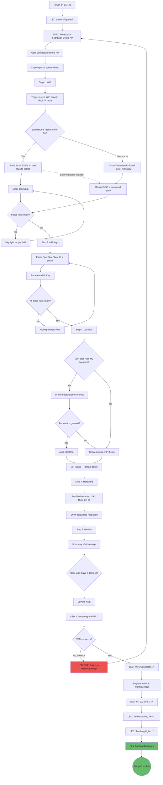
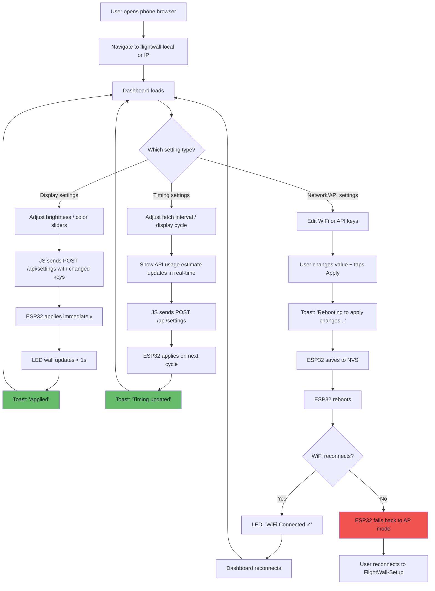
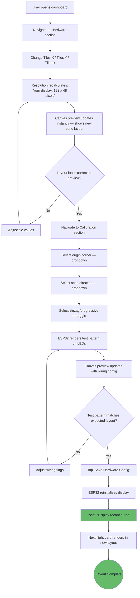
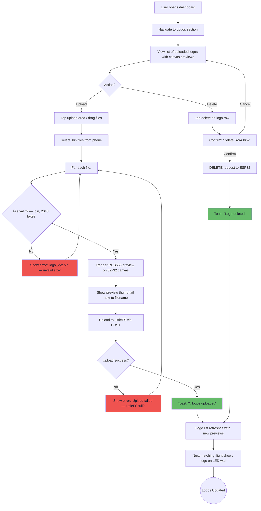
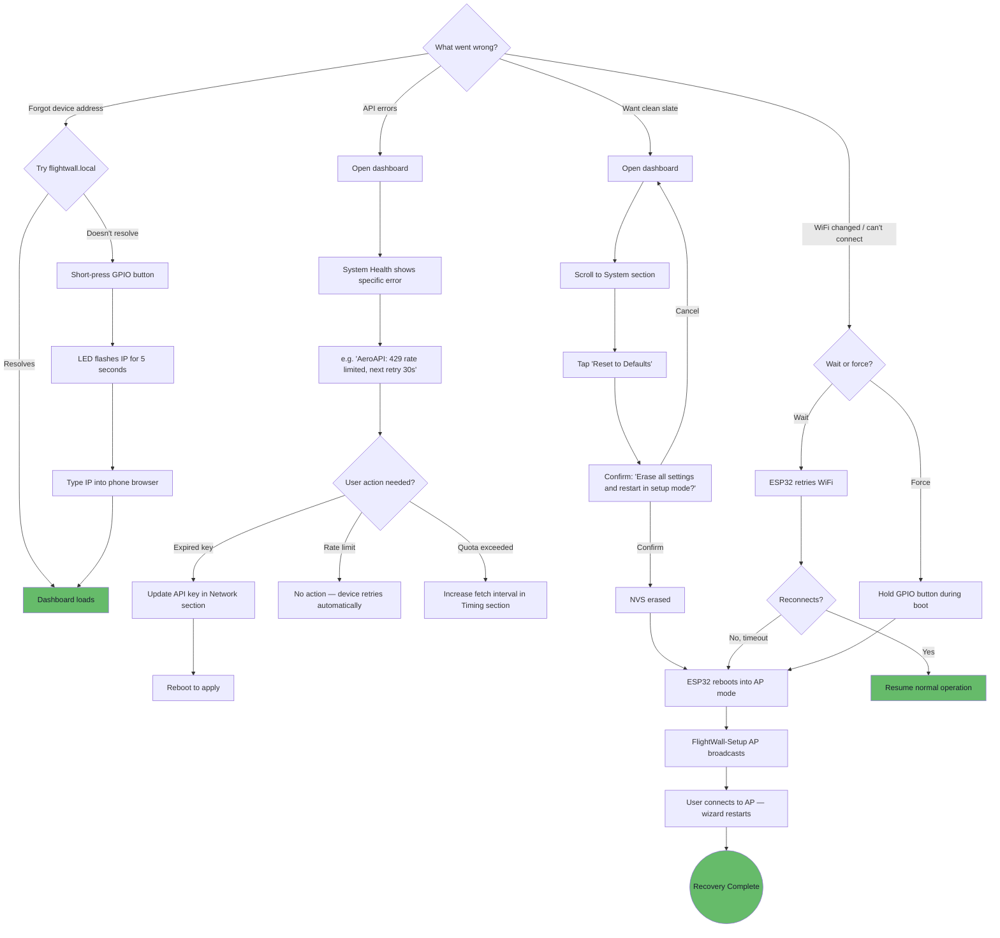

# UX Design Specification TheFlightWall_OSS-main

**Author:** Christian
**Date:** 2026-04-02

---

## Executive Summary

### Project Vision

TheFlightWall transforms from a developer-oriented maker project into a self-contained, configurable product through two UX surfaces: a browser-based Web Configuration Portal and an enhanced LED matrix display. The web interface is the product surface — it's how users interact with, configure, and personalize their device. The LED wall is the output. Together they create a unified device-plus-UI experience where anyone with the hardware can set up and customize without writing code.

### Target Users

**Primary User: Christian (project owner)**
- Tech-savvy maker who designed and soldered the hardware
- Wants a no-code configuration experience after initial firmware flash
- Interacts via phone browser (setup, tweaks) and glances at the LED wall (passive consumption)
- Single-user, trusted local network — no authentication or multi-tenancy concerns
- Devices: phone (primary for config), occasionally laptop browser
- Context: wall-mounted display in home, configured from couch or standing nearby

### Key Design Challenges

1. **Constrained rendering environment** — Web UI served from ESP32 with ~2MB for all assets (HTML/JS/CSS + logos). No heavy frameworks, no large bundles. Every design choice must respect the flash budget while remaining functional and polished.

2. **Two fundamentally different displays** — The LED matrix (160x32+ pixels, viewed from meters away, no interaction) and the phone browser (full mobile UI, touch interaction). Design language must bridge both without conflating their constraints.

3. **Captive portal limitations** — Setup wizard runs in a captive portal context with quirky browser behavior (limited JS support, redirect issues, no persistent storage). The flow must be linear, robust, and forgiving of portal edge cases.

4. **Abstract calibration concepts** — Wiring flags (tile origin, scan direction, zigzag/progressive) are meaningless without visual feedback. Users need a tight loop between changing a setting and seeing the result on both the actual LEDs and the browser preview.

### Design Opportunities

1. **Live canvas preview** — Real-time browser representation of the LED matrix makes configuration visual and immediate. Seeing zones, colors, and layout respond instantly to setting changes transforms abstract configuration into tangible, satisfying interaction.

2. **Progressive disclosure** — Setup wizard presents only essential settings (WiFi, API keys, location, hardware); full config dashboard reveals deeper options (timing, colors, calibration) on return visits. First-time simplicity, power-user depth.

3. **The "it just works" moment** — The transition from setup wizard to live flight data should feel immediate and magical. Minimal steps between "Save & Connect" and seeing the first flight card on the wall. UX should celebrate this moment, not bury it in loading states.

## Core User Experience

### Defining Experience

The core experience is the first-boot setup flow: power on the device, connect to its AP from a phone, complete the setup wizard, and see live flights appear on the LED wall. This is the moment that transforms custom hardware into a working product. If this flow is seamless, every subsequent interaction benefits from earned trust. If it fails, nothing else matters.

Secondary interactions (tweaking settings, reconfiguring hardware, uploading logos) are infrequent and utilitarian. The config dashboard is set-and-forget by design — but its first impression still matters. The first time a user opens the dashboard after setup, the interface should feel inviting enough to encourage exploration of brightness, color, timing, and logo options. After that, it recedes.

### Platform Strategy

| Surface | Context | Input | Priority |
|---------|---------|-------|----------|
| Setup Wizard | Captive portal on ESP32 AP | Phone touch | Critical — must work flawlessly |
| Config Dashboard | Local network browser | Phone or laptop | Utility — set-and-forget, but first visit matters |
| Live Preview Canvas | Embedded in config dashboard | View-only (responds to settings) | High — accuracy builds trust |
| LED Matrix Display | Physical wall-mounted hardware | Passive viewing | Output — the reward |

**Constraints:**
- All web assets (HTML/JS/CSS) served from ESP32 — ~2MB budget shared with logos
- No frontend frameworks — vanilla HTML/JS/CSS with a minimal design system (consistent spacing, typography, color palette via small reusable stylesheet)
- Captive portal JS support varies by OS — keep wizard logic minimal and linear
- Canvas preview renders client-side in the browser — the ESP32 only sends zone layout and tile config as a small JSON payload. Rendering fidelity is a browser concern, not a device resource concern
- Map component (Leaflet ~40KB gzipped) loads tiles from external OSM tile server at runtime — requires internet, zero storage cost

### Key Interaction Patterns

#### Map-Based Location Configuration

The setup wizard collects location as text input (latitude, longitude, radius) since the device has no internet during AP mode. After WiFi connects and the user accesses the config dashboard, a **visual map with draggable circle overlay** replaces the text fields as the primary location interface. The user sees their location, the surrounding area, and the capture radius — making the abstract concept of "geographic bounding box" immediately tangible. The wizard includes a prompt: "Fine-tune your location with the interactive map in the dashboard."

#### Flight Timing Controls

Two distinct timing controls, designed as labeled sliders with real-time feedback:

1. **Fetch interval** — "Check for flights every: [1 min ——●—— 5 min]" with estimated monthly API usage displayed (e.g., "~4,300 calls/month"). This is the control with real cost — shorter intervals burn API quota faster. Area size does not affect API call frequency; one call returns all planes in the bounding box regardless of radius.

2. **Display cycle** — "Show each flight for: [3s ——●—— 30s]" — hot-reloads so the user sees pacing change on the LED wall in real-time. Most relevant when multiple flights are in range (larger radius areas near airports).

#### Progress Visibility

All state transitions show explicit progress on the LED matrix to reduce perceived wait time:
- "Connecting to WiFi..." → "WiFi Connected ✓" → "Authenticating APIs..." → "Fetching flights..." → First flight card
- Target: under 60 seconds from "Save & Connect" to first flight card. With progress states, 60 seconds feels fast. Without them, it feels broken.

### Effortless Interactions

- **WiFi credential entry** — Single field pair, no confirmation screen, no terms of service. Type, submit, done.
- **API key entry** — Paste-friendly input fields. No formatting validation beyond non-empty. Users copy keys from provider dashboards.
- **Location entry (wizard)** — Latitude/longitude with browser geolocation prompt ("Use my location"). Radius via number input. Quick and functional.
- **Location entry (dashboard)** — Interactive map with draggable circle radius. Visual, accurate, and satisfying.
- **Brightness/color changes** — Slider or input that applies instantly to the LED wall. No save button, no reboot. The wall IS the preview.
- **Timing changes** — Sliders with real-time feedback. Fetch interval shows API budget impact. Display cycle hot-reloads to the wall.

### Critical Success Moments

1. **"Save & Connect" → first flight card** — The wizard's final step triggers WiFi connection, API authentication, and first data fetch. The LED wall shows clear progress states throughout. Target: under 60 seconds from button press to first flight card.

2. **Instant brightness response** — The first time the user drags a brightness slider and the wall dims in real-time, they understand this is a real product, not a prototype.

3. **Map circle reveals the airspace** — Opening the dashboard map and seeing the capture radius over a real map, with nearby airports visible, transforms an abstract number into spatial understanding.

4. **Preview matches reality** — When the canvas preview shows the same zone layout the LEDs display, the user trusts the tool. Accuracy here eliminates trial-and-error for calibration.

5. **First logo appears** — A real airline logo rendering on a homemade LED wall transforms the display from functional to impressive.

### Experience Principles

1. **Setup is the product** — First-boot wizard is the make-or-break experience. Every other interaction is secondary. Optimize for first-time success above all.

2. **Show, don't explain** — Live preview, test patterns, map overlays, and instant LED feedback replace documentation. Users should never have to imagine what a setting does — they should see it.

3. **Respect the user's time** — No unnecessary steps, no confirmation dialogs for reversible actions, no settings buried three levels deep. Every interaction should be as short as the task requires. The config UI exists to get out of the way.

4. **The wall is the reward** — Every configuration action should end with something visible on the LEDs. The display is the payoff for every setting change.

## Desired Emotional Response

### Primary Emotional Goals

**Pride in craftsmanship** — "I built this, and it works beautifully." The FlightWall is a personal project. The emotional payoff is seeing custom hardware do something impressive — real airline logos, live telemetry, a polished display that looks like a product, not a prototype.

**Transparency over comfort** — When something breaks, don't hide it. Show what's wrong so it can be fixed. This is a maker's device — the user wants to understand the system, not be shielded from it.

### Emotional Journey Map

| Stage | Feeling | Design Implication |
|-------|---------|-------------------|
| First boot | Anticipation → satisfaction | Setup wizard must be frictionless — the faster the payoff, the better |
| First flight card appears | Pride, wonder | Clear transition from progress states to live data. Don't undercut the moment with warnings or prompts |
| Tweaking settings | Control, mastery | Instant feedback. Sliders that move the wall in real-time. No guessing |
| Something breaks | Clarity, not anxiety | Show the error state plainly — "WiFi disconnected, retrying..." / "AeroAPI: 429 rate limited, next retry in 30s". No vague "Something went wrong" |
| Returning after weeks | Familiarity | Dashboard is where you left it. Settings persisted. No re-onboarding |

### Micro-Emotions

**Prioritize:**
- **Confidence** over confusion — every control should make its effect obvious
- **Trust** over skepticism — the live preview matches reality, the settings persist, the device recovers
- **Accomplishment** over frustration — setup ends with live flights, not troubleshooting

**Avoid:**
- Anxiety from vague error states — always show specifics
- Frustration from hidden settings or unclear consequences
- Helplessness from "something failed" with no path to fix it

### Design Implications

| Emotion | UX Approach |
|---------|-------------|
| Pride | Display layout should look polished — proper alignment, clean typography on LEDs, real logos |
| Transparency | Error states show specific cause + what the device is doing about it (retrying, falling back, waiting) |
| Control | Every setting change has immediate visible feedback — no "save and hope" |
| Mastery | Dashboard surfaces system health — API quota usage, WiFi signal, last successful fetch, heap status |
| Trust | Canvas preview is accurate. Settings survive power cycles. Recovery works without tools |

### Emotional Design Principles

1. **Be specific, not reassuring** — "AeroAPI returned 429, retrying in 30s" beats "Something went wrong, please try again." Makers fix problems; give them the information to do so.

2. **Reward the build** — The LED display is the emotional payoff for hours of soldering and wiring. Make it look as good as the effort deserves — clean layout, real logos, smooth transitions.

3. **Stay out of the way** — No onboarding tours, no tooltips, no "did you know?" prompts. The interface should be self-evident. If it needs explanation, redesign it.

## UX Pattern Analysis & Inspiration

### Inspiring Products Analysis

**Philips Hue (Smart Home Setup)**
- Setup wizard is linear and forgiving — one step at a time, clear progress, hard to get lost
- Bridge discovery is automatic — minimal manual configuration
- Instant feedback loop: change color in app → light changes in room. The physical world IS the preview
- **Lesson for FlightWall:** The setup wizard should feel this effortless. And the brightness/color controls should have the same instant physical feedback — slider moves, wall changes.

**Home Assistant (IoT Dashboard)**
- Onboarding is opinionated — sensible defaults, optional depth. Doesn't ask questions it can answer itself
- Dashboard is information-dense but scannable — cards with clear hierarchy
- System health is always accessible but never intrusive — you check it when you want, it doesn't nag
- **Lesson for FlightWall:** The config dashboard should present settings as organized cards/sections, not a flat form. System health should be a glanceable section, not buried in a debug menu.

**UniFi Controller (Network Admin)**
- Clean, dark-themed utility UI — professional without being sterile
- Map-based device placement — you see your network spatially. Abstract concepts become visual
- Settings are grouped logically with clear section headers. Advanced options exist but don't clutter the primary view
- **Lesson for FlightWall:** The map-based location config follows this exact pattern — spatial understanding of abstract settings. Section-grouped config with progressive disclosure (basic visible, advanced expandable).

**Flightradar24 (Flight Tracking)**
- Map is the primary interface — flights are spatial objects, not list items
- Flight cards show exactly the right info density: airline, route, aircraft, altitude, speed
- Color coding communicates altitude/status without labels
- **Lesson for FlightWall:** The LED flight card layout should mirror this information hierarchy — airline identity (logo), route, aircraft type, then telemetry. The map in the dashboard could show active flights in the capture radius as a bonus feature.

**Tasmota / ESPHome (ESP32 Web UIs)**
- Proof that a capable config UI fits in ESP32 flash constraints — Tasmota's web UI is ~200KB
- Functional over pretty — but functional IS the right priority for a maker tool
- Settings organized by category (WiFi, MQTT, logging, etc.) with clear save/reboot boundaries
- Status page shows uptime, free heap, WiFi signal, firmware version — exactly the system health info a maker wants
- **Lesson for FlightWall:** This is the floor, not the ceiling. Tasmota proves the constraints are workable. FlightWall should match Tasmota's utility and system transparency, then exceed it with the live preview, map, and visual polish.

### Transferable UX Patterns

**Navigation:**
- **Section-based dashboard** (Home Assistant / UniFi) — Config organized into collapsible or tabbed sections: Display, Network, Location, Timing, Logos, System. Not a single long form.
- **Linear wizard with progress indicator** (Philips Hue) — Setup wizard shows "Step 2 of 5" with clear back/forward. No branching, no skipping.

**Interaction:**
- **Instant physical feedback** (Philips Hue) — Display settings apply to the LED wall in real-time as controls are adjusted. The wall is the preview.
- **Map as primary location interface** (UniFi / Flightradar24) — Spatial configuration replaces coordinate entry. Draggable circle makes radius intuitive.
- **Product-specific system health card** — Not generic IoT health, but FlightWall-specific: API quota remaining (calls used / 4,000 monthly limit), last successful fetch (timestamp + flight count), WiFi signal strength (dBm), free heap (KB), LittleFS usage (logos stored / space remaining). API quota display reinforces the fetch interval slider — both surfaces show the same budget from different angles.

**Novel Pattern — Triple Feedback:**
- No reference product has TheFlightWall's unique challenge: three visual surfaces update simultaneously when a display setting changes.
  1. **Form control** updates in the browser (instant, local)
  2. **Canvas preview** updates in the browser (instant, client-side JS — shows predicted LED state)
  3. **LED wall** updates physically (50-200ms network latency)
- The canvas preview is intentionally **predictive** — it shows what the LEDs *will* look like before they catch up. This slight lead is a feature, not a bug. The canvas is intent; the LEDs are confirmation.
- Two distinct communication paths: browser-local (form ↔ canvas, instant) and browser → ESP32 → LEDs (network-dependent). Design should acknowledge this rather than pretending simultaneity.

**Visual:**
- **Dark theme default** — Functional choice, not just aesthetic. The config dashboard will often be open on a phone while looking at the LED wall. A bright white UI destroys night vision and makes the wall look dim by comparison. A dark theme keeps the LED wall as the visual focal point. Light theme available as option.
- **Information-dense cards** (Flightradar24 / Home Assistant) — Flight data and settings presented in compact, scannable blocks rather than sprawling forms.

### Anti-Patterns to Avoid

- **Tasmota's flat form layout** — Every setting on one page with no grouping. Works for 10 settings, breaks at 30+. FlightWall has enough settings to need sections.
- **Router-style "Apply Changes" with full page reload** — UniFi does this; it breaks flow. Hot-reload for display settings, targeted reboot only for network/API changes.
- **Flightradar24's feature overload on first visit** — Too many layers, filters, and options visible immediately. FlightWall's dashboard should start simple and reveal depth.
- **Generic error modals** — "An error occurred. OK." Zero information, zero trust. Every error should name the cause and the recovery path.
- **Confirmation dialogs for reversible actions** — "Are you sure you want to change brightness?" wastes time. Reserve confirmation for destructive actions only (factory reset).
- **Auto-refreshing dashboard** — Some IoT dashboards poll the device and refresh the whole page every few seconds. On an ESP32 with 2-3 max concurrent connections, an auto-refreshing dashboard could block API calls. The dashboard should be mostly static — update only when the user changes a setting or explicitly hits a "Refresh Status" button on the health card.

### Design Inspiration Strategy

**Adopt:**
- Philips Hue's instant physical feedback model — slider moves, wall changes
- Product-specific system health card — API quota, last fetch, WiFi, heap, LittleFS usage
- UniFi's section-based settings organization with progressive disclosure
- Flightradar24's flight card information hierarchy (identity → route → telemetry)
- Dark theme as default for functional reasons (night vision, wall as focal point)

**Adapt:**
- Home Assistant's card-based dashboard — simplified for single-device, fewer cards, but same scannable density
- UniFi's dark theme — adapted for a minimal CSS budget (~5KB stylesheet), not a full design system
- Flightradar24's map — stripped down to just the capture radius circle, not a full flight tracker

**Innovate:**
- Triple feedback pattern (form → canvas → LEDs) — novel to FlightWall, no direct reference product. Canvas as predictive digital twin, LEDs as physical confirmation.

**Avoid:**
- Tasmota's flat single-page config dump
- Any "Are you sure?" dialogs for non-destructive changes
- Generic error messages without specific cause and recovery info
- Onboarding tours, tooltips, or "getting started" overlays
- Auto-refreshing dashboard pages that consume ESP32 connections

## Design System Foundation

### Design System Choice

**Minimal Custom Stylesheet** — A single hand-written CSS file (~3-5KB) served from LittleFS, using CSS custom properties for theming and consistency.

This is not a framework adoption — it's a purpose-built design system scoped to exactly what TheFlightWall needs. Nothing more, nothing less.

### Rationale for Selection

- **Flash budget:** ~3-5KB CSS vs. 100KB+ for any framework. On a 2MB LittleFS partition shared with logos, every KB matters
- **No build tooling:** Raw `.css` file, no npm, no bundler, no transpilation. Edit and upload
- **Dark theme control:** Custom properties allow precise color matching to the LED wall aesthetic — no fighting a framework's defaults
- **Custom interactions required:** The triple feedback pattern (form → canvas → LEDs), map integration, and canvas preview are all bespoke JS. No CSS framework helps with these — they just add weight
- **Single developer:** No team to onboard on a framework's conventions. One person, one stylesheet, full understanding

### Implementation Approach

**Single file architecture (gzipped for ~70% size savings):**
```
/web/
├── style.css.gz          (~1.5KB gzipped — the design system)
├── common.js.gz          (~0.5KB gzipped — shared HTTP helpers, settings API)
├── wizard.html.gz        (setup wizard)
├── wizard.js.gz          (wizard logic)
├── dashboard.html.gz     (config dashboard)
├── dashboard.js.gz       (dashboard logic + canvas)
└── leaflet/              (lazy-loaded on Location section open)
    ├── leaflet.min.js.gz (~25KB gzipped)
    └── leaflet.min.css.gz (~3KB gzipped)
```

ESPAsyncWebServer serves `.gz` files transparently with `Content-Encoding: gzip` header via `serveStatic`. Zero code overhead.

**`common.js` — shared module for both wizard and dashboard:**
- `applySettings(endpoint, data)` — POST settings to ESP32, return response
- `fetchStatus()` — GET system health for health card
- `rebootDevice()` — POST reboot with countdown feedback
- Eliminates duplicated HTTP logic between wizard and dashboard

**Leaflet lazy-loading:**
- Map component is only relevant when user opens the Location section of the dashboard
- Leaflet JS + CSS (~28KB gzipped) loads on-demand when Location card is expanded, not on initial dashboard load
- Dashboard opens fast; map appears when needed — progressive disclosure of code, not just UI

**CSS custom properties as design tokens:**
```css
:root {
  /* Colors — dark theme optimized for LED wall viewing */
  --bg-primary: #1a1a2e;
  --bg-surface: #222240;
  --bg-input: #2a2a4a;
  --text-primary: #e0e0e0;
  --text-secondary: #b0b0c0;   /* verified WCAG AA on --bg-surface */
  --accent: #4fc3f7;
  --accent-dim: #2a6a8a;       /* muted accent for borders, inactive states */
  --success: #66bb6a;
  --warning: #ffa726;
  --error: #ef5350;

  /* Spacing scale */
  --space-xs: 4px;
  --space-sm: 8px;
  --space-md: 16px;
  --space-lg: 24px;
  --space-xl: 32px;

  /* Typography */
  --font-family: -apple-system, BlinkMacSystemFont, 'Segoe UI', sans-serif;
  --font-size-sm: 0.85rem;
  --font-size-md: 1rem;
  --font-size-lg: 1.25rem;

  /* Layout */
  --radius: 6px;
  --max-width: 480px;
}
```

**All color combinations must pass WCAG AA contrast ratio (4.5:1 minimum).** Verify especially: `--text-secondary` on `--bg-surface`, `--text-secondary` on `--bg-primary`, `--accent-dim` used as text.

**Component patterns (CSS patterns, not framework components):**
- `.card` — Surface container with background, padding, border-radius. Used for each settings section
- `.field` — Label + input pair with consistent spacing
- `.slider` — Range input with value display. Used for brightness, timing, radius
- `.btn-primary`, `.btn-danger` — Two button styles: accent (save, connect) and destructive (reset)
- `.status` — Inline status indicator with colored dot (green/amber/red) + text
- `.progress` — Step indicator for setup wizard ("Step 2 of 5")
- `.health-card` — System health section with key-value pairs
- `.toast` — Transient notification bar for action confirmations. Slides in from top, lingers 2-3 seconds, slides out. Confirms device received the command: "Settings saved", "Rebooting in 3s...", "Logo uploaded". Essential for a no-page-reload UI — without toast feedback, the user clicks "Save" and wonders if anything happened.

### Customization Strategy

**Theming via CSS custom properties:**
- Dark theme is the default and primary design target
- Light theme achievable by overriding `--bg-*` and `--text-*` variables in a `@media (prefers-color-scheme: light)` block or a toggle class — low priority, implement only if time permits
- Accent color (`--accent`) matches the LED wall's default text color for visual cohesion between phone and wall

**Responsive behavior:**
- `--max-width: 480px` centered container for phone-first layout
- No breakpoints needed — the UI is single-column on all devices. Wider screens just get more whitespace
- Canvas preview scales proportionally within the container width

**Form control styling:**
- Native `<input>`, `<select>`, `<range>` elements styled via CSS — no custom JS widgets for basic controls
- Custom JS only where native controls can't do the job: canvas preview, map, color picker

## Defining Core Experience

### The Defining Interaction

*"Plug it in, set it up from your phone, and watch planes appear on your wall."*

The defining experience is the complete arc from power-on to live flight data — accomplished entirely from a phone browser. This is the interaction users describe to others: "I built an LED wall that shows planes flying over my house, and I set the whole thing up from my phone."

The setup wizard IS the product experience. Everything after it — tweaking, reconfiguring, uploading logos — is secondary. If the wizard works perfectly, the user trusts the device. If it fails, nothing else matters.

### User Mental Model

**Expected model: Smart home device setup**
- Power on → device broadcasts WiFi → connect from phone → setup page opens → answer questions → device works
- Users have done this with Hue bridges, smart plugs, UniFi controllers, Sonos speakers
- The expectation is: 5 minutes, no laptop, no technical knowledge beyond "connect to WiFi and follow prompts"

**Where FlightWall breaks the model:**
- **API credentials** — Smart home devices don't ask you to paste API keys. This is the one step that feels "developer-ish." The wizard must make this step as painless as possible: clear labels ("OpenSky Client ID"), paste-friendly input fields, a brief inline explanation of where to get the keys, and validation that they're non-empty before proceeding.
- **Geographic coordinates** — Most people don't know their lat/lon. The wizard should offer browser geolocation first ("Use my location") with manual entry as fallback. This feels natural on a phone — location permission prompts are familiar.

**Where FlightWall matches the model:**
- WiFi setup — identical to every smart home device
- Hardware config — tile count and dimensions feel like "how many lights did you connect?" in Hue
- Completion — device reboots, connects, and starts working. Same as every smart device

### Success Criteria

| Criterion | Target | Measurement |
|-----------|--------|-------------|
| Wizard completion time | Under 5 minutes | From AP connection to "Save & Connect" button press |
| Zero-error completion rate | 90%+ | First attempt, no backtracking, no confusion |
| Time to first flight card | Under 60 seconds | From "Save & Connect" to live data on LEDs |
| No external tools needed | 100% | Phone browser only — no laptop, no terminal, no USB |
| Settings persist | 100% | Power cycle → device reconnects → flights resume without re-setup |

**The user feels successful when:** The LED wall shows a real flight with airline name, route, and altitude — and they configured it all from their phone while standing in front of the wall.

### Novel vs. Established Patterns

**Established patterns (adopt directly):**
- Linear wizard with progress indicator (Step 1 of 5) — proven, familiar, no learning curve
- WiFi credential entry — same as every captive portal setup
- Form fields with validation — native HTML inputs, nothing custom needed
- Reboot-with-progress — "Connecting..." → "WiFi OK" → progress states on LEDs

**Novel pattern (unique to FlightWall):**
- **API key entry in a setup wizard** — uncommon in consumer IoT. Mitigate with clear labeling, inline "Where do I find this?" links, and paste-optimized input fields. Accept that this step will feel slightly technical — the goal is minimizing friction, not eliminating it entirely.

**Adapted patterns:**
- **Browser geolocation for coordinates** — common in web apps, uncommon in IoT setup wizards. The phone is the perfect device for this — it has GPS. "Use my location" button with one-tap permission, falling back to manual lat/lon entry.

### Experience Mechanics — Setup Wizard Flow

**Step 1: WiFi Configuration**
- **Screen:** SSID text input + password field
- **Smart behavior:** If browser supports it, show available networks via scan (ESP32 can do WiFi scan and return results via API). Otherwise, manual SSID entry.
- **Validation:** Non-empty fields. No "confirm password" — unnecessary friction.
- **Action:** "Next →"

**Step 2: API Credentials**
- **Screen:** Three fields: OpenSky Client ID, OpenSky Client Secret, FlightAware AeroAPI Key
- **Smart behavior:** Paste-friendly inputs (no autocorrect, no autocapitalize). Inline helper text: "Get your free OpenSky credentials at opensky-network.org"
- **Validation:** Non-empty. No format validation — the device will report auth errors later if keys are wrong, and the user can fix them in the dashboard.
- **Action:** "Next →"

**Step 3: Location**
- **Screen:** "Use my location" button (prominent) + manual entry fields (lat, lon, radius km)
- **Smart behavior:** Browser geolocation API. On permission grant, auto-fill lat/lon and show "Location set: [lat], [lon]". Radius defaults to 10km with a number input to adjust.
- **Validation:** Lat/lon must be valid coordinates. Radius must be positive.
- **Action:** "Next →"

**Step 4: Hardware Configuration**
- **Screen:** Tiles X (default 10), Tiles Y (default 2), Tile pixels (default 16), Data pin (default 25)
- **Smart behavior:** Defaults pre-filled from compile-time values. Most users won't change these. Show calculated resolution: "Your display: 160 x 32 pixels"
- **Validation:** Positive integers. Pin must be valid GPIO.
- **Action:** "Next →"

**Step 5: Review & Connect**
- **Screen:** Summary of all settings entered. Each section editable (tap to go back to that step).
- **Smart behavior:** No new input needed — just review. This is the confidence moment before committing.
- **Action:** "Save & Connect" (primary button, prominent)

**Post-wizard transition (on LED matrix):**
1. "Saving configuration..." (1-2s)
2. "Connecting to WiFi..." (variable, up to 10s)
3. "WiFi Connected ✓" (1s)
4. "IP: 192.168.1.47" (2s — so user can find the dashboard later)
5. "Authenticating APIs..." (2-3s)
6. "Fetching flights..." (variable, up to 15s)
7. First flight card appears

**On the phone:** After "Save & Connect", the captive portal page shows "Configuration saved! Your FlightWall is connecting to WiFi. Look at the LED wall for progress. Once connected, access the dashboard at your device's IP address."

## Visual Design Foundation

### Color System

**Primary palette — dark theme optimized for LED wall co-viewing:**

| Token | Value | Usage | Rationale |
|-------|-------|-------|-----------|
| `--bg-primary` | `#1a1a2e` | Page background | Deep navy-black. Darker than pure gray to feel intentional, not just "dark mode." The blue tint echoes the night sky — fitting for an aviation display. |
| `--bg-surface` | `#222240` | Cards, sections | Slightly lifted from background. Enough contrast to define boundaries without harsh edges. |
| `--bg-input` | `#2a2a4a` | Form inputs, interactive areas | Distinct from surface so inputs are findable without labels pointing at them. |
| `--text-primary` | `#e0e0e0` | Headings, labels, values | Off-white. Not pure `#fff` — softer on eyes in dark rooms, reduces halo effect on phone screens. |
| `--text-secondary` | `#b0b0c0` | Helper text, descriptions | Muted but readable. 5.2:1 contrast ratio on `--bg-surface` (passes WCAG AA). |
| `--accent` | `#4fc3f7` | Buttons, active states, links | Light blue — matches the default LED text color for visual cohesion between phone and wall. |
| `--accent-dim` | `#2a6a8a` | Borders, inactive tabs, subtle highlights | Muted accent. Visible but doesn't compete with interactive accent elements. |
| `--success` | `#66bb6a` | Connected, saved, OK states | Green — universal "good" signal. Used in status dots and toast confirmations. |
| `--warning` | `#ffa726` | Rate limits, low quota, degraded state | Amber — attention without alarm. "AeroAPI: 2 retries remaining." |
| `--error` | `#ef5350` | Failed, disconnected, invalid | Red — something needs action. "WiFi: Disconnected." |

**Status dot pattern:** A 10px colored circle (success/warning/error) inline before status text. Scannable at a glance without reading the text.

### Typography System

**Font stack:** `-apple-system, BlinkMacSystemFont, 'Segoe UI', Roboto, sans-serif`
- System fonts — zero download cost, native feel on every OS
- No custom web fonts. On a 2MB LittleFS budget, even a single font file (~20-50KB) is unjustifiable

**Type scale:**

| Token | Size | Weight | Usage |
|-------|------|--------|-------|
| `--font-size-lg` | `1.25rem` (20px) | 600 | Section headings ("Display Settings", "Location") |
| `--font-size-md` | `1rem` (16px) | 400 | Body text, labels, values |
| `--font-size-sm` | `0.85rem` (13.6px) | 400 | Helper text, status messages, secondary info |

**Three sizes only.** A utility dashboard doesn't need h1–h6 hierarchy. Section headings (lg), content (md), and supporting info (sm) cover every case.

**Line height:** `1.5` globally. Generous for readability on small phone screens in varying lighting conditions.

**No bold body text.** Weight 600 reserved for headings only. Emphasis within body text uses `--accent` color, not bold — keeps the visual hierarchy clean.

### Spacing & Layout Foundation

**Spacing scale (4px base):**

| Token | Value | Usage |
|-------|-------|-------|
| `--space-xs` | `4px` | Tight gaps: status dot to text, icon to label |
| `--space-sm` | `8px` | Inner padding: input fields, between label and input |
| `--space-md` | `16px` | Standard padding: card content, between form fields |
| `--space-lg` | `24px` | Section separation: between cards |
| `--space-xl` | `32px` | Page-level: top/bottom padding, major section breaks |

**Layout structure:**
- Single column, `max-width: 480px`, centered with `margin: 0 auto`
- No grid system — the UI is a vertical stack of cards. Grid adds complexity with zero benefit for single-column layout
- Cards stack vertically with `--space-lg` (24px) between them
- Card internal padding: `--space-md` (16px)
- Form fields within cards: `--space-md` (16px) between fields

**Wizard layout:**
- Same single-column structure
- Progress indicator fixed at top: "Step 2 of 5" with visual progress bar
- Navigation buttons at bottom: "← Back" (left) and "Next →" (right)
- Content area scrollable between fixed header and footer

### Accessibility Considerations

**Contrast ratios (verified):**

| Combination | Ratio | Passes |
|-------------|-------|--------|
| `--text-primary` on `--bg-primary` | 11.4:1 | AAA |
| `--text-primary` on `--bg-surface` | 9.8:1 | AAA |
| `--text-secondary` on `--bg-surface` | 5.2:1 | AA |
| `--text-secondary` on `--bg-primary` | 6.1:1 | AA |
| `--accent` on `--bg-surface` | 5.7:1 | AA |
| `--accent` on `--bg-primary` | 6.6:1 | AA |

**Touch targets:** All interactive elements (buttons, inputs, sliders) minimum 44x44px touch area per WCAG 2.5.5. Critical for phone-first usage.

**Focus indicators:** Visible focus ring using `--accent` for keyboard navigation. Not the primary interaction method (touch-first) but supports accessibility.

**Motion:** Toast notifications use `prefers-reduced-motion` media query — if enabled, toasts appear/disappear instantly instead of sliding.

## Design Direction Decision

### Design Directions Explored

A single focused direction was explored rather than multiple abstract variations, given that the visual foundation was already well-defined through collaborative steps 3–8. The direction applies all established design tokens (dark theme, accent blue, system fonts, 4px spacing scale) to the three key screens.

### Chosen Direction

**Dark utility dashboard** — Navy-black backgrounds, light blue accent, card-based sections, single-column phone-first layout. The visual tone sits between UniFi (professional, dark) and Tasmota (functional, information-dense) — more polished than a developer tool, more utilitarian than a consumer app.

**Key characteristics:**
- Cards with `--bg-surface` on `--bg-primary` create subtle depth without harsh borders
- Status dots (green/amber/red) provide at-a-glance system state
- Sliders with inline value display for all numeric settings
- Toast notifications for action confirmations
- Progressive disclosure: Location card lazy-loads Leaflet only when opened
- Danger zone (reset) visually separated with red border treatment

### Design Rationale

- **Dark theme** is functional, not aesthetic — optimizes for co-viewing with the LED wall in dim rooms
- **Card-based layout** groups related settings logically (Display, Timing, Location, Hardware, System) — avoids Tasmota's flat-form anti-pattern
- **Single column** eliminates responsive complexity — same layout on phone and laptop, just more whitespace on wider screens
- **Accent blue (#4fc3f7)** matches the LED wall's default text color — visual thread between the two surfaces
- **System fonts** — zero download cost, native feel, no LittleFS budget impact

### Implementation Approach

The HTML mockup at `ux-design-directions.html` serves as the visual reference for implementation. The actual CSS file will be a condensed version of the mockup's stylesheet (~3-5KB uncompressed, ~1.5KB gzipped). No additional design tools or prototyping needed — the mockup IS the specification.

## User Journey Flows

### Journey 1: First-Time Setup



**Key decisions:**
- WiFi scan attempted in AP_STA mode — async, non-blocking, 5-second timeout
- Scan results shown as tappable list if found; manual entry always accessible via link or as automatic fallback
- mDNS registered on WiFi connect — device reachable at `flightwall.local`
- API key validation is non-empty only — auth errors handled post-setup in dashboard
- Geolocation prompt is the happy path; manual entry is the fallback
- Phone shows "look at the LED wall" after Save — captive portal connection drops when ESP32 switches to STA

### Journey 2: Tweaking Settings



**Key decisions:**
- Single API endpoint: `POST /api/settings` with JSON body `{ "key": value }` — fewer routes, simpler client code, supports batching multiple changes
- Two distinct apply paths: hot-reload (display/timing — instant, no save button) vs. reboot (network/API — explicit apply + reboot)
- Device reachable via `flightwall.local` (mDNS) or IP address
- Toast confirms every action

### Journey 3: New Panel Layout



**Key decisions:**
- Canvas preview updates client-side (instant) — no round-trip for layout preview
- Test pattern renders on actual LEDs for calibration — the real hardware is the ground truth
- Triple feedback loop: form control → canvas preview → LED wall
- Save is explicit for hardware changes (reinitializes display driver)

### Journey 4: Adding Logos



**Key decisions:**
- Client-side RGB565 preview before upload — ~20 lines of JS reads the 2,048-byte file, decodes RGB565 pixels, draws onto a 32x32 canvas scaled to 128x128
- Batch upload supported — drag multiple files at once
- Validation happens client-side before upload (file size check)
- Delete requires confirmation — destructive action
- Logo list shows ICAO code, canvas preview thumbnail, file size, and delete button

### Journey 5: Recovery & Maintenance



**Key decisions:**
- **mDNS first** (`flightwall.local`) — primary device discovery method
- **Short-press GPIO** shows IP on LEDs for 5 seconds — fallback when mDNS doesn't resolve
- **Long-press GPIO during boot** forces AP setup mode — hardware escape hatch
- System Health gives specific, actionable error info — never generic
- Factory reset is the only action with confirmation dialog
- Auto-AP fallback on WiFi timeout — device self-recovers

### API Contract Pattern

All dashboard settings use a single endpoint:

```
POST /api/settings
Content-Type: application/json

{ "brightness": 25, "text_color_r": 255 }
```

- ESP32 handler reads JSON keys, applies only what changed
- Responds with `{ "applied": ["brightness", "text_color_r"], "reboot_required": false }`
- If `reboot_required: true`, client shows toast + countdown before ESP32 reboots
- Fewer routes on ESPAsyncWebServer, simpler `common.js`, supports batching

### Journey Patterns

| Pattern | Implementation | Used In |
|---------|---------------|---------|
| Toast confirmation | Slide-in notification, 2-3s, auto-dismiss | J2, J3, J4, J5 |
| Hot-reload | POST /api/settings → ESP32 applies → LED updates < 1s | J2, J3 |
| Reboot flow | Toast "Rebooting..." → LED progress → reconnect | J2, J5 |
| Validation-then-action | Client-side check before server request | J1, J4 |
| Triple feedback | Form → canvas → LEDs | J2, J3 |
| Error specificity | Named error + cause + recovery path | J1, J4, J5 |
| Confirmation gate | Only for destructive actions (reset, delete) | J4, J5 |
| mDNS discovery | flightwall.local as primary address | J2, J3, J4, J5 |
| Graceful degradation | Scan with manual fallback, geolocation with manual fallback | J1 |

### Flow Optimization Principles

1. **No dead ends** — Every error state has a recovery path. WiFi fails → AP mode. Upload fails → error + retry. API fails → show cause + auto-retry. mDNS fails → GPIO shows IP.

2. **Minimum steps to value** — Setup wizard: 5 steps. Settings change: 1 interaction. Logo upload: drag + drop + preview. No unnecessary intermediate screens.

3. **Feedback at every state change** — Toast for saves, LED progress for reboots, canvas updates for layout changes, logo preview before upload. The user should never wonder "is it working?"

4. **Destructive actions are gated, reversible actions are instant** — Brightness change: no confirmation. Factory reset: confirmation required. Heavily skewed toward instant.

5. **Multiple discovery paths** — mDNS (`flightwall.local`) as primary, short-press GPIO for IP display as fallback, IP shown on LED during boot as last resort.

## Component Strategy

### Design System Components (Available from CSS Patterns)

| Pattern | HTML Element | CSS Class | Used In |
|---------|-------------|-----------|---------|
| Card container | `<div>` | `.card` | All dashboard sections |
| Text input | `<input type="text">` | `.field input` | Wizard, Dashboard |
| Number input | `<input type="number">` | `.field input` | Hardware config, radius |
| Password input | `<input type="password">` | `.field input` | WiFi password |
| Select dropdown | `<select>` | `.field select` | Calibration dropdowns |
| Range slider | `<input type="range">` | `.slider` | Brightness, timing, radius |
| Primary button | `<button>` | `.btn-primary` | Save & Connect, Apply, Next |
| Danger button | `<button>` | `.btn-danger` | Reset to Defaults |
| Secondary button | `<button>` | `.btn-secondary` | Back, Cancel |
| Status indicator | `<span>` | `.status-dot` + `.green/.amber/.red` | Health card |
| Progress bar | `<div>` | `.progress` | Wizard step indicator |
| Toast notification | `<div>` | `.toast` | All confirmations |
| Health row | `<div>` | `.health-row` | System Health page |
| Helper text | `<span>` | `.helper` | Below inputs, API usage |

### Custom Components (Require JS)

#### Canvas Layout Preview

**Purpose:** Real-time visual representation of the LED matrix zone layout
**Used in:** Dashboard (Hardware section), Calibration
**Anatomy:** `<canvas>` element scaled proportionally to container width. Grid of rectangles representing tiles, colored by zone (logo / flight card / telemetry). Legend below.
**States:** Updates instantly when tile count, dimensions, or wiring flags change
**JS complexity:** ~50 lines — reads tile config from form, calculates zones, draws rectangles
**Triple feedback:** Form values → canvas updates (instant, client-side) → LED wall updates (after POST)

#### Interactive Map with Circle Radius

**Purpose:** Visual geographic configuration — drag to set center, resize circle for radius
**Used in:** Dashboard (Location section)
**Anatomy:** Leaflet.js map with OSM tiles, draggable marker, resizable circle overlay, radius synced to slider
**States:** Loading (lazy-load), Active (interactive), Error (tiles fail → show lat/lon inputs as fallback)
**JS complexity:** ~40 lines + Leaflet library (~25KB gzipped)
**Dependencies:** External OSM tile server (requires internet)

#### RGB565 Logo Preview

**Purpose:** Client-side rendering of uploaded .bin logo files before committing upload
**Used in:** Dashboard (Logos section)
**Anatomy:** `<canvas>` 128x128px (32x32 scaled 4x). Reads 2,048-byte file via FileReader, decodes RGB565 → RGB888, draws onto canvas.
**States:** Empty, Preview (decoded), Error (invalid file)
**JS complexity:** ~20 lines

#### WiFi Network Scanner

**Purpose:** Show available WiFi networks as tappable list during setup
**Used in:** Wizard (Step 1)
**Anatomy:** `GET /api/wifi/scan` (async) → list of SSIDs with signal strength → fallback to manual entry
**States:** Scanning (spinner, 5s timeout), Results (list), Failed (manual entry)
**JS complexity:** ~25 lines

#### Toast Notification System

**Purpose:** Transient action confirmations without page reload
**Used in:** All dashboard interactions
**Anatomy:** Fixed-position bar at top, severity-colored background, auto-dismiss 2-3s
**States:** Hidden, Visible (sliding in), Dismissing (sliding out)
**JS complexity:** ~15 lines
**Accessibility:** Respects `prefers-reduced-motion`

### Component Implementation Strategy

**No build step.** All components are vanilla HTML + CSS + JS. Files are authored, gzipped, uploaded to LittleFS.

**Shared code in `common.js`:**
- `applySettings(data)` — POST to `/api/settings`
- `fetchStatus()` — GET `/api/status`
- `rebootDevice()` — POST `/api/reboot`
- `showToast(message, severity)` — trigger toast notification
- `decodeRGB565(buffer)` — decode logo binary to canvas pixel data

**Page-specific code:**
- `wizard.js` — step navigation, WiFi scan, geolocation, validation, save
- `dashboard.js` — slider handlers, canvas preview, Leaflet lazy-loader, logo upload/preview

### Implementation Roadmap

**Phase 1 — Setup Wizard (Epic 1 core):**
- Text inputs, buttons, progress bar (CSS only)
- WiFi scanner component
- Toast notification system
- Validation + form navigation

**Phase 2 — Config Dashboard (Epic 1 core):**
- Card layout with all settings sections (CSS only)
- Slider components with live value display
- Toast integration for all actions
- Hot-reload via POST /api/settings

**Phase 3 — Advanced Dashboard (Epic 1 + 2):**
- Canvas layout preview
- Leaflet map with circle radius (lazy-loaded)
- System Health page with status dots
- RGB565 logo preview + upload

**Phase 4 — Enhancement:**
- Light theme toggle (CSS custom property override)
- WiFi scan in dashboard (STA mode — reliable)

## UX Consistency Patterns

### Button Hierarchy

| Level | Class | Appearance | Usage | Examples |
|-------|-------|-----------|-------|----------|
| Primary | `.btn-primary` | Accent blue background, dark text, full-width | One per screen — the main action | "Save & Connect", "Next →", "Upload" |
| Danger | `.btn-danger` | Transparent, red border + text | Destructive actions only | "Reset to Defaults", "Delete Logo" |
| Secondary | `.btn-secondary` | Transparent, dim border, secondary text | Back, cancel, alternative actions | "← Back", "Enter manually instead" |

**Rules:**
- Never two primary buttons on the same screen — if there are two actions, one is primary, one is secondary
- Danger buttons always require a confirmation step before executing
- Buttons are always full-width on mobile — no inline button pairs except wizard nav (Back + Next)

### Feedback Patterns

| Type | Component | Duration | Trigger |
|------|-----------|----------|---------|
| **Action confirmation** | Toast (green) | 2-3s auto-dismiss | Setting saved, logo uploaded, config applied |
| **Reboot warning** | Toast (amber) | Persistent until reboot | Network/API change requires reboot |
| **Error notification** | Toast (red) | 5s auto-dismiss | Upload failed, invalid input, connection error |
| **Progress state** | LED matrix text | Until next state | WiFi connecting, API authenticating, fetching flights |
| **Inline validation** | Red border + helper text | Until corrected | Empty required field, invalid coordinate |

**Rules:**
- Toast is the only feedback mechanism in the browser. No alert dialogs, no inline banners, no page-level messages.
- LED matrix handles all firmware-side state communication (boot progress, connection status, IP display)
- Error toasts include the specific cause: "Upload failed: file exceeds 2048 bytes" not "Upload failed"
- Success toasts are brief: "Settings saved" not "Your settings have been saved successfully"

### Form Patterns

**Input behavior:**
- All inputs use native HTML elements — no custom widgets for text, number, password, or select
- Paste-friendly: `autocorrect="off" autocapitalize="off" spellcheck="false"` on API key and coordinate fields
- No "confirm password" fields anywhere — unnecessary friction
- Validation happens on "Next" or "Apply" — not on every keystroke (reduces noise)

**Slider behavior:**
- Range input with inline value display to the right
- Value updates as user drags (oninput, not onchange)
- For hot-reload settings (brightness, color): POST fires on `onchange` (when user releases slider)
- Helper text below shows context: API usage estimate for fetch interval, "Changes apply instantly" for display settings

**Grouping:**
- Related fields grouped inside `.card` containers
- Each card has a title with icon: "🎨 Display", "⏱️ Timing", "📍 Location"
- Fields within a card separated by `--space-md` (16px)
- Cards separated by `--space-lg` (24px)

### Navigation Patterns

**Wizard navigation:**
- Linear progression: Step 1 → 2 → 3 → 4 → 5. No skipping.
- Progress bar at top: "Step N of 5" + visual fill bar
- "← Back" (secondary) on left, "Next →" (primary) on right
- Step 5 (Review) replaces "Next" with "Save & Connect" (primary)
- Back always works — no data loss on back navigation (form state preserved)

**Dashboard navigation:**
- Single scrollable page with card sections — no tabs, no sidebar, no hamburger menu
- Section headers act as visual anchors while scrolling
- System Health is a separate page (linked from dashboard header) — keeps the main dashboard focused on settings
- Device address shown in header: "FlightWall — 192.168.1.47"

**Between wizard and dashboard:**
- No navigation link between them — they operate in different WiFi contexts
- Wizard runs on captive portal (AP mode). Dashboard runs on local network (STA mode).
- Wizard's final screen tells user how to find the dashboard: "Access the dashboard at flightwall.local"

### State Patterns

**Loading states:**
- Wizard WiFi scan: Spinner with "Scanning for networks..." (5s timeout → manual entry)
- Leaflet map: "Loading map..." placeholder until tiles render (lazy-loaded)
- No loading states for settings saves — they're fast enough (<200ms) to not need one

**Empty states:**
- Logo list (no logos): "No logos uploaded yet. Drag .bin files here to add airline logos."
- Flight data (no flights): LED matrix shows "No flights in range" (firmware-side, not web UI)
- System Health (no data): "Tap Refresh to load current status"

**Error states:**
- WiFi scan empty: "No networks found — enter your WiFi name manually" + input fields appear
- Geolocation denied: Input fields appear automatically, no error message (permission denial is expected)
- Logo upload failed: Red toast with specific cause. Failed files highlighted in upload list. Successful files still upload.
- API auth error: System Health shows specific error + suggested action ("Update API key in Network section")

**Confirmation pattern:**
- Used ONLY for: factory reset, logo deletion
- Not used for: any setting change, any save, any reboot
- Format: inline text below the danger button — "All settings will be erased. Device will restart in setup mode." + "Confirm" / "Cancel" buttons replace the original button
- No modal dialogs — they're jarring and unnecessary for a two-action confirmation

## Responsive Design & Accessibility

### Responsive Strategy

**No breakpoints needed.** The UI is single-column with `max-width: 480px` centered. This works identically on phone, tablet, and desktop — wider screens just get more whitespace. No layout changes, no columns collapsing, no hamburger menus.

**Phone is the primary device.** All design decisions optimize for phone-in-hand-while-looking-at-wall. Desktop/tablet access works but isn't the design target.

### Device Testing

| Device | Context | Priority |
|--------|---------|----------|
| iPhone Safari | Captive portal + dashboard | Primary — most common captive portal behavior |
| Android Chrome | Captive portal + dashboard | Primary — most common Android browser |
| Desktop Chrome | Dashboard only | Secondary — occasional use |
| Desktop Safari | Dashboard only | Low — works if Chrome works |

**Captive portal testing is critical.** iOS and Android handle captive portals differently (iOS uses a limited WebKit sheet, Android uses Chrome). The wizard must work in both contexts. Test early.

### Accessibility Baseline

**What we do:**
- WCAG AA contrast ratios on all text (already verified in Visual Foundation)
- 44x44px minimum touch targets on all interactive elements
- Semantic HTML (`<label>`, `<input>`, `<button>`, `<h2>`) — not div soup
- `prefers-reduced-motion` respected for toast animations
- Visible focus rings for keyboard navigation

**What we skip (personal project):**
- Screen reader optimization (ARIA roles, live regions)
- Skip links
- Full keyboard-only workflow testing
- Color blindness simulation
- WCAG AAA compliance
