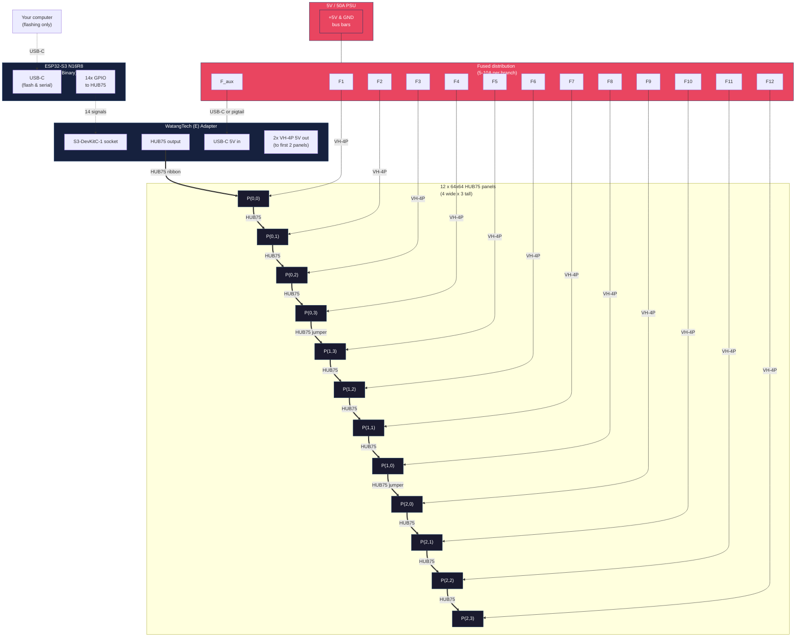
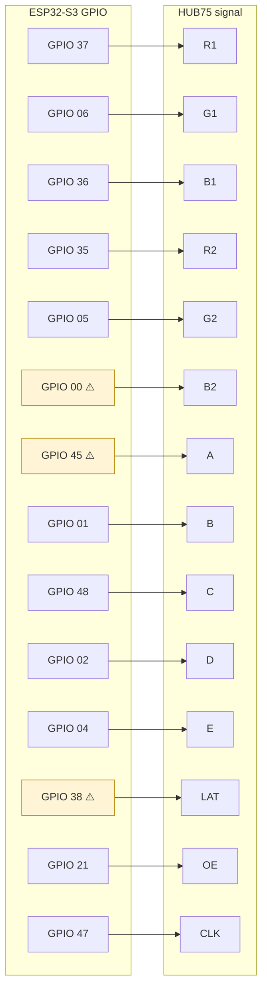
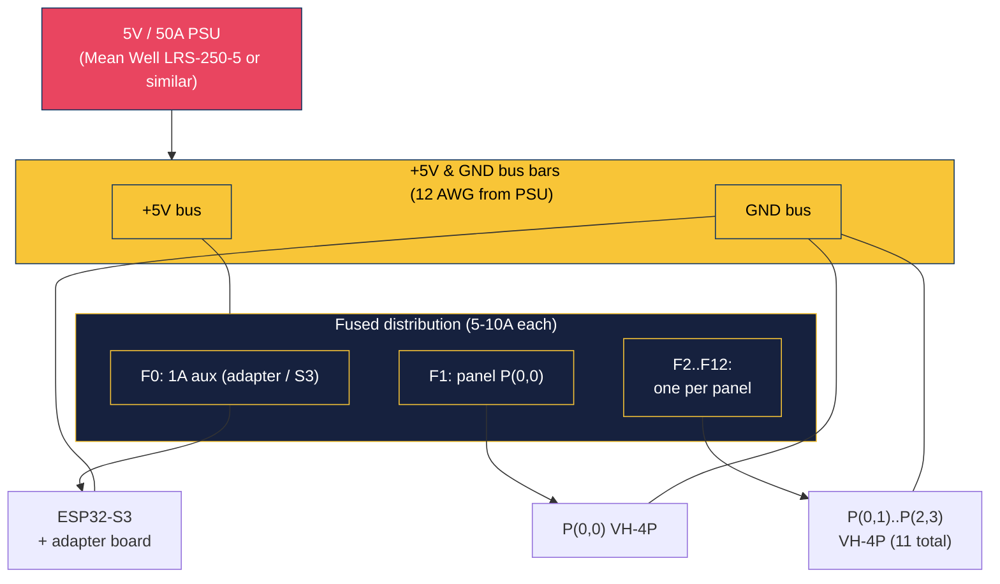

# TheFlightWall — Wiring Diagrams

Visual companion to `docs/hardware-build-guide.md`. Mermaid diagrams render inline in GitHub, VS Code (with the Markdown Preview Mermaid Support extension), and most modern markdown viewers. If you're reading this as plain text, the ASCII fallbacks below each diagram carry the same information.

---

## 1. System block diagram

Full system topology at a glance — what connects to what.



**Reading the diagram:**
- **Dotted line** = USB-C for flashing (temporary, not needed once firmware is loaded)
- **Thin arrows** = 5V power (one pigtail per panel + one aux for adapter)
- **Thick arrows** = HUB75 ribbons (16-pin IDC, data only — power is separate)

---

## 2. HUB75 ribbon serpentine routing

The 12 panels form **one daisy-chain**. Each panel has an `IN` side (OUT of the previous panel) and an `OUT` side (IN of the next). The chain walks the grid serpentine so row-to-row jumpers are short.


**Ribbon count: 12 total**
- 1 adapter → P(0,0)
- 3 across row 0 (left→right)
- 1 jumper P(0,3) → P(1,3) (right edge, top to middle)
- 3 across row 1 (right→left)
- 1 jumper P(1,0) → P(2,0) (left edge, middle to bottom)
- 3 across row 2 (left→right)

**Why this order:** matches the mrfaptastic `VirtualMatrixPanel_T<CHAIN_TOP_LEFT_DOWN>` preset. The library translates virtual (x, y) coordinates into chain index automatically — you draw at `(200, 50)` and the pixel lands on P(0,3) without any app-level math.

If your physical wiring ends up different, **no hardware rewire needed** — just change the template argument in `firmware/adapters/HUB75MatrixDisplay.h`:

```cpp
using VirtualPanel = VirtualMatrixPanel_T<CHAIN_TOP_LEFT_DOWN>;
//                                         ^^^^^^^^^^^^^^^^^^^
// Swap for: CHAIN_TOP_RIGHT_DOWN, CHAIN_BOTTOM_LEFT_UP,
//           CHAIN_BOTTOM_RIGHT_UP, or any of the _ZZ zigzag variants.
```

---

## 3. HUB75 ribbon pinout (both ends identical)

All HUB75 panels use the same 16-pin IDC layout. The ribbon is symmetric — same pinout both ends. Orient with the red stripe on pin 1 (pin 1 is R1 on standard panels).

```
Looking at the IDC connector face (panel or adapter):

        Pin 1 (red stripe)  ─── Pin 2
              │                     │
         ┌────┴─────────────────────┴────┐
         │  R1   │  G1  │  B1  │  GND   │
         │  R2   │  G2  │  B2  │  GND   │
         │  A    │  B   │  C   │  D     │
         │  CLK  │  LAT │  OE  │  GND   │
         │                               │
         │    (pins 1..16 packed 8x2)   │
         └───────────────────────────────┘
              │                     │
             Pin 15                Pin 16
```

**Pin order (standard HUB75 16-pin):**

| IDC | Signal | IDC | Signal |
|---|---|---|---|
| 1 | R1 | 2 | G1 |
| 3 | B1 | 4 | GND |
| 5 | R2 | 6 | G2 |
| 7 | B2 | 8 | GND |
| 9 | A | 10 | B |
| 11 | C | 12 | D |
| 13 | CLK | 14 | LAT |
| 15 | OE | 16 | GND |

On the **E-variant** adapter (yours), pin 8 carries E instead of GND. Most 64×64 panels (1/32 scan) decode E from this pin. The firmware's `HUB75PinMap.h` routes GPIO 4 to the E slot accordingly.

---

## 4. ESP32-S3 → HUB75 signal mapping (WatangTech (E) §4.1.1)



**⚠️ Three pins with caveats** (all harmless, documented in `firmware/adapters/HUB75PinMap.h`):

- **GPIO 0 (B2)** — BOOT strapping pin. Panel driver IC is high-impedance at reset so boot works; DMA drives it post-boot.
- **GPIO 45 (A)** — VDD_SPI strapping pin. Adapter leaves it floating at reset; N16R8 flash is 3.3V which is the floating-default, so no conflict.
- **GPIO 38 (LAT)** — labeled `RGB_LED` on the Lonely Binary silkscreen. If your board has a WS2812 wired there, it'll flicker cosmetically during LAT pulses. No display impact.

---

## 5. Power distribution detail

This is where most builds go wrong. Don't chain panels on one pigtail.



**Rules:**
1. **One pigtail (VH-4P) per panel.** 12 panels = 12 pigtails. At 4A peak per panel, a single daisy-chained pigtail across 3 panels would drop ~0.4V — enough to visibly dim the far end.
2. **Per-branch fuses** (5-10A each). A short in one pigtail takes down one panel, not the whole wall.
3. **12 AWG wire** from PSU to the bus bars. 16-18 AWG pigtails from bus to each panel (fine at 4A for short runs).
4. **Tie ESP32 GND to the panel GND bus.** Otherwise you'll see data-line glitches from ground-bounce at high currents.

**Peak current math:**

| State | Per-panel draw | 12 panels | Notes |
|---|---|---|---|
| All black | ~150 mA | ~1.8 A | HUB75 always scanning, never truly dark |
| Typical flight card | ~1 A | ~12 A | Most content |
| All white full bright | ~4 A | ~48 A | Sustained-worst-case |

A 50A PSU has ~5 % headroom over worst-case. Don't undersize.

---

## 6. Panel physical arrangement + magnetic mount layout

What the back of the wall looks like — panels on the backer plate, seen from behind.

```
  +--- 4x 64 = 256 px wide (~24"-32" at P3-P4 pitch) ---+
  |                                                     |
  +-----------+-----------+-----------+-----------+     ─┐
  |           |           |           |           |      │
  |  P(0,0)   |  P(0,1)   |  P(0,2)   |  P(0,3)   |      │
  |  ●     ●  |  ●     ●  |  ●     ●  |  ●     ●  |      │
  |  (IN)     |           |           |     (OUT) |      │
  |  ●     ●  |  ●     ●  |  ●     ●  |  ●     ●  |      │
  +-----------+-----------+-----------+-----------+      │
  |  ●     ●  |  ●     ●  |  ●     ●  |  ●     ●  |   3x │
  |     (OUT) |           |           |     (IN)  |   64 │
  |  P(1,0)   |  P(1,1)   |  P(1,2)   |  P(1,3)   |  = 192 px tall
  |  ●     ●  |  ●     ●  |  ●     ●  |  ●     ●  |      │
  +-----------+-----------+-----------+-----------+      │
  |  ●     ●  |  ●     ●  |  ●     ●  |  ●     ●  |      │
  |  (IN)     |           |           |     (OUT) |      │
  |  P(2,0)   |  P(2,1)   |  P(2,2)   |  P(2,3)   |      │
  |  ●     ●  |  ●     ●  |  ●     ●  |  ●     ●  |      │
  +-----------+-----------+-----------+-----------+     ─┘

  Legend:
    ●          = M3 magnetic mounting screw (4 per panel, 48 total)
    (IN)/(OUT) = HUB75 ribbon connectors on the back of the panel
    row-edge jumpers (P03→P13 and P10→P20) cross vertically between rows

  At P3 pitch: ~24" wide × ~18" tall.
  At P4 pitch: ~32" wide × ~24" tall.
```

The backer plate should be 1-2" larger than the panel extent on each side so your magnetic screws have margin for alignment tweaks.

---

## 7. Minimum viable bring-up sequence

First power-on doesn't need all 12 panels. Start with one to catch gross wiring errors early.

```mermaid
flowchart LR
    STEP1["1. ESP32 in adapter socket.<br/>Adapter 5V-in powered.<br/>No panels."] -->
    STEP2["2. Flash firmware via USB-C.<br/>Boot; verify Wi-Fi AP<br/>FlightWall-Setup appears."] -->
    STEP3["3. Power off.<br/>Wire 1 panel (P(0,0))<br/>to adapter HUB75 + VH-4P."] -->
    STEP4["4. Power on both rails.<br/>Enable Calibration Mode<br/>from dashboard."] -->
    STEP5["5. Verify panel shows<br/>colored block + '0,0' label<br/>at top-left corner."] -->
    STEP6["6. Power off.<br/>Add remaining 11 panels<br/>per serpentine order."] -->
    STEP7["7. Power on.<br/>Re-run calibration.<br/>Verify all 12 panels light<br/>with correct positions."]

    classDef step fill:#16213e,stroke:#e94560,color:#fff
    class STEP1,STEP2,STEP3,STEP4,STEP5,STEP6,STEP7 step
```



**Why this order:** if something's wrong (power brownout, wrong HUB75 chain direction, bad pin map), you'd rather find out with 1 panel at risk than with all 12 powered and sinking 48A.

---

## See also

- `docs/hardware-build-guide.md` — BOM, assembly, firmware flash, troubleshooting (text-heavy companion)
- `firmware/adapters/HUB75PinMap.h` — the authoritative pin map (14 lines; the Mermaid diagrams above mirror this file)
- `firmware/adapters/HUB75MatrixDisplay.h` — canvas constants + chain topology template parameter

If you'd rather have a PDF / printed version: open this file in VS Code with the Mermaid preview extension, then "Print to PDF" from the preview. GitHub's web UI also renders Mermaid inline — push the branch and view on github.com.
